## 1.1  从一个小问题开始

假设你想让计算机记住一个字母：

```text
A
```

人看到的是字母 `A`。可是计算机里面没有一个小抽屉专门放“字母 A”。

它真正存进去的是一个数字：

```text
65
```

问题来了：

> 为什么 `65` 会变成 `A`？

答案要分成两层看：内存里放的是 `65` 这个数字；程序按 ASCII 规则读它时，屏幕上显示成 `A`。

---

## 1.2  内存像一排格子

内存可以先想成一排格子。每个格子有一个编号，格子里放一个小数字。


格子的编号叫 **地址**。格子本身通常按 **字节** 来看。

一个字节有 8 个二进制位。每个位只能是 0 或 1，所以一个字节能表示：

```text
00000000  -> 0
00000001  -> 1
01000001  -> 65
11111111  -> 255
```

也就是 0 到 255 之间的数字。

这几个二进制例子先说明一件事：

> 内存格子里先放的是数字。

---

## 1.3  `65` 为什么是 `A`

`65` 本身不是 `A`。

`65` 变成 `A`，是因为有一张约定好的表。最常见的一张表叫 ASCII。


ASCII 表里有这样的约定：

| 数字 | 按 ASCII 解释 |
|------|---------------|
| 65 | `A` |
| 66 | `B` |
| 67 | `C` |

所以，内存里仍然是数字 `65`。只是程序把它拿去查表，于是屏幕上显示了 `A`。

换句话说：内存里的数字 `65` 加上 ASCII 规则，就会显示成字母 `A`。

这一步很重要。字符串、图片、音频、文件、数据库，本质上都会遇到同一个问题：

> 这些字节应该按什么规则解释？

---

## 1.4  同一份数据，可以有不同看法

同一个 `65`，可以有不同解释。



| 内存里的数字 | 解释规则 | 看到的东西 |
|--------------|----------|------------|
| `65` | 当整数看 | `65` |
| `65` | 按 ASCII 字符看 | `A` |
| `65` | 当颜色亮度看 | 一种灰度 |

数据没有变，变的是读法。

这也是理解“类型”的入口。类型不是为了背语法而发明的，它最朴素的作用就是告诉程序：

> 这块内存里的数字，应该按哪种方式看？

---

## 1.5  地址是什么

如果内存是一排格子，地址就是格子的编号。

```text
地址 0x1000 的格子里放 65
地址 0x1001 的格子里放 66
地址 0x1002 的格子里放 67
```

有了地址，程序才能说清楚：

> 去哪个格子里读数据？


平时听到 32 位、64 位，可以先这样理解：

- 32 位地址：门牌号长度是 32 个二进制位。
- 64 位地址：门牌号长度是 64 个二进制位。

门牌号越长，理论上能编号的位置越多。

| 架构 | 地址位数 | 理论范围 |
|------|----------|----------|
| 32 位 | 32 位地址 | `2^32` 个字节，也就是 4 GiB，约 4.29 GB |
| 64 位 | 64 位地址 | `2^64` 个字节，也就是 16 EiB |

真实电脑还会受到 CPU、操作系统和硬件限制。地址位数说的是理论上能编号多少内存位置。

---

## 1.6  程序在内存里做什么

程序看起来会做很多事：计算、画图、播放音乐、查询数据库、训练模型。

底层看，都离不开这几步：


1. 读数据。
2. 解释数据。
3. 处理数据。
4. 写回或显示。

例如：

| 你看到的任务 | 内存里发生的事 |
|--------------|----------------|
| 显示字母 `A` | 读到数字 `65`，按字符规则解释 |
| 计算 `3 + 5` | 读到两个数字，做加法，得到 `8` |
| 显示一张图片 | 读到很多数字，按颜色规则解释 |
| 搜索一条记录 | 读到很多字节，按结构规则比较 |

把这件事看清楚，再写代码会稳很多：

> 程序一直在和内存里的数字打交道。

---

## 1.7  一个很小的伪代码

先不用 C 语法，写人能看懂的步骤：

1. 把数字 `65` 放进一个内存格子。
2. 按整数读它，看到 `65`。
3. 按 ASCII 字符读它，看到 `A`。

这段伪代码已经有程序的味道了：

- 有数据：`65`
- 有存放位置：某个内存格子
- 有解释规则：整数、ASCII 字符
- 有输出结果：`65` 或 `A`

真正写 C 代码时，会用变量来给这块内存起名字，用类型来告诉程序怎么解释它。

---

## 1.8  常见误区

**误区 1：以为内存里直接存着 `A`。**

内存格子里存的是数字。`A` 是程序按 ASCII 规则解释 `65` 后得到的显示结果。

**误区 2：以为同一个数字只有一种意义。**

同一个 `65` 可以当整数，也可以按 ASCII 看成字符，还可以按别的规则解释成颜色或状态。数字没变，读它的规则变了，看到的含义就变了。

**误区 3：以为地址就是数据本身。**

地址只是位置编号，数据是这个位置里放着的内容。`0x1000` 像门牌号，门里放的东西才是数据。

---

## 1.9  自己试试看

这些题不需要写成可运行程序。先用纸笔、表格，或者脑子里的图来想。

**Q1：如果内存格子里是 `66`，按 ASCII 看是什么？**

提示：ASCII 表里 `65` 是 `A`，`66` 是 `B`。

**Q2：同一个 `65`，为什么能看成数字，也能看成字符？**

不要回答“因为 C 语言这样规定”。更底层的原因是：内存只存数字，程序选择解释规则。

**Q3：如果一个程序把图片里的颜色也存成数字，你觉得 `0` 和 `255` 可能代表什么？**

可以先猜：很暗、很亮，或者某个颜色通道的强弱。

**Q4：为什么地址需要编号？**

如果没有地址，程序就说不清楚“我要读哪一格”。

---

## 下一章的问题

现在已经知道：

- 内存里存的是数字。
- 同一个数字可以有不同解释。

那程序怎么知道该按哪种方式解释？

比如同样是 `65`：

| 解释方式 | 看到的意义 |
|----------|------------|
| 按整数看 | `65` |
| 按字符看 | `A` |
| 按颜色亮度看 | 一种灰度 |

变量给内存位置起名字，类型告诉程序怎么解释那块内存。这样程序读到 `65` 时，才知道它应该按整数、字符还是别的规则使用。
