## 3.1  问题从哪来

上一章知道了变量和类型：`int score = 86;` 把 86 放进一个叫 `score` 的整数变量里。

但有一个东西程序还不会做：

1. 如果 `score >= 60`，打印"及格"。
2. 否则，打印"不及格"。

这种"根据条件走不同路"的能力，C 语言里用 `if/else` 来表达。

另一个问题：如果有很多个分数要处理，总不能复制粘贴一百遍相同的代码。程序需要一种"回头再做一遍"的能力，这就是循环。

先看分支，再看循环。

---

## 3.2  先看一个例子

假设手头有这些分数：

```text
72 55 88 43 91 60 -1
```

`-1` 不是真正的分数，它是一个标记，意思是"输入结束了"。

这个程序的处理步骤：

1. 读一个分数。
2. 如果是 `-1`，停止。
3. 如果 `>= 60`，算及格。
4. 否则算不及格。
5. 回到第 1 步，读下一个。

最后打印及格人数、不及格人数和平均分。

下面就把这个程序跑起来。

---

## 3.3  最小实验

先跑一个小实验，再一段一段拆。

这段程序里会同时看到几个新东西：`scanf` 负责读输入，`while` 负责反复执行，`if` 负责根据条件选择路径。先观察它能做什么，后面再把每一块拆开看。

```c
#include <stdio.h>

int main(void)
{
    int score;          // 当前读到的分数
    int pass_count = 0; // 及格人数
    int fail_count = 0; // 不及格人数
    int sum = 0;        // 分数总和

    printf("Enter scores (enter -1 to finish):\n");

    while (1) {                        // 无限循环，靠 break 跳出
        if (scanf("%d", &score) != 1) { // 确认读到了一个整数
            printf("Invalid input, please enter an integer.\n");
            return 1;
        }

        if (score == -1) {             // 遇到 -1，结束
            break;
        }

        if (score >= 60) {             // 及格
            pass_count = pass_count + 1;
        } else {                       // 不及格
            fail_count = fail_count + 1;
        }

        sum = sum + score;             // 累加总分
    }

    int total = pass_count + fail_count; // 总人数

printf("Pass: %d\n", pass_count);
printf("Fail: %d\n", fail_count);

if (total > 0) {                   // 防止除以零
    printf("Average: %d\n", sum / total);
}

    return 0;
}
```

---

## 3.4  编译运行

保存成 `grade.c`，编译：

```console
$ gcc grade.c -o grade
```

运行，依次输入 `72 55 88 43 91 60 -1`：

```console
Enter scores (enter -1 to finish):
$ 72
$ 55
$ 88
$ 43
$ 91
$ 60
$ -1
Pass: 4
Fail: 2
Average: 68
```

---

## 3.5  代码拆解

### 3.5.1  if/else：根据条件走不同的路

```c
if (score >= 60) {                      // 分数 >= 60 时为真，走这条路
    pass_count = pass_count + 1;        // 及格人数加 1
} else {                                // 条件为假时走这条路
    fail_count = fail_count + 1;        // 不及格人数加 1
}
```

`if` 后面圆括号里是一个条件。条件的结果只有两种：真（非零）或假（零）。

- `score` 是 `72`，`72 >= 60` 为真，走 `if` 里面的那条路。
- `score` 是 `43`，`43 >= 60` 为假，走 `else` 里面的那条路。

两条路只会走一条，走完之后继续往下执行。



`else` 不是必须的。如果只关心一种条件，可以只写 `if`：

```c
if (score >= 60) {                      // 条件为真时执行花括号里的代码
    pass_count = pass_count + 1;        // 及格人数加 1
}
```

没有 `else` 时，条件为假就直接跳过，继续执行后面的代码。

### 3.5.2  while：反复做同一件事

```c
while (1) {
    // 循环体
}
```

`while` 后面圆括号里也是一个条件。条件为真，就执行花括号里的代码，执行完再回来检查条件。如此反复，直到条件变成假。

`while (1)` 的条件永远是 `1`（真），所以它会一直循环下去。这种写法需要在循环体里用 `break` 手动跳出：

```c
if (score == -1) {
    break;   // 跳出 while 循环
}
```

`break` 一执行，程序立刻离开当前所在的 `while`，跳到 `while` 后面的代码继续执行。

完整程序里还有一层检查：

```c
if (scanf("%d", &score) != 1) {         // 检查 scanf 是否成功读到一个整数
    printf("Invalid input, please enter an integer.\n");
    return 1;                           // 输入格式不对，返回 1 表示异常退出
}
```

`scanf` 成功读到一个整数时，返回值是 `1`。如果输入结束了，或者输入的不是整数，它就读不到这个分数。这个时候 `score` 里没有新的可靠分数，提示错误并退出更稳。

`&score` 把 `score` 的地址交给 `scanf`，这样 `scanf` 知道把数字写到哪一格。这个写法在第 2 章已经见过。

在 `main` 里，`return 0` 通常表示程序正常结束。这里用 `return 1`，表示程序因为输入格式不对提前结束。



> 注意：`break` 只能跳出它所在的那一层循环。如果循环套着循环，`break` 只跳内层。

### 3.5.3  计数器和累加器

```c
pass_count = pass_count + 1;   // 及格人数加 1
fail_count = fail_count + 1;   // 不及格人数加 1
sum = sum + score;              // 把当前分数加到总分里
```

这三行的模式一样：从右边取旧值，加上一个数，放回左边。

`pass_count` 和 `fail_count` 是计数器：每遇到一个符合条件的分数，就加 1。

`sum` 是累加器：把每一轮读到的分数都往上加。

这三个变量在循环开始前初始化为 `0`，在循环里逐步增长。


### 3.5.4  防止除以零

```c
if (total > 0) {                        // 防止除以零
    printf("Average: %d\n", sum / total);
}
```

如果一个分数都没输入（直接输入 `-1`），`total` 是 `0`。C 语言里整数除以零是未定义行为，程序可能崩溃，也可能出现别的不可预测结果。先用 `if` 检查 `total`，只有大于 `0` 时才做除法。

### 3.5.5  整数除法

```c
sum / total                             // 整数除法，小数部分直接丢掉
```

`sum` 和 `total` 都是 `int`，结果也是 `int`，小数部分直接丢掉。

比如 `sum` 是 `409`，`total` 是 `6`，`409 / 6` 的结果是 `68`，不是 `68.166...`。

如果需要更精确的平均分，可以把其中一个转成 `double`：

```c
printf("Average: %.1f\n", (double)sum / total); // 将 sum 转为 double，触发浮点除法
```

`(double)sum` 把 `sum` 的值临时按 `double` 来算，除法就变成浮点除法了。

---

## 3.6  数据在内存里怎么走

看其中一轮运行时的数据变化，是这样的：



每一轮循环：

1. `scanf` 读一个分数放进 `score`。
2. 程序检查 `score` 是否为 `-1`，是就跳出。
3. 程序检查 `score >= 60`，决定 `pass_count` 加 1 还是 `fail_count` 加 1。
4. `sum` 加上 `score`。
5. 回到第 1 步。

循环结束后，`pass_count`、`fail_count`、`sum` 各自保持着最终的值，供最后打印。

这三个变量从头到尾只有一份，但它们的值在每一轮循环中都在变化。

---

## 3.7  更多 if/else 的写法

### 3.7.1  多个分支：else if

如果要分多个等级：

```c
if (score >= 90) {                      // 90 分及以上
    printf("Excellent\n");
} else if (score >= 60) {               // 60 到 89 分
    printf("Pass\n");
} else {                                // 60 分以下
    printf("Fail\n");
}
```

`else if` 是在前一个条件为假时，再检查下一个条件。从上往下依次检查，一旦某个条件为真，就执行对应的代码块，后面的都不看了。

| 分数 | 走哪条路 |
|------|----------|
| `95` | `score >= 90` 为真 → 打印"优秀" |
| `72` | `score >= 90` 为假，`score >= 60` 为真 → 打印"及格" |
| `43` | 前两个都为假 → 打印"不及格" |

### 3.7.2  补充观察：条件里的比较运算符

`if` 和 `while` 的条件里，经常会用到这些比较运算符：

| 运算符 | 含义 | 例子 |
|--------|------|------|
| `==` | 等于 | `score == -1` |
| `!=` | 不等于 | `score != 0` |
| `>` | 大于 | `score > 60` |
| `<` | 小于 | `score < 60` |
| `>=` | 大于等于 | `score >= 60` |
| `<=` | 小于等于 | `score <= 100` |

> 警告：`=` 是赋值，`==` 是比较。写成 `if (score = 60)` 不会报错，但意思完全变了——它把 60 赋给 `score`，然后判断 `score`（也就是 60）是否为真。60 非零，条件永远为真。这是初学者最常见的 bug 之一。

---

## 3.8  while 的其他用法

### 3.8.1  带条件的 while

除了 `while (1)` 配 `break`，也可以把条件直接写在 `while` 后面：

```c
if (scanf("%d", &score) != 1) {         // 循环前先读第一个数
    printf("Invalid input, please enter an integer.\n");
    return 1;
}

while (score != -1) {                   // 不是 -1 就继续循环
    if (score >= 60) {                  // 及格
        pass_count = pass_count + 1;
    } else {                            // 不及格
        fail_count = fail_count + 1;
    }
    sum = sum + score;                  // 累加总分
    if (scanf("%d", &score) != 1) {     // 循环末尾读下一个数
        printf("Invalid input, please enter an integer.\n");
        return 1;
    }
}
```

注意这里 `scanf` 写了两次：循环前一次，循环末尾一次。两次都要检查返回值。如果漏掉循环前的那次，`score` 在第一次检查条件时可能还没有被赋值。

> 注意：循环前读一次，循环末尾读一次，这种模式叫"先读再处理"。它比 `while (1)` 加 `break` 的写法更容易漏写，但有些场合更直观。

### 3.8.2  补充观察：for 循环

前面的主线是 `while`。如果事先知道要循环几次，C 程序里也常用 `for` 写得更紧凑：

```c
for (int i = 0; i < 5; i++) {           // 从 0 数到 4，共 5 次
    printf("%d\n", i);                  // 打印当前 i 的值
}
```

输出：

```console
0
1
2
3
4
```

`for` 后面圆括号里有三部分，用分号隔开：

| 位置 | 作用 | 例子 |
|------|------|------|
| 第 1 部分 | 循环开始前执行一次 | `int i = 0` |
| 第 2 部分 | 每轮检查的条件 | `i < 5` |
| 第 3 部分 | 每轮结束后执行 | `i++` |

`i++` 是 `i = i + 1` 的简写。同样，`i--` 是 `i = i - 1`。

`for` 和 `while` 可以互相转换。上面的 `for` 循环等价于：

```c
int i = 0;                              // 循环变量初始化为 0
while (i < 5) {                         // 条件：i 小于 5 时继续
    printf("%d\n", i);
    i++;                                // 每轮加 1
}
```

选哪个，看哪种写法让代码更清楚。事先知道循环次数时，`for` 更常见。靠某个条件停下来时，`while` 更自然。

### 3.8.3  补充：用 for 改写分数统计

如果不用 `-1` 做结束标记，而是先告诉程序有几个分数，就可以用 `for`：

```c
#include <stdio.h>

int main(void)
{
    int n;               // 分数个数
    int score;
    int pass_count = 0;
    int fail_count = 0;
    int sum = 0;

    printf("How many scores? ");
    if (scanf("%d", &n) != 1 || n < 0) {        // 检查输入是否是有效的非负整数
        printf("Count must be a non-negative integer.\n");
        return 1;
    }

    for (int i = 0; i < n; i++) {               // 循环 n 次，i 从 0 到 n-1
        printf("Score %d: ", i + 1);
        if (scanf("%d", &score) != 1) {          // 检查每个分数是否能正确读入
            printf("Invalid input, please enter an integer.\n");
            return 1;
        }

        if (score >= 60) {                       // 及格
            pass_count = pass_count + 1;
        } else {                                 // 不及格
            fail_count = fail_count + 1;
        }

        sum = sum + score;                       // 累加总分
    }

    int total = pass_count + fail_count;         // 计算总人数

printf("Pass: %d\n", pass_count);
printf("Fail: %d\n", fail_count);

if (total > 0) {                                 // 防止除以零
    printf("Average: %d\n", sum / total);
}

    return 0;
}
```

运行时先输入 `5`（表示有 5 个分数），再依次输入 5 个分数。这里也检查了输入格式：分数个数不能是负数，每个分数都要能读成整数。

---

## 3.9  常见坑

**坑 1：把 `==` 写成 `=`，或者把 `=` 写成 `==`。**

```c
if (score = 60) {      // 错：赋值，不是比较
    printf("This will execute\n");
}

if (score == 60) {     // 对：比较
    printf("score is indeed 60\n");
}
```

编译器通常会对 `if (score = 60)` 发出警告。看到警告就认真对待。

**坑 2：忘记初始化计数器。**

```c
int pass_count;          // 没有初始化，可能是任意值
pass_count = pass_count + 1;  // 结果不可预测
```

计数器、累加器这类变量，在使用前一定要设为 `0`。

**坑 3：`scanf` 忘写 `&`。**

```c
scanf("%d", score);    // 错：传的是值，不是地址
scanf("%d", &score);   // 对：传地址
```

`scanf` 需要知道"把读到的值放到哪块内存"，所以要传地址。漏掉 `&`，程序可能崩溃，也可能把输入写到错误的位置。

**坑 4：整数除法丢小数。**

```c
int sum = 409;                          // 总分
int total = 6;                          // 人数
printf("%d\n", sum / total);   // 打印 68，不是 68.166...
```

需要小数时，用 `(double)sum / total`。

**坑 5：死循环。**

```c
int i = 0;
while (i < 10) {
    printf("%d\n", i);
    // 忘了 i++，i 永远是 0，条件永远为真
}
```

循环体里必须有让条件最终变成假的操作，否则程序停不下来。

---

## 3.10  自己试试看

**Q1：把及格线从 60 改成 70。**

重新运行，观察及格人数和不及格人数的变化。

**Q2：增加一个统计——最高分。**

在循环里，每读到一个分数，如果它比当前最高分还高，就更新最高分。

提示：如果有效分数范围是 0 到 100，最高分的初始值设为 `0` 还是设为 `-1`？为什么？

**Q3：用 `for` 循环打印 1 到 10。**

```c
for (int i = 1; i <= 10; i++) {         // 从 1 数到 10
    printf("%d\n", i);                  // 打印当前 i 的值
}
```

然后改成只打印偶数。（提示：`i % 2 == 0` 表示 `i` 除以 2 余数为 0。）

**Q4：写一个程序，输入一个整数，判断它是奇数还是偶数。**

```console
Input: 7
Output: Odd

Input: 12
Output: Even
```

提示：`%` 是取余运算符。`7 % 2` 的结果是 `1`，`12 % 2` 的结果是 `0`。

**Q5：写一个程序，输入 10 个整数，统计其中正数、负数和零的个数。**

这个程序的结构和分数统计很像：三个计数器，循环 10 次，每轮根据条件选一个计数器加 1。

---

## 下一章的问题

这一章的分数统计程序已经能完成基本统计。但如果要在多个地方都做"判断等级"这件事，比如一次统计优秀、及格、不及格三种，每次都把 `if/else if/else` 写一遍，代码会越来越长。

有没有办法把一段逻辑"打包"起来，需要时直接调用？

把这段逻辑变成一个可以反复调用的小工具，主程序就不用到处复制同一组判断。
