## 4.1  问题从哪来

上一章写了一个分数统计程序，循环读入分数，用 `if/else if/else` 判断等级，然后计数。程序能跑，但有一个烦人的地方：

如果想在多个地方都做"分数变等级"这件事——比如先统计优秀/及格/不及格的人数，再把每个分数的等级打印出来——`if/else if/else` 那段判断逻辑就得写两遍。

```c
// 第一处：统计人数
if (score >= 90) {              // 分数大于等于90
    excellent_count++;           // 优秀人数加1
} else if (score >= 60) {       // 分数在60到89之间
    pass_count++;                // 及格人数加1
} else {                         // 分数小于60
    fail_count++;                // 不及格人数加1
}

// 第二处：打印等级
if (score >= 90) {               // 分数大于等于90
    printf("Excellent\n");       // 打印优秀
} else if (score >= 60) {       // 分数在60到89之间
    printf("Pass\n");            // 打印及格
} else {                         // 分数小于60
    printf("Fail\n");            // 打印不及格
}
```

两段逻辑几乎一样，只是"命中之后做的事"不同。如果及格线从 60 改成 65，两处都得改。漏改一处，程序就出现前后不一致的 bug。

复制粘贴很容易埋下不一致的 bug。代码一多，改了一处忘了另一处，问题就藏在这种地方。

C 语言的解决办法是**函数**：把一段逻辑写一次，装进一个有名字的"小盒子"里。需要的时候叫一声它的名字，它就替你把活干了。

---

## 4.2  先看一个例子

还是用分数变等级的场景。这次把判断等级的逻辑单独拿出来，放进一个叫 `grade_of` 的小盒子里：

```c
#include <stdio.h>

// 定义一个函数：接收一个 int 分数，返回一个 char 等级
char grade_of(int score)
{
    if (score >= 90) return 'A';
    if (score >= 80) return 'B';
    if (score >= 60) return 'C';
    return 'F';
}

int main(void)
{
    int score;

    printf("Enter scores (enter -1 to finish):\n");

    while (1) {
        scanf("%d", &score);
        if (score == -1) break;

        char grade = grade_of(score);   // 调用函数，拿到等级
        printf("%d -> %c\n", score, grade);
    }

    return 0;
}
```

主程序里没有 `if/else` 了。判断等级这件事，全部交给 `grade_of` 去做。主程序只管读分数、调函数、打印结果。

这段程序假设输入的是整数。如果输入字母，`scanf` 读不到整数，程序的行为就不适合拿来观察函数调用了。

---

## 4.3  最小实验

函数的写法有一个固定格式：

```c
返回类型 函数名(参数列表)
{
    // 函数体
    return 返回值;
}
```

拿 `grade_of` 来对照：

```c
char grade_of(int score)             // 返回类型char，参数int score
{
    if (score >= 90) return 'A';     // 90分及以上：优秀
    if (score >= 80) return 'B';     // 80-89分：良好
    if (score >= 60) return 'C';     // 60-79分：及格
    return 'F';                      // 60分以下：不及格
}
```

| 部分 | 在例子里是什么 | 作用 |
|------|---------------|------|
| 返回类型 | `char` | 函数算完之后，交回来的值是什么类型 |
| 函数名 | `grade_of` | 给这段逻辑起个名字，调用时用 |
| 参数列表 | `int score` | 函数需要外部提供的数据，以及它的类型 |
| 函数体 | 花括号里的代码 | 具体的判断逻辑 |
| `return` | `return 'A'` | 把结果交出去，函数立刻结束 |

调用函数的写法：

```c
char grade = grade_of(score);  // 调用函数，返回值赋给grade
//          ^^^^^^^^^^^^^^^^
//          函数名(值)
```

圆括号里的 `score` 是传给函数的值。函数算完之后，`return 'A'` 把字符 `'A'` 交回来，赋给变量 `grade`。


### return 的两个作用

`return` 做了两件事：

1. 把后面的值交给调用者。
2. 立刻结束函数，`return` 后面的代码不会执行。

```c
char grade_of(int score)
{
    if (score >= 90) return 'A';  // 满足就交回 'A'，函数结束
    if (score >= 80) return 'B';  // 上一个没命中，检查这个
    if (score >= 60) return 'C';  // 还没命中，继续检查
    return 'F';                   // 都没命中，交回 'F'
}
```

注意顺序：先检查 `>= 90`，再检查 `>= 80`。如果反过来先检查 `>= 80`，一个 95 分会先被 `>= 80` 捕获，返回 `'B'`，永远到不了 `'A'`。



---

## 4.4  编译运行

保存成 `grade_func.c`，编译运行：

```console
$ gcc grade_func.c -o grade_func
```

运行，依次输入 `95 72 55 88 -1`：

```console
Enter scores (enter -1 to finish):
$ 95
95 -> A
$ 72
72 -> C
$ 55
55 -> F
$ 88
88 -> B
$ -1
```

每个分数都被 `grade_of` 转成了对应的等级字符。主程序里没有任何 `if/else` 判断。


---

## 4.5  数据在内存里发生了什么

调用函数的时候，内存里到底发生了什么？这值得看清楚。

### 4.5.1  参数是一份拷贝

当主程序执行 `grade_of(score)` 时，`score` 的值（比如 `72`）会被**复制一份**，交给函数参数 `score`。



这意味着函数里拿到的 `score` 和主程序里的 `score` 是两个独立的变量，只是碰巧同名。函数里改了自己的 `score`，主程序的 `score` 不受影响。

做个实验验证一下：

```c
#include <stdio.h>

int add_ten(int n)
{
    n = n + 10;     // 修改的是函数自己的 n
    return n;
}

int main(void)
{
    int x = 5;
    int result = add_ten(x);

    printf("result = %d\n", result);  // 15
    printf("x = %d\n", x);           // 5，没有被改变

    return 0;
}
```

输出：

```console
result = 15
x = 5
```

`add_ten` 里把 `n` 加了 10，但主程序的 `x` 还是 `5`。因为传进去的是 `x` 的一份拷贝，函数改的是拷贝，原件没动。

> 注意：C 语言的参数传递是"值传递"——永远传的是值的副本。传地址的写法能让函数修改调用者的变量，但本质上，传的也是地址的副本。

有时候函数需要直接修改调用者的数据，比如交换两个变量的值。这时候可以把变量的地址传给函数，让函数知道"去内存的哪一格操作"。前面 `scanf("%d", &score)` 里的 `&score` 其实是同一个原理：`scanf` 需要往 `score` 的地址写数据，所以必须拿到它的地址。第 10 章会用这个原理实现 `swap` 函数和动态学生表。**地址是一种可以传递给函数的信息。**

### 4.5.2  函数调用的步骤

把 `char grade = grade_of(score);` 这一行拆开，内存里依次发生这几件事：

| 步骤 | 发生了什么 |
|------|-----------|
| 1 | 程序遇到 `grade_of(score)`，暂停 `main`，跳到 `grade_of` 函数 |
| 2 | `score` 的值（比如 `72`）被复制一份，赋给 `grade_of` 的参数 `score` |
| 3 | `grade_of` 里的代码开始执行，依次检查条件 |
| 4 | 遇到 `return 'C'`，把字符 `'C'` 交出去 |
| 5 | `grade_of` 结束，程序回到 `main` 里调用它的地方 |
| 6 | `'C'` 被赋给变量 `grade` |

一次函数调用像一件临时任务：传入参数，执行函数体，遇到 `return` 时交回结果。

### 4.5.3  函数不调用就不执行

函数定义好之后，里面的代码不会自动运行。只有被调用时才会执行。

```c
char grade_of(int score)     // 定义，只是告诉编译器"有这么个函数"
{
    if (score >= 90) return 'A';
    if (score >= 80) return 'B';
    if (score >= 60) return 'C';
    return 'F';
}

int main(void)
{
    // 如果这里从头到尾都没写 grade_of(...)，
    // 那 grade_of 里的代码一次都不会运行
    return 0;
}
```

定义函数是画图纸，调用函数是按图纸造东西。

---

## 4.6  函数的声明和定义

上面的代码把 `grade_of` 写在 `main` 前面。如果反过来，把 `main` 写在前面呢？

```c
#include <stdio.h>

int main(void)                        // main写在函数定义前面
{
    int score = 85;                   // 待判断的分数
    char grade = grade_of(score);     // 编译器还不知道 grade_of 是什么
    printf("%c\n", grade);            // 打印等级
    return 0;
}

char grade_of(int score)              // 函数定义在调用之后
{
    if (score >= 90) return 'A';
    if (score >= 80) return 'B';
    if (score >= 60) return 'C';
    return 'F';
}
```

编译会报错或给出警告。原因是编译器看到 `grade_of(score)` 时，还没见过 `grade_of` 的声明，不知道它接收什么参数、返回什么类型。

解决办法是在 `main` 前面加一行**函数声明**（也叫函数原型）：

```c
#include <stdio.h>

char grade_of(int score);    // 声明：告诉编译器这个函数存在，长什么样

int main(void)
{
    int score = 85;
    char grade = grade_of(score);   // 现在编译器认识了
    printf("%c\n", grade);
    return 0;
}

char grade_of(int score)           // 定义：具体的实现
{
    if (score >= 90) return 'A';
    if (score >= 80) return 'B';
    if (score >= 60) return 'C';
    return 'F';
}
```

声明和定义的区别：

| | 声明（原型） | 定义 |
|---|------------|------|
| 写法 | `char grade_of(int score);` | `char grade_of(int score) { ... }` |
| 作用 | 告诉编译器函数的签名 | 提供函数的具体实现 |
| 分号 | 有 | 没有（后面跟花括号） |
| 位置 | 通常放在文件顶部，`main` 之前 | 放在 `main` 之前或之后都可以 |

> 注意：声明末尾有分号，定义末尾没有。`char grade_of(int score);` 是声明，`char grade_of(int score) { ... }` 是定义。这个分号的有无是初学者容易混淆的地方。

---

## 4.7  没有参数和没有返回值的函数

函数不一定需要参数，也不一定需要返回值。

### 没有参数

如果函数不需要外部数据，参数列表写 `void` 最清楚。这样编译器和读者都能看出：这个函数不接收任何参数。

```c
#include <stdio.h>

void say_hello(void)         // 无参数、无返回值的函数
{
    printf("Hello!\n");      // 只打印，不返回任何值
}

int main(void)
{
    say_hello();             // 调用时圆括号里不写东西
    return 0;
}
```

`void` 表示"没有"。`void` 参数表示不接收任何东西，`void` 返回值表示不交回任何东西。

### 没有返回值

如果函数只做事、不返回结果，返回类型写 `void`，函数里用 `return;`（不带值）或者干脆不写 `return`：

```c
void print_grade(int score)
{
    if (score >= 90) {
        printf("Excellent\n");
    } else if (score >= 60) {
        printf("Pass\n");
    } else {
        printf("Fail\n");
    }
    // 不需要 return，执行到末尾自动结束
}
```

对比一下两种设计：

| 设计 | 函数签名 | 调用方式 | 适用场景 |
|------|---------|---------|---------|
| 返回等级字符 | `char grade_of(int score)` | `char g = grade_of(s);` | 拿到结果后还要做别的事 |
| 直接打印等级 | `void print_grade(int score)` | `print_grade(s);` | 只需要打印，不需要结果 |

`grade_of` 更灵活——拿到字符之后可以打印、可以统计、可以存起来。`print_grade` 只能打印，打印完就没了。

---

## 4.8  用函数改写分数统计

回到第 3 章的分数统计程序。这次用函数来重构：

```c
#include <stdio.h>

char grade_of(int score)
{
    if (score >= 90) return 'A';
    if (score >= 80) return 'B';
    if (score >= 60) return 'C';
    return 'F';
}

int main(void)
{
    int score;
    int count_a = 0, count_b = 0, count_c = 0, count_f = 0;
    int sum = 0;
    int total = 0;

    printf("Enter scores (enter -1 to finish):\n");

    while (1) {
        scanf("%d", &score);
        if (score == -1) break;

        char grade = grade_of(score);   // 一行搞定等级判断

        switch (grade) {                // 根据等级计数
            case 'A': count_a++; break;
            case 'B': count_b++; break;
            case 'C': count_c++; break;
            case 'F': count_f++; break;
        }

        sum += score;
        total++;
    }

    printf("A: %d  B: %d  C: %d  F: %d\n", count_a, count_b, count_c, count_f);

    if (total > 0) {
        printf("Average: %d\n", sum / total);
    }

    return 0;
}
```

程序变短了，而且等级判断的逻辑只写了一次。如果只是调整某个分数对应的等级，改 `grade_of` 就能集中处理。要是等级种类也变了，比如加上 `D`，统计代码里的计数变量、`switch` 分支和打印内容也要跟着增加。

这里顺带用了 `switch` 语句。`switch` 根据一个值跳到对应的 `case` 分支，每个分支末尾的 `break` 防止"穿透"到下一个分支。`switch` 适合值是整数或字符、分支比较多的场合，比一串 `if/else if` 更清晰。

---

## 4.9  常见坑

**坑 1：忘记 return。**

```c
char grade_of(int score)
{
    if (score >= 90) return 'A';
    if (score >= 80) return 'B';
    if (score >= 60) return 'C';
    // 忘了 return 'F';
}
```

如果 `score` 小于 60，函数走完了所有 `if` 都没命中，没有 `return` 就交不出结果。C 语言允许这么写，但函数返回的值是不确定的（未定义行为），程序可能输出乱码。编译器通常会警告 "control reaches end of non-void function"。

> 警告：非 `void` 函数的每一条可能的执行路径都必须有 `return`。漏掉的 `return` 不一定报错，但结果一定不可靠。

**坑 2：参数类型不匹配。**

```c
#include <stdio.h>

char grade_of(int score);   // 期望 int

int main(void)
{
    double s = 85.5;
    char grade = grade_of(s);   // 传了 double
    printf("%c\n", grade);
    return 0;
}

char grade_of(int score)
{
    if (score >= 90) return 'A';
    if (score >= 80) return 'B';
    if (score >= 60) return 'C';
    return 'F';
}
```

C 语言会自动把 `double` 转成 `int`（截断小数部分），所以 `85.5` 变成 `85`，程序能跑。但这种隐式转换容易让人忽略精度丢失。显式写出类型转换 `(int)s` 更清楚。

**坑 3：在函数定义末尾多写分号。**

```c
char grade_of(int score);    // 这是声明，有分号，正确
{
    // ...
}
```

这会被编译器当成"声明 + 一个孤立的代码块"，可能报错。定义不需要分号：

```c
char grade_of(int score)     // 定义，没有分号
{
    // ...
}
```

**坑 4：调用时忘记写圆括号。**

```c
char grade = grade_of score;     // 错：缺少圆括号
char grade = grade_of(score);    // 对
```

函数调用必须带圆括号，即使没有参数也要写：`say_hello()`。

**坑 5：定义在调用之后，又没写声明。**

```c
int main(void)
{
    char grade = grade_of(85);   // 编译器还不认识 grade_of
    return 0;
}

char grade_of(int score)
{
    // ...
}
```

在 `main` 前面加一行声明就能解决：`char grade_of(int score);`。

---

## 4.10  自己试试看

**Q1：写一个函数 `max_of_two`，接收两个 `int`，返回较大的那个。**

```c
int max_of_two(int a, int b)
{
    // 你的代码
}
```

在 `main` 里测试：

```c
printf("%d\n", max_of_two(3, 7));   // 应该输出 7
printf("%d\n", max_of_two(10, 2));  // 应该输出 10
```

**Q2：写一个函数 `is_even`，接收一个 `int`，如果是偶数返回 `1`，否则返回 `0`。**

```c
int is_even(int n)
{
    // 提示：n % 2 == 0
}
```

在 `main` 里用循环测试 1 到 10：

```c
for (int i = 1; i <= 10; i++) {                                 // 遍历 1 到 10
    printf("%d: %s\n", i, is_even(i) ? "Even" : "Odd");          // 三元运算符判断奇偶
}
```

`? :` 是三元运算符。`is_even(i) ? "Even" : "Odd"` 的意思是：如果 `is_even(i)` 为真，用 `"Even"`，否则用 `"Odd"`。

**Q3：把第 3 章的分数统计程序用函数重构。**

要求：

- 写一个 `void print_stats(int pass, int fail)` 函数，负责打印及格人数和不及格人数。
- 主程序只负责读分数和计数，打印交给函数。

**Q4：写一个函数 `absolute`，接收一个 `int`，返回它的绝对值。**

```c
int absolute(int n)
{
    // 提示：负数取反，正数不变
}
```

测试：

```c
printf("%d\n", absolute(-5));   // 5
printf("%d\n", absolute(3));    // 3
printf("%d\n", absolute(0));    // 0
```

这个练习只考虑常见的整数值。`INT_MIN` 是一个特殊边界，取相反数会超出 `int` 能表示的范围。

---

## 下一章的问题

`grade_of` 能处理一个分数了。但回到最开始的统计场景：循环里读到的分数，处理完就丢了。如果想在所有分数都读完之后，再做一次排序或者找出中位数，怎么办？

一个分数只需要一个变量 `int score`。一百个分数呢？总不能写一百个变量。

一批同类型的数据需要放在连续的位置里，用下标逐个访问。数组就是为这种场景准备的。
