## 7.1  问题从哪来

上一章已经会用字符数组保存姓名，比如一批学生的名字可以这样放：

```c
char names[100][32];  // 100 个名字，每个最多 31 字符 + 1 个 \0
```

再加上前面学过的学号和分数，如果要记录一批学生的完整信息，就容易写成三个数组：

```c
int ids[100];           // 所有学生的学号  —— 三个数组靠下标关联
char names[100][32];    // 所有学生的姓名
int scores[100];        // 所有学生的分数
```

三个数组靠下标关联：`ids[0]`、`names[0]`、`scores[0]` 都属于第 0 个学生。

这样能跑，但有一个麻烦：没有任何语法机制保证这三个数组的下标始终同步。如果你不小心往 `scores[3]` 写了值，却忘了更新 `ids[3]`，这个学生的信息就对不上了。

有没有办法把一个学生的学号、姓名、分数放在**一个变量**里？

---

## 7.2  先看一个例子

假设要记录三个学生：

| 学号 | 姓名 | 分数 |
|------|------|------|
| 1 | Alice | 92 |
| 2 | Bob | 78 |
| 3 | Carol | 85 |

每个学生有三种数据：一个整数（学号）、一串字符（姓名）、一个整数（分数）。

如果能把这三种数据绑成一个"包裹"，每个学生用一个包裹来表示，就不会对不上了。C 语言里做这件事的工具叫 **结构体**（`struct`）。

这里的姓名仍然沿用上一章的写法，用 `char name[32]` 保存一个英文名。

---

## 7.3  最小实验

```c
#include <stdio.h>

struct Student {              // 定义结构体类型
    int id;                   // 学号
    char name[32];            // 姓名，最多存 31 个字节的内容
    int score;                // 分数
};

int main(void)
{
    struct Student s;         // 声明一个结构体变量

    s.id = 1;                         // 给学号赋值
    snprintf(s.name, sizeof(s.name), "%s", "Alice");    // 给姓名赋值
    s.score = 92;                     // 给分数赋值

    printf("ID: %d\n", s.id);
    printf("Name: %s\n", s.name);
    printf("Score: %d\n", s.score);

    return 0;
}
```

程序很短，但做了三件事：

1. 定义了一个叫 `struct Student` 的结构体类型。
2. 创建了一个这种类型的变量 `s`。
3. 用点号 `.` 访问 `s` 里面的每个字段，分别赋值和打印。

---

## 7.4  编译运行

保存成 `student.c`，编译：

```console
$ gcc student.c -o student
```

运行：

```console
ID:
$ 1
Name:
$ Alice
Score:
$ 92
```

学号、姓名、分数都来自同一个变量 `s`。

---

## 7.5  结构体里发生了什么

### 7.5.1  定义不分配内存

```c
struct Student {               // 定义结构体类型（图纸，不分配内存）
    int id;                    // 学号字段
    char name[32];             // 姓名字段，最多 31 个字节内容
    int score;                 // 分数字段
};                             // 注意结尾有分号
```

这段代码写在所有函数的外面，它告诉编译器：以后遇到 `struct Student` 变量，就按这个模板来理解它的内存布局——一个 `int`，接着一个 32 字节的字符数组，再接着一个 `int`。

定义本身不创建任何变量，不占运行时内存。它像一张图纸。

### 7.5.2  声明才分配内存

```c
struct Student s;  // 声明结构体变量，此时才分配内存
```

这行才真正创建变量 `s`。从这时开始，程序才需要给这条学生记录留出一块内存。

先按字段本身来看，它们需要这些空间：

| 字段 | 类型 | 大小（典型值） |
|------|------|----------------|
| `id` | `int` | 4 字节 |
| `name` | `char[32]` | 32 字节 |
| `score` | `int` | 4 字节 |

在这个例子里，常见编译器会把它排成大约 40 字节。三个字段按声明顺序组织在同一个结构体变量里：


实际分配时，编译器可能会在字段之间或末尾插入一些填充字节（padding），让每个字段从合适的地址开始。日常读写字段时，先抓住这个事实：`id`、`name`、`score` 属于同一个变量 `s`，不是三份散开的数据。

结构体变量也有地址。`&s` 就是这条记录在内存里的起始位置。结构体内部的字段按声明顺序依次排列：`s.id` 在最前面，接着是 `s.name`，最后是 `s.score`。

如果知道结构体的地址，可以用箭头 `->` 访问字段：

```c
struct Student *p = &s;    // p 指向 s
p->id = 1;                 // 等价于 (*p).id = 1
p->score = 92;             // 等价于 (*p).score = 92
```

`p->id` 的意思是：顺着地址 `p` 找到那条记录，取出它的 `id` 字段。这个写法在第 10 章的动态学生表里会大量出现。结构体的地址可以传递给函数，函数顺着地址就能读写这条记录的字段。

### 7.5.3  用点号访问字段

```c
s.id = 1;           // 用点号访问 id 字段并赋值
s.score = 92;       // 用点号访问 score 字段并赋值
```

`s.id` 的意思是：变量 `s` 里面的 `id` 字段。点号 `.` 是成员访问运算符，左边是结构体变量，右边是字段名。



可以把 `s.id` 当成一个普通的 `int` 变量来用——赋值、打印、做运算都行。`s.score` 也一样。

`s.name` 是一个 `char[32]` 数组，可以用 `printf` 的 `%s` 格式打印。

### 7.5.4  字符数组不能用等号赋值

```c
s.name = "Alice";    // 错：数组不能整体赋值
```

C 语言里，数组名在大多数场景下代表首元素的地址，数组不能作为整体赋值的目标。要把字符串放进字符数组，可以用 `snprintf` 或 `strcpy`：

```c
snprintf(s.name, sizeof(s.name), "%s", "Alice");    // 对：把字符串复制进数组
```

`snprintf` 的第二个参数 `32` 是目标数组的大小。它最多向数组里写入 32 个字节，其中最后一个字节要留给字符串结尾的 `\0`。

### 7.5.5  结构体和普通变量的关系

`struct Student s;` 和 `int x;` 的本质一样：都是声明一个变量，分配内存，然后通过变量名来读写。

区别在于：`int x` 只存一个值，`struct Student s` 存一组值。点号让你精确访问其中某一个字段。

| | `int x` | `struct Student s` |
|---|---|---|
| 存什么 | 一个整数 | 三个字段（学号、姓名、分数） |
| 怎么访问 | `x` | `s.id`、`s.name`、`s.score` |
| 大小 | 4 字节 | 约 40 字节 |


---

## 7.6  常见坑

**坑 1：声明变量时忘记写 `struct`。**

```c
Student s;           // 错：C 语言不认识这个名字
struct Student s;    // 对
```

每次声明变量都要写 `struct Student`，确实有点啰嗦。可以用 `typedef` 起一个简短的别名：

```c
typedef struct {
    int id;
    char name[32];
    int score;
} Student;               // Student 现在是一个类型名

Student s;               // 不用再写 struct 了
```

`typedef` 的作用是给已有的类型起一个新名字。写不写看个人习惯，两种方式都能跑。

**坑 2：用 `=` 给字符数组赋值。**

```c
s.name = "Alice";              // 错
snprintf(s.name, sizeof(s.name), "%s", "Alice"); // 对
```

**坑 3：`snprintf` 的大小参数写错。**

```c
snprintf(s.name, 100, "Alice"); // 错：给错了目标数组大小
snprintf(s.name, sizeof(s.name), "%s", "Alice");  // 对：sizeof 自动算大小
```

第二个参数应该等于目标数组的大小。`"Alice"` 很短，写成 100 时可能暂时看不出问题；如果换成长名字，`snprintf` 就会相信你给的 100，继续往 `name` 后面的内存写，破坏其他数据。

> 警告：`snprintf` 的第二个参数不是"字符串长度"，而是"目标数组能容纳的最大字节数"。它会写入结尾的 `\0`，所以实际最多能存 `size - 1` 个字节的内容。

**坑 4：字段名大小写搞错。**

```c
s.Score = 92;    // 错：C 区分大小写
s.score = 92;    // 对
```

**坑 5：结构体之间不能直接用 `==` 比较。**

```c
struct Student a = {1, "Alice", 92};
struct Student b = {1, "Alice", 92};

if (a == b) { /* ... */ }    // 错：C 不支持结构体直接比较
```

需要逐个字段比较：

```c
#include <string.h>

if (a.id == b.id && a.score == b.score && strcmp(a.name, b.name) == 0) {
    // 两个学生信息相同
}
```

**坑 6：误以为包含数组的结构体不能整体赋值。**

实际上，C 语言允许结构体整体赋值：

```c
struct Student a = {1, "Alice", 92};
struct Student b;
b = a;    // 可以：逐字段复制
```

对于只包含基本类型和字符数组的 `struct Student`，整体赋值没问题。以后遇到保存地址的成员时，整体赋值还会牵涉更细的复制问题；那时需要把“地址”和“地址指向的数据”分开判断。

---

## 7.7  自己试试看

**Q1：定义一个 `struct Book`，包含书名（`char title[64]`）、作者（`char author[32]`）、价格（`double price`）。创建一本书并打印它的信息。**

```c
struct Book b;                                                          // 声明一本书的结构体变量
snprintf(b.title, sizeof(b.title), "%s", "C Primer Plus");             // 复制书名到 title 字段
snprintf(b.author, sizeof(b.author), "%s", "Stephen Prata");           // 复制作者到 author 字段
b.price = 89.0;                                                         // 直接给价格字段赋值
```

**Q2：连续创建 3 个 `struct Student` 变量，分别保存 3 个学生，再打印分数最高的学生姓名。**

提示：可以先写成 `s1`、`s2`、`s3` 三个变量。读姓名时使用带宽度限制的格式，例如 `%31s`。如果觉得三个变量写起来重复，说明多条记录需要一种更统一的组织方式。

**Q3：写一个函数 `print_student(struct Student s)`，接收一个结构体变量，打印这个学生的信息。在 `main` 里调用它。**

```c
void print_student(struct Student s)                                         // 结构体作为参数（传的是副本）
{
    printf("ID: %d  Name: %s  Score: %d\n", s.id, s.name, s.score);        // 打印各字段
}
```

结构体可以像 `int` 一样作为函数参数传递。传进去的是一个副本，函数里修改不会影响外面的原变量。

**Q4：在 Q3 的基础上，写一个 `update_score` 函数，接收一个 `struct Student` 和新的分数，把分数更新后打印。在 `main` 里调用后，检查原来的变量有没有被改。**

你会发现：函数里改的是副本，`main` 里的原变量没变。这和 `int` 参数的行为一样。

---

## 下一章的问题

这一章用 `struct Student` 把一个学生的学号、姓名、分数绑在了一起。一条记录已经清楚了，但班里不会只有一个学生。

如果程序要支持多个学生，还要能添加、按学号查找、打印全部记录，单个 `struct Student` 就不够用了。

一种自然的做法是把很多条 `struct Student` 放进同一个数组，再配一个 `count` 记录当前有多少条有效数据。这样一排记录就有了表的雏形。
