## 9.1  问题从哪来

上一章用 `struct Student` 和结构体数组管理学生记录，能添加、查找、打印。但只要程序一关，所有数据全部消失。

原因很简单：结构体数组存在内存里，内存是易失的——断电就清空。

要把数据留下来，得把它写到**文件**里。文件存在磁盘上，断电不丢。下次程序启动，再从文件读回来。

这一章要做的事：把结构体数组里的学生记录写成文本文件，再从文本文件恢复成结构体数组。

---

## 9.2  先看一个例子

假设内存里有两个学生：

| 学号 | 姓名 | 分数 |
|------|------|------|
| 1001 | Alice | 86 |
| 1002 | Bob | 91 |

保存到文件 `students.txt` 后，文件内容长这样：

```text
1001 Alice 86
1002 Bob 91
```

每行一个学生，学号、姓名、分数用空格隔开。

下次程序启动，读这个文件，就能把这两条记录重新填回结构体数组。

这就是"持久化"的基本思路：保存时，把结构体字段写成文本行；读取时，再按同样的格式把文本行拆回字段。


---

## 9.3  最小实验

这段演示只新增两个函数：`save_students` 和 `load_students`。`main` 用来准备几条记录、调用这两个函数、观察文件有没有留下来。

第 8 章的菜单、添加、查找都先拿掉。这样实验里只剩下一件事：数组里的记录怎样写进文件，又怎样从文件读回数组。把这两个函数看清楚以后，再接回菜单程序就只是调用位置的问题。

```c
#include <stdio.h>
#include <string.h>

struct Student {          // 学生结构体：学号、姓名、分数
    int id;
    char name[32];
    int score;
};

// 把 students 数组的前 count 条写入文件
int save_students(const char *filename, struct Student students[], int count)
{
    FILE *fp = fopen(filename, "w");   // "w" 表示写模式，文件不存在会创建
    if (fp == NULL) {
        return -1;                     // 打开失败
    }

    for (int i = 0; i < count; i++) {
        fprintf(fp, "%d %s %d\n",      // 格式和 printf 一样，只是输出到文件
                students[i].id,
                students[i].name,
                students[i].score);
    }

    fclose(fp);                        // 写完必须关
    return 0;
}

// 从文件读取学生记录，填入 students 数组，返回读到的条数
int load_students(const char *filename, struct Student students[], int max_count)
{
    FILE *fp = fopen(filename, "r");   // "r" 表示读模式
    if (fp == NULL) {
        return 0;                      // 文件不存在，返回 0 条
    }

    int count = 0;
    while (count < max_count &&
           fscanf(fp, "%d %31s %d",    // %31s 防止姓名写越界
                  &students[count].id,
                  students[count].name,
                  &students[count].score) == 3) {  // 成功读到 3 个字段才算一条
        count++;
    }

    fclose(fp);
    return count;
}

int main(void)
{
    struct Student students[100];   // 学生数组，最多100条记录
    int count = 0;                // 当前实际记录数

    // 先尝试从文件加载
    count = load_students("students.txt", students, 100);
    if (count > 0) {
        printf("Loaded %d records from file:\n", count);
    } else {
        printf("File not found, starting fresh.\n");
    }

    // 显示已有记录
    for (int i = 0; i < count; i++) {
        printf("  %d %s %d\n", students[i].id, students[i].name, students[i].score);
    }

    // 手动添加两条记录。写入数组前，先确认还有空位。
    if (count < 100) {
        students[count].id = 1001;
        snprintf(students[count].name, sizeof(students[count].name), "%s", "Alice");
        students[count].score = 86;
        count++;
    } else {
        printf("Table full, skipping Alice.\n");
    }

    if (count < 100) {
        students[count].id = 1002;
        snprintf(students[count].name, sizeof(students[count].name), "%s", "Bob");
        students[count].score = 91;
        count++;
    } else {
        printf("Table full, skipping Bob.\n");
    }

    // 保存到文件
    if (save_students("students.txt", students, count) == 0) {
        printf("Saved %d records to students.txt\n", count);
    } else {
        printf("Save failed!\n");
    }

    return 0;
}
```

---

## 9.4  编译运行

保存成 `file_demo.c`，编译：

```console
$ gcc file_demo.c -o file_demo
```

**第一次运行**（没有 `students.txt` 文件）：

```console
File not found, starting fresh.
Saved 2 records to students.txt
```

运行之后，目录下多了一个 `students.txt` 文件。用记事本打开看看：

```text
1001 Alice 86
1002 Bob 91
```

**第二次运行**（`students.txt` 已经存在）：

```console
Loaded 2 records from file:
  1001 Alice 86
  1002 Bob 91
Saved 4 records to students.txt
```

数据被加载回来，又追加了两条，变成了 4 条。

> 注意：这个程序每次运行都会重复添加同样的学生。练习题会把这个问题改成“先加载，再根据需要添加新记录”。

---

## 9.5  数据/内存/流程里发生了什么

### 9.5.1  fopen 和 FILE*

```c
FILE *fp = fopen("students.txt", "w");   // 以写模式打开文件，返回文件指针fp
```

`fopen` 打开一个文件，返回一个 `FILE *`。`FILE` 是 C 标准库定义的文件流类型，`FILE *` 可以先理解成标准库给出的“文件句柄”：它代表一个已经打开的文件流。

标准库用这个句柄记录当前读写位置、缓冲区状态、错误状态等信息。程序把同一个 `fp` 传给 `fprintf`、`fscanf`、`fclose`，这些函数就能继续操作同一个文件流。第 10 章会专门拆开“指针”这个词；在本章，重点是 `fp` 代表哪一个打开的文件。

第二个参数是打开模式：

| 模式 | 含义 | 文件不存在时 | 文件已存在时 |
|------|------|-------------|-------------|
| `"r"` | 只读 | 打开失败（返回 `NULL`） | 从头读 |
| `"w"` | 只写 | 创建新文件 | **清空**原有内容 |
| `"a"` | 追加 | 创建新文件 | 在末尾写，不清空 |

> 警告：`"w"` 模式会清空文件。如果只想在文件末尾追加内容，用 `"a"`。

### 9.5.2  fprintf：往文件里写

```c
fprintf(fp, "%d %s %d\n", students[i].id, students[i].name, students[i].score);   // 将格式化数据写入文件
```

`fprintf` 和 `printf` 用法几乎一样，区别是多了一个 `FILE *` 参数，表示写到哪里去。

`printf(...)` 其实等价于 `fprintf(stdout, ...)`——`stdout` 就是标准输出，也就是屏幕。

### 9.5.3  fscanf：从文件里读

```c
fscanf(fp, "%d %31s %d", &students[count].id, students[count].name, &students[count].score)   // 从文件按格式读取数据
```

`fscanf` 和 `scanf` 用法几乎一样，区别也是多了一个 `FILE *` 参数。

返回值是**成功读到的字段数**。这里格式串有 3 个转换（`%d`、`%31s`、`%d`），所以正常情况下返回 3。如果到了文件末尾，或者当前位置的内容和格式不匹配，返回值会小于 3。

`%31s` 里的 `31` 是宽度限制：最多读 31 个字符，留一个位置给 `\0`，防止写越界。它保护的是数组边界，不等于“超长姓名也能正确保存”。如果文件里有一个很长的名字，程序不会把它写爆，但这条记录后面的内容仍可能影响下一次读取。

> 注意：`fscanf` 按空白字符连续读字段，不会自动知道“这一行已经读完”。`%s` 遇到空格就停，所以 "Alice" 没问题，但 "Alice Wang" 会拆成两段。如果姓名可能包含空格，就要先规定更严格的文件格式，再按那个格式读写。

### 9.5.4  fclose：关掉文件

```c
fclose(fp);   // 关闭文件，将缓冲区数据刷入磁盘
```

写完或读完，必须调 `fclose` 关掉文件。写文件时，`fclose` 会把缓冲区里剩余的数据刷新出去；读写结束后，它还会释放这个文件流占用的系统资源。

不调 `fclose` 的后果：
- 写文件时，缓冲区里的数据可能没刷到磁盘，程序异常退出会丢数据。
- 操作系统对同时打开的文件数有上限，不关会耗尽。

### 9.5.5  数据的三次存在

整个过程中，同一条学生记录出现在三个地方：

| 位置 | 形态 | 什么时候有 |
|------|------|-----------|
| 键盘输入 | 用户键入的字符 | 输入时 |
| 内存 | 结构体字段（`int`、`char[]`） | 程序运行时 |
| 文件 | 文本行（字符序列） | 写入后一直有 |

先看输入进入内存的那一步。键盘输入的是字符，`scanf` 按格式把它们写进结构体字段。



再看内存和文件之间的转换。内存里的 `int` 字段不是直接变成文件里的字节；`fprintf` 会把字段写成字符，`fscanf` 再按格式读回字段。



键盘输入是字符，`scanf` / `fscanf` 把字符转成 `int` 存进结构体。`fprintf` 把 `int` 转回字符写进文件。`fscanf` 再把字符转回 `int` 放进结构体。

本质上，每次读写都是一次"解释方式的转换"。内存里的 `int` 是 4 个字节的二进制数，文件里的 `86` 是两个字符 `'8'` 和 `'6'`。`fprintf` 和 `fscanf` 负责这两种表示之间的转换。

### 9.5.6  文本格式和二进制格式

这一章用的是**文本格式**：数据被转成人能看懂的字符序列写进文件。

还有一种方式是**二进制格式**：按字节把数据写进文件。如果直接写结构体里的字节，还要面对填充字节、字节序、类型大小这些问题。

| | 文本格式 | 二进制格式 |
|---|---|---|
| 人能读 | 能 | 不能 |
| 跨平台 | 好（不同系统都能读） | 差（字节序、类型大小可能不同） |
| 文件大小 | 较大（数字转成字符会变长） | 较小 |
| 实现难度 | 简单 | 需要注意对齐和字节序 |

这一章只讲文本格式。文本格式够用，而且出了问题容易排查——打开文件就能看到内容。

文件格式是程序和文件之间的约定。保存时写成 `id name score`，加载时也必须按 `id name score` 读；如果保存时换成逗号分隔，加载函数也要跟着改。保存和加载不一致，文件本身看起来还在，读回来的记录却会错。

---

## 9.6  常见坑

**坑 1：忘记检查 `fopen` 的返回值。**

```c
FILE *fp = fopen("data.txt", "r");
fscanf(fp, "%d", &x);    // 如果文件不存在，fp 是 NULL，这里会崩溃
```

`fopen` 失败返回 `NULL`。必须检查：

```c
FILE *fp = fopen("data.txt", "r");
if (fp == NULL) {
    printf("File not found\n");
    return -1;
}
```

**坑 2：用 `"w"` 模式打开已有文件。**

`"w"` 会清空文件。如果你想先读再写，需要先用 `"r"` 读完、`fclose` 关掉，再用 `"w"` 打开写。

如果想在已有内容后面追加，用 `"a"` 模式。

**坑 3：忘记 `fclose`。**

```c
FILE *fp = fopen("out.txt", "w");
fprintf(fp, "hello\n");
// 忘了 fclose，数据可能还在缓冲区，没写到磁盘
```

**坑 4：`fscanf` 的返回值不检查。**

```c
fscanf(fp, "%d %s %d", &id, name, &score);  // 不检查返回值
```

如果文件当前位置的内容格式不对，`fscanf` 会返回一个不是 3 的值。不检查的话，结构体里可能是乱数据。

这里还有个容易误会的地方：`fscanf` 不会替你“一次处理一整行”。如果一行少了字段，它通常读不到 3 个值；如果一行多了字段，多出来的内容会留在文件流里，下一次读取还会遇到它。真正需要严格检查“每行只有 3 个字段”时，通常先用 `fgets` 读一整行，再用 `sscanf` 检查这一行。

**坑 5：`%s` 没有限制宽度。**

```c
fscanf(fp, "%s", name);         // 如果文件里有一个很长的字符串，会越界写
fscanf(fp, "%31s", name);       // 对：限制最多 31 个字符
```

**坑 6：文件路径写错。**

```c
fopen("C:\\data\\students.txt", "r");   // Windows 路径要用双反斜杠
fopen("students.txt", "r");             // 或者只写文件名，放在当前目录
```

> 注意：只写文件名（如 `"students.txt"`）时，文件会在程序的**工作目录**下找。在终端里运行程序，工作目录就是你运行命令时所在的目录。

---

## 9.7  自己试试看

**Q1：修改程序，让用户可以选择"加载"或"新建"。如果选新建，清空数组从头开始。**

提示：在 `load_students` 之前，问用户一个选择。

**Q2：修改程序，添加一个"按学号查找"功能。如果找到，打印这个学生的信息。**

学号查找在前面已经做过。现在加一步：启动时先从文件加载，再查找。

**Q3：修改程序，让用户可以连续添加学生，输入学号 0 时停止。添加完后保存到文件。**

```c
while (1) {
    printf("Enter ID (0 to stop): ");
    scanf("%d", &id);
    if (id == 0) break;
    // 读入姓名和分数，加入数组
}
save_students("students.txt", students, count);
```

**Q4：修改 `save_students`，用 `"a"` 追加模式代替 `"w"` 写模式。观察文件内容的变化。**

追加模式下，每次运行都会在文件末尾添加新记录，不会清空旧记录。但这也意味着旧记录可能被重复加载——想想怎么解决。

**Q5：写一个 `export_csv` 函数，把学生记录保存成 CSV 格式（逗号分隔）。**

```text
学号,姓名,分数
1001,Alice,86
1002,Bob,91
```

CSV 用逗号分隔，第一行是表头。用 `fprintf` 一行一行写。

---

## 下一章的问题

这一章让数据从内存走进了文件，程序关了再开，数据还在。文件读写解决的是“数据会不会留下来”。

内存里的学生表还有另一个限制：结构体数组的大小是写死的 `100`。如果学生人数超过 100，数组就放不下了。

能不能让数组自己"长"？需要多少就分配多少？

这需要程序在运行时申请一块数组空间，空间不够时再换一块更大的空间。下一章会用 `malloc`、`realloc` 和 `free` 做这个实验。
