## 10.1  问题从哪来

第 9 章已经把学生记录写进文件，程序关了再开，数据还能读回来。文件解决的是“数据会不会留下来”。

现在看内存里的学生表。上几章一直用结构体数组存学生记录：

```c
struct Student students[100];  // 固定大小的数组，最多存 100 条
int count = 0;                 // 当前已存入的学生数量
```

100 条，写死在代码里。如果学校今年招了 120 个学生，第 101 条就放不进去了。

一种做法是把 100 改成 10000，但 10000 条还是有上限，而且大多数时候只用了几十条，剩下 9000 多格全浪费了。

另一种做法是问用户"你要存几条"，按需分配。但用户往往不知道自己最终要存多少：今天加 5 个，明天加 10 个，后天又删掉 3 个。

真正需要的是：**一开始分配一小块空间，快用完时自动变大。**

本章先不处理文件读写，只把固定的 `students[100]` 换成会增长的学生表。文件保存和读取以后仍然可以接在这张表外面。

这个能力在 C 语言里叫做**动态内存分配**。它依赖两个基础概念：函数怎么拿到外面的变量，以及指针怎么保存一块内存的地址。

---

## 10.2  函数改不了外面的变量

动态内存分配依赖一个基础：函数要能修改调用者的变量。先用一个最小的例子把这个基础看清。

假设要写一个函数，交换两个整数。第一版这样写：

```c
#include <stdio.h>

void swap(int a, int b)        // a、b 是 x、y 的副本，不是变量本身
{
    int tmp = a;               // 保存 a 的值
    a = b;                     // 改的是副本 a
    b = tmp;                   // 改的是副本 b，外面的 x、y 不变
}

int main(void)
{
    int x = 3, y = 7;
    swap(x, y);                // 传值：x 和 y 的值被复制给 a 和 b
    printf("x=%d, y=%d\n", x, y);
    return 0;
}
```

运行结果：

```console
x=3, y=7
```

没交换。函数里明明写了 `a = b; b = tmp;`，为什么外面的 `x` 和 `y` 没变？

因为 `swap` 的参数 `a` 和 `b` 是 `x` 和 `y` 的**副本**，不是 `x` 和 `y` 本身。调用 `swap(x, y)` 时，程序把 `x` 的值（3）复制一份给 `a`，把 `y` 的值（7）复制一份给 `b`。函数里交换的是这两份副本，跟外面的 `x` 和 `y` 没有关系。

| 位置 | 调用 `swap(x, y)` 时 | `swap` 内交换后 |
|------|----------------------|-----------------|
| `main` 的变量 | `x = 3`，`y = 7` | `x = 3`，`y = 7` |
| `swap` 的参数 | `a = 3`，`b = 7` | `a = 7`，`b = 3` |

`a` 和 `b` 只是拷贝。`swap` 里交换的是 `a` 和 `b`，不是 `main` 里的 `x` 和 `y`。

C 语言的参数传递始终是**值传递**：传进去的是一个值的拷贝，不是变量本身。

### 用地址解决

要让函数改外面的变量，得把变量的**地址**传进去。函数拿到地址后，顺着地址找到那块内存，就能修改里面的内容。

```c
#include <stdio.h>

void swap(int *a, int *b)      // a、b 是指针，保存 x、y 的地址
{
    int tmp = *a;              // *a：顺着地址 a 读取 x 的值
    *a = *b;                   // *a：顺着地址 a 写入，即修改 x
    *b = tmp;                  // *b：顺着地址 b 写入，即修改 y
}

int main(void)
{
    int x = 3, y = 7;
    swap(&x, &y);              // &x：取 x 的地址传给函数
    printf("x=%d, y=%d\n", x, y);
    return 0;
}
```

运行结果：

```console
x=7, y=3
```

交换成功。这里发生了什么：

| 写法 | 含义 |
|------|------|
| `int *a` | 参数 `a` 是一个指针，保存的是某个 `int` 的地址 |
| `&x` | 取 `x` 的地址 |
| `*a` | 顺着地址 `a` 找到那块内存，读写里面的值 |

调用 `swap(&x, &y)` 时，`a` 得到 `x` 的地址，`b` 得到 `y` 的地址。`a` 和 `b` 仍然是副本，但它们复制的是地址。顺着地址写 `*a = *b`，改的是 `x` 和 `y` 本身。

| 位置 | 调用 `swap(&x, &y)` 时 | `swap` 内写入后 |
|------|------------------------|-----------------|
| `main` 的变量 | `x = 3`，`y = 7` | `x = 7`，`y = 3` |
| `swap` 的参数 | `a = &x`，`b = &y` | `a`、`b` 保存的地址不变 |

`*a = *b` 的意思是：顺着 `a` 保存的地址，找到 `x` 那块内存，把它改成 `*b` 的值。这里 `x` 会被改成 7。

地址虽然也是一份拷贝，但它指向外面的那块内存。函数通过地址间接修改外面的变量，这就是指针的核心用途。后面动态学生表里的 `table_init(&table, 2)` 用的也是同一个原理——把 `table` 的地址传进去，函数才能初始化外面的表。

---

## 10.3  先看一个例子

假设要实现一个学生表：

- 初始能存 2 个学生。
- 每次快满了，容量翻倍。
- 程序结束时释放所有内存。

先跑一个小实验，观察容量什么时候变大，再回到代码里看每一步在改什么。

---

## 10.4  最小实验

```c
#include <stdio.h>
#include <stdlib.h>     // malloc, realloc, free
#include <string.h>     // snprintf

struct Student {
    int id;
    char name[32];
    int score;
};

struct StudentTable {
    struct Student *students;   // 指向堆上的数组
    int count;                  // 当前存了多少条
    int capacity;               // 数组能装多少条
};

// 初始化学生表
int table_init(struct StudentTable *t, int capacity)
{
    if (capacity <= 0) {
        t->students = NULL;
        t->count = 0;
        t->capacity = 0;
        return 0;
    }

    t->students = malloc(capacity * sizeof(*t->students));  // 在堆上分配空间
    if (t->students == NULL) {
        t->count = 0;
        t->capacity = 0;
        return 0;
    }
    t->count = 0;
    t->capacity = capacity;
    return 1;
}

// 添加一个学生，满了就扩容
void table_add(struct StudentTable *t, int id, const char *name, int score)
{
    if (t->count == t->capacity) {
        int new_cap = t->capacity > 0 ? t->capacity * 2 : 1;  // 容量翻倍
        struct Student *tmp = realloc(t->students,
                                      new_cap * sizeof(*t->students));
        if (tmp == NULL) {
            printf("Memory allocation failed\n");
            return;
        }
        t->students = tmp;
        t->capacity = new_cap;
    }

    struct Student *s = &t->students[t->count];
    s->id = id;
    snprintf(s->name, sizeof(s->name), "%s", name);
    s->score = score;
    t->count++;
}

// 打印所有学生
void table_print(struct StudentTable *t)
{
    printf("ID  Name      Score  (count=%d, capacity=%d)\n", t->count, t->capacity);
    for (int i = 0; i < t->count; i++) {
        printf("%-6d%-10s%d\n",
               t->students[i].id,
               t->students[i].name,
               t->students[i].score);
    }
}

// 释放内存
void table_free(struct StudentTable *t)
{
    free(t->students);      // 释放堆上的数组
    t->students = NULL;     // 避免悬空指针
    t->count = 0;
    t->capacity = 0;
}

int main(void)
{
    struct StudentTable table;
    if (!table_init(&table, 2)) {  // 初始容量只有 2
        printf("Memory allocation failed\n");
        return 1;
    }

    table_add(&table, 1, "Alice", 92);
    table_add(&table, 2, "Bob", 78);
    table_add(&table, 3, "Carol", 85);   // 第 3 个学生触发扩容
    table_add(&table, 4, "Dave", 90);
    table_add(&table, 5, "Eve", 88);     // 第 5 个学生又触发扩容

    table_print(&table);

    table_free(&table);     // 程序结束前释放内存
    return 0;
}
```

---

## 10.5  编译运行

保存成 `student_table.c`，编译：

```console
$ gcc student_table.c -o student_table
```

运行：

终端会打印 5 条学生记录。此时 `count = 5`，`capacity = 8`：

| ID | Name | Score |
|----|------|-------|
| 1 | Alice | 92 |
| 2 | Bob | 78 |
| 3 | Carol | 85 |
| 4 | Dave | 90 |
| 5 | Eve | 88 |

5 个学生都存下了。初始容量只有 2，但程序自动扩到了 8。

---

## 10.6  数据/内存/流程里发生了什么

### 10.6.1  函数调用时发生了什么

先看 `main` 里的这几行：

```c
int main(void)
{
    struct StudentTable table;          // table 在 main 的栈空间里
    if (!table_init(&table, 2)) {       // 把 table 的地址传进去
        ...
    }
}
```

`table` 是 `main` 里的局部变量。程序运行到 `main` 时，会给 `main` 准备一块临时空间，用来放 `table` 这样的局部变量。这块空间通常叫**栈空间**。

调用 `table_init(&table, 2)` 时，`&table` 取得 `table` 的地址。这个地址会被复制一份，交给 `table_init` 的参数 `t`：

```c
int table_init(struct StudentTable *t, int capacity)
```

这里有两层关系：

| 名字 | 在哪里 | 保存什么 |
|------|--------|----------|
| `table` | `main` 的栈空间 | 一整个 `struct StudentTable` |
| `t` | `table_init` 的栈空间 | `table` 的地址副本 |
| `capacity` | `table_init` 的栈空间 | 整数 `2` 的副本 |



C 语言的参数传递始终是**值传递**。传普通整数时，复制的是整数值；传结构体时，复制的是结构体内容；传地址时，复制的是地址值。

地址值虽然也是一份拷贝，但它指向外面的那块内存。所以 `table_init` 里写：

```c
t->count = 0;              // 顺着地址改 table.count
t->capacity = capacity;    // 同理，修改 main 里的 table.capacity
```

改到的是 `main` 里的 `table.count` 和 `table.capacity`。函数拿到的是地址副本，顺着地址找到的是同一张表。

如果在函数里写：

```c
t = NULL;   // 只把参数 t（地址副本）置空，main 里的 table 不受影响
```

这只会修改参数 `t` 自己，不会让 `main` 里的 `table` 消失。因为 `t` 这个参数本身仍然是一份拷贝。

### 10.6.2  栈空间和堆空间

函数调用时自动出现、函数返回时自动回收的空间，就是栈空间。`main` 有自己的栈空间，`table_init` 被调用时也会有自己的栈空间。

`table_init` 返回后，`table_init` 里的参数 `t`、`capacity` 和临时变量都会消失。但 `main` 还没结束，所以 `main` 里的 `table` 还在。

`malloc` 申请的空间不属于某个函数的栈空间，而是在**堆空间**里。堆空间的生命周期由程序自己管理：用 `malloc` 申请，用 `free` 释放。


这就是动态学生表能工作的原因：

- `table` 在 `main` 的栈空间里，保存 `students`、`count`、`capacity`。
- `table_init` 用参数 `t` 找到 `main` 里的 `table`。
- `malloc` 在堆空间里分配学生数组。
- `table.students` 保存堆上数组的地址，这块数组也常叫**动态数组**。
- `table_init` 返回后，堆上的数组还在，后续 `table_add` 还能继续使用它。

| | 栈空间 | 堆空间 |
|---|---|---|
| 分配方式 | 声明局部变量、调用函数时自动分配 | 用 `malloc` 手动分配 |
| 释放方式 | 函数返回时自动回收 | 用 `free` 手动释放 |
| 生命周期 | 跟函数调用绑定 | 跟 `malloc/free` 绑定 |
| 典型用途 | 局部变量、函数参数 | 动态数组、需要跨函数继续存在的数据 |

### 10.6.3  malloc：在堆上分配空间

```c
t->students = malloc(capacity * sizeof(*t->students));
```

`malloc` 的意思是"memory allocate"：向系统申请一块堆空间。参数是字节数，返回值是这块内存的**地址**。

`sizeof(*t->students)` 按指针指向的类型计算大小。这里 `students` 指向 `struct Student`，所以它算的是一个学生记录占多少字节。

| 表达式 | 含义 |
|--------|------|
| `sizeof(*t->students)` | 一个学生占多少字节（约 40 字节） |
| `capacity * sizeof(...)` | `capacity` 个学生总共要多少字节 |
| `malloc(...)` | 返回一个地址，指向刚分配的那块内存 |

`malloc` 返回的地址存到哪里？存到 `t->students` 里。因为 `t` 指向 `main` 里的 `table`，所以这一步实际改的是 `table.students`。



指针看起来就是个数字，但这个数字代表的是内存中的某个位置。通过这个位置，程序可以读写那块内存里的数据。

### 10.6.4  count 和 capacity

这两个变量是整个设计的关键：

| 变量 | 含义 |
|------|------|
| `capacity` | 数组总共能装多少条（分配了多少格） |
| `count` | 当前实际存了多少条 |


`capacity` 是容器的大小，`count` 是容器里实际装了多少东西。数组有 8 格不代表 8 格都用了，可能只用了 3 格。

遍历时用 `count`，不用 `capacity`：

```c
for (int i = 0; i < t->count; i++) {   // 对
for (int i = 0; i < t->capacity; i++) { // 错：会读到没赋值的格子
```

### 10.6.5  扩容：realloc

```c
if (t->count == t->capacity) {
    int new_cap = t->capacity > 0 ? t->capacity * 2 : 1;
    struct Student *tmp = realloc(
        t->students,
        new_cap * sizeof(*t->students)
    );

    if (tmp == NULL) {
        printf("Memory allocation failed\n");
        return;
    }

    t->students = tmp;
    t->capacity = new_cap;
}
```

`realloc` 的意思是"re-allocate"：把原来那块内存扩大（或缩小）。

它的第一个参数是原来的指针，第二个参数是新的总字节数。返回值是新内存的地址。

代码先判断 `count == capacity`，说明数组已经满了。`new_cap` 是新的容量，通常翻倍。`tmp` 先接住 `realloc` 的返回值，检查不为 `NULL` 后，才更新 `t->students`。



扩容时，`realloc` 可能会搬到一块新内存：

1. 找一块更大的新内存。
2. 把旧内存里的数据复制到新内存。
3. 释放旧内存。
4. 返回新内存的地址。

也有可能原地扩容成功，地址不变。无论是哪一种情况，代码都要用 `realloc` 的返回值更新指针。

> 注意：`realloc` 可能失败（返回 `NULL`）。代码里先用 `tmp` 接住返回值，检查不为 `NULL` 才更新 `t->students`。如果直接写 `t->students = realloc(t->students, ...)`，一旦失败，原来的指针就丢了，内存泄漏。

### 10.6.6  执行流程

以初始容量 2、添加 5 个学生为例：

| 操作 | count | capacity | 发生了什么 |
|------|-------|----------|-----------|
| `table_init(&table, 2)` | 0 | 2 | 在堆上分配 2 格空间，地址存进 `table.students` |
| 添加 Alice | 1 | 2 | 直接存入 |
| 添加 Bob | 2 | 2 | 直接存入，下一次添加前已经满了 |
| 添加 Carol | 3 | 4 | 先扩容到 4，复制旧数据，再存入 |
| 添加 Dave | 4 | 4 | 直接存入，下一次添加前已经满了 |
| 添加 Eve | 5 | 8 | 先扩容到 8，复制旧数据，再存入 |

容量变化可以单独看成一张小表：

| 阶段 | 触发动作 | capacity |
|------|----------|----------|
| 初始 | `table_init(&table, 2)` | 2 |
| 第一次扩容 | 添加 Carol 前，`count == capacity` | 4 |
| 第二次扩容 | 添加 Eve 前，`count == capacity` | 8 |

容量翻了两次，5 个学生全部存下。

### 10.6.7  free：释放内存

```c
void table_free(struct StudentTable *t)
{
    free(t->students);           // 释放堆上的数组
    t->students = NULL;          // 置空指针，避免悬空指针
    t->count = 0;
    t->capacity = 0;
}
```

`free` 把 `malloc`/`realloc` 分配的堆空间还给系统。程序结束时系统会回收所有内存，但显式 `free` 是好习惯：如果程序不是退出而是长期运行，不释放就会越吃越多。

`free` 之后把指针设为 `NULL`，防止后面不小心继续使用这个指针。指向已释放内存的指针叫**悬空指针**（dangling pointer），用它读写数据是未定义行为。

---

## 10.7  把三个函数放在一起看

| 阶段 | 函数 | 做什么 | 用到的关键函数 |
|------|------|--------|---------------|
| 分配 | `table_init` | 通过地址修改外面的表，并分配初始空间 | `malloc` |
| 使用 | `table_add` | 添加学生；满了就扩容 | `realloc` |
| 释放 | `table_free` | 释放堆空间，清空表状态 | `free` |

三个函数对应动态内存的三个阶段：分配、使用（可能扩容）、释放。

动态内存有一条主线：`malloc` 申请堆空间，把返回的地址保存到指针里；后面通过这个指针读写数组；结束时用 `free` 释放，再把指针清空。



扩容是中途发生的动作。`realloc` 的返回值要先交给临时指针 `tmp`，检查成功后，再让 `students` 指向新的地址。



---

## 10.8  常见坑

**坑 1：以为传了指针就不是值传递。**

```c
void reset_pointer(struct StudentTable *t)
{
    t = NULL;        // 只改了参数 t 这份地址副本
}
```

这不会改变 `main` 里的 `table`。C 语言没有把变量本身交给函数，交过去的始终是一个值。区别只是：这个值可能是普通整数，也可能是某块内存的地址。

**坑 2：忘记 `#include <stdlib.h>`。**

`malloc`、`realloc`、`free` 都声明在 `<stdlib.h>` 里。现代 C 不允许随便调用一个没有声明的函数；有些编译器为了兼容旧代码，仍会给出警告后继续编译。这样的代码很危险，返回的地址可能被当成 `int` 处理，在 64 位系统上就可能被截断。

**坑 3：`malloc` 返回值不做检查。**

```c
t->students = malloc(capacity * sizeof(*t->students));
// 没检查 t->students 是否为 NULL
t->students[0].id = 1;   // 如果 malloc 失败，这里就是空指针解引用
```

`malloc` 失败时返回 `NULL`。应该检查：

```c
if (t->students == NULL) {
    printf("Memory allocation failed\n");
    return;
}
```

**坑 4：`realloc` 的返回值直接覆盖原指针。**

```c
t->students = realloc(t->students, new_size);   // 危险
```

如果 `realloc` 失败，返回 `NULL`，原来的 `t->students` 就丢了：既无法使用旧内存，也无法释放它。正确做法是先用临时变量接住：

```c
struct Student *tmp = realloc(t->students, new_size);
if (tmp == NULL) {
    printf("Expansion failed, existing data retained\n");
    return;
}
t->students = tmp;
```

**坑 5：`free` 之后继续使用指针。**

```c
free(t->students);
t->students[0].id = 1;   // 未定义行为：内存已经还给系统了
```

`free` 之后把指针设为 `NULL`，后续如果误用，问题通常更容易暴露。注意，空指针解引用也是未定义行为；正确做法不是依赖它崩溃，而是避免继续使用已经释放的指针。

**坑 6：忘记 `free`。**

程序退出时系统会回收所有内存，所以短程序里忘记 `free` 看不出问题。但如果程序长时间运行、反复分配不释放，内存占用会越来越大，最终耗尽。这叫**内存泄漏**。

**坑 7：`malloc` 的大小算错。**

```c
malloc(capacity * sizeof(int));              // 错：要的是 Student，不是 int
malloc(capacity * sizeof(*t->students));   // 对
```

`sizeof` 里放的类型必须和后面用的类型一致。

> 警告：一个常见的写法是 `malloc(capacity * sizeof(*t->students))`，意思是"按指针指向的类型的大小来算"。这样改了结构体也不用同步修改 `malloc` 里的类型名。

---

## 10.9  自己试试看

**Q1：写一个函数 `void sort_two(int *a, int *b)`，如果 `*a > *b` 就交换它们，保证调用后 `a` 指向的值不大于 `b`。**

提示：用 10.2 里 `swap` 的思路，加一个 `if (*a > *b)` 判断。调用方式是 `sort_two(&x, &y)`。

**Q2：把初始容量改成 1，添加 5 个学生，观察容量变化。**

在 `table_add` 里加一行 `printf`，每次扩容时打印旧容量和新容量。

**Q3：写一个 `table_find` 函数，按学号查找学生，返回下标（找不到返回 -1）。**

```c
int table_find(struct StudentTable *t, int id)
{
    for (int i = 0; i < t->count; i++) {  // 只遍历 count 个有效元素，不用 capacity
        if (t->students[i].id == id) {    // 找到了
            return i;
        }
    }
    return -1;                             // 没找到
}
```

**Q4：写一个 `table_remove` 函数，按学号删除学生。**

提示：删除后，后面的元素要往前移一位，`count` 减 1。

**Q5：写一个小实验，验证 `t = NULL` 不会改变外面的表。**

提示：写一个 `void reset_pointer(struct StudentTable *t)`，在里面执行 `t = NULL;`，调用前后打印 `table.count`。

**Q6：如果 `free` 了两次同一个指针会怎样？**

可以写一个独立的小程序观察，不要放进学生表主程序里。这叫"double free"，是未定义行为；不同系统上的表现可能不一样，有的会立刻报错，有的看起来暂时没事。

**Q7：不调用 `table_free`，程序能正常运行吗？**

短程序可以，但养成 `free` 的习惯很重要。

---

## 下一章的问题

这一章用 `malloc` 和 `realloc` 让学生表的容量可以增长。只要内存还能分配，空间就可以按需要继续变大。

但有一个操作很慢：删除一个学生时，后面所有元素都要往前挪一位。如果表里有 10 万条记录，删第 1 条就要搬动 99999 条。在数组中间插入也一样，后面的元素全部后移。

有没有一种结构，插入和删除时只改连接关系，不搬动其他元素？

---

## 阶段项目

[阶段项目 2：可保存的学生表](../projects/project-2.md) 把结构体、动态内存和文件读写合到一起：做一个容量能自动增长的学生表，启动时从文件加载，退出时保存。练完这个再进入数据结构段落。
