## 11.1  问题从哪来

上一章用动态数组存学生记录，容量能增长了。但有一个麻烦没解决：**中间插入和删除太贵**。

假设数组里有 5 个学生，要在第 2 个位置插入一个新学生：


`Bob` 到 `Eve` 四个人全部要往后挪一格，空出位置给新学生。图里的数字是下标，所以“第 2 个位置”对应下标 1。如果有 10 万条记录，在头部插入就要移动 10 万次。

删除也一样。删掉第 1 个学生，后面的全部要往前挪。

能不能有一种结构，插入和删除时**不用移动其他元素**？

---

## 11.2  用指针串起来

数组的痛点在于所有元素必须挤在一起。打破这个规则的办法是：让每个学生自己记住下一个学生在哪里。

第 10 章已经见过地址。`&students[1]` 就是第 2 个学生的地址。如果学生记录里除了存自己的学号和名字，还额外存一个地址，指向下一个学生的地址，那从第一个学生就能找到第二个，从第二个就能找到第三个。三个人不需要紧挨着，只靠地址就能串成一条链。

这个结构里，每个学生是一个**节点**（node），节点有两部分：

| 部分 | 内容 |
|------|------|
| `data` | 学生的信息（`struct Student`） |
| `next` | 一个指针，存下一个节点的地址 |

`next` 里存的是内存地址。最后一个节点后面没有节点时，就把 `next` 设为 `NULL`。节点散落在堆内存的各个角落，不需要紧挨着，只要靠 `next` 里的地址互相找到就行。

插入时，只需要改两条指针：前一个节点的 `next` 指向新节点，新节点的 `next` 指向原来的下一个节点。其他节点完全不用动。删除时也一样，让前一个节点的 `next` 跳过被删节点，直接指向下一个。链表中只改指针，不搬数据。

---

## 11.3  最小实验

先看节点长什么样：

```c
#include <stdio.h>
#include <stdlib.h>
#include <string.h>

struct Student {
    int id;
    char name[32];
    int score;
};

struct Node {
    struct Student data;    // 这个节点存的学生信息
    struct Node *next;      // 指向下一个节点，没有下一个就是 NULL
};
```

一个节点就是一个 `struct Node`，里面装着一个学生的信息，外加一根指针指向下一个节点。

先做一个最小实验：创建三个节点，串起来，然后遍历打印。

```c
#include <stdio.h>
#include <stdlib.h>
#include <string.h>

struct Student {
    int id;
    char name[32];
    int score;
};

struct Node {
    struct Student data;
    struct Node *next;
};

// 创建一个新节点
struct Node *create_node(int id, const char *name, int score)
{
    struct Node *n = malloc(sizeof(*n));   // 动态分配一个节点
    if (n == NULL) {
        return NULL;                                // 分配失败
    }
    n->data.id = id;
    snprintf(n->data.name, sizeof(n->data.name), "%s", name);
    n->data.score = score;
    n->next = NULL;                                 // 新节点暂时没有后继
    return n;
}

// 在链表头部插入一个新节点
struct Node *insert_head(struct Node *head, struct Node *new_node)
{
    if (new_node == NULL) {
        return head;
    }
    new_node->next = head;      // 新节点的 next 指向原来的头
    return new_node;            // 新节点成为新的头
}

// 遍历链表，打印每个学生的信息
void print_list(struct Node *head)
{
    struct Node *cur = head;    // 从头开始
    while (cur != NULL) {       // 还有节点就继续
        printf("ID: %d  Name: %s  Score: %d\n",
               cur->data.id, cur->data.name, cur->data.score);
        cur = cur->next;        // 移动到下一个节点
    }
}

// 释放整个链表的内存
void free_list(struct Node *head)
{
    struct Node *cur = head;
    while (cur != NULL) {
        struct Node *tmp = cur; // 先记住当前节点
        cur = cur->next;        // 移动到下一个
        free(tmp);              // 释放刚才记住的节点
    }
}

int main(void)
{
    struct Node *head = NULL;   // 空链表，头指针为 NULL

    // 创建三个节点并插入头部
    head = insert_head(head, create_node(3, "Carol", 85));
    head = insert_head(head, create_node(2, "Bob", 78));
    head = insert_head(head, create_node(1, "Alice", 92));

    printf("=== List Contents ===\n");
    print_list(head);

    free_list(head);            // 用完释放
    return 0;
}
```

---

## 11.4  编译运行

保存成 `linkedlist.c`，编译：

```console
$ gcc linkedlist.c -o linkedlist
```

运行：

```console
=== List Contents ===
ID: 1  Name: Alice  Score: 92
ID: 2  Name: Bob  Score: 78
ID: 3  Name: Carol  Score: 85
```

注意插入顺序：先插 Carol，再插 Bob，最后插 Alice。每次都插到头部，所以打印出来是倒序的。这就是头部插入的特点——最后插入的排在最前面。

---

## 11.5  数据/内存/流程里发生了什么

### 11.5.1  节点在内存里不连续

数组在内存里是一整块连续空间，`students[0]` 和 `students[1]` 紧挨着。链表的节点是用 `malloc` 一个个单独分配的，它们可能散落在堆内存的各个角落。


每个节点有两部分：

| 部分 | 内容 | 大小（典型值） |
|------|------|----------------|
| `data` | 一个 `struct Student` | 约 40 字节 |
| `next` | 一个指针 | 8 字节（64 位系统） |

`next` 里存的是下一个节点的内存地址。如果后面没有节点了，`next` 就是 `NULL`。

### 11.5.2  多个节点串起来

三个节点串起来的样子：



`head` 指针指向第一个节点。每个节点的 `next` 指向下一个。最后一个节点的 `next` 是 `NULL`，表示链表到这里结束。

遍历就是沿着 `next` 一根一根走下去：

```c
struct Node *cur = head;    // 从头开始
while (cur != NULL) {       // 还有节点就继续
    // 处理 cur 指向的节点
    cur = cur->next;        // 跳到下一个
}
```

### 11.5.3  头部插入：改一根指针就够了

插入一个新节点到头部，只需要两步。

第一步，让新节点的 `next` 指向原来的头节点：



第二步，再让 `head` 指向新节点：



顺序不能反过来。

```c
new_node->next = head;      // 新节点接上原来的头
head = new_node;            // 新节点变成新的头
```

不管链表有多长，头部插入都是常数时间——只改了两根指针。

### 11.5.4  按位置插入：找到前一个节点

如果要插到中间，比如在学号 1 和学号 3 之间插入学号 2，需要先找到前一个节点：

```c
// 在 prev 节点后面插入 new_node
new_node->next = prev->next;    // 新节点的 next 指向 prev 的下一个
prev->next = new_node;          // prev 的 next 改为指向新节点
```

这里假设 `prev` 和 `new_node` 都不是 `NULL`。真正写成函数时，还要单独处理空链表、插入到头部、分配失败这些情况。指针已经准备好以后，插入本身还是两步，和头部插入本质一样。

### 11.5.5  删除节点：前一个节点跳过它

删除学号为 2 的节点：



先找到要删的节点和它的前一个节点，再让前一个节点的 `next` 指向被删节点的下一个节点：

```c
prev->next = cur->next;     // 前一个跳过当前节点
```

这一步完成后，链表已经不再经过学号为 2 的节点：



最后 `free` 掉被删节点。

```c
free(cur);                  // 释放当前节点的内存
```

这里假设要删的不是头节点，所以有一个有效的 `prev`。如果删的是头节点，要改的是 `head` 本身。指针已经找到以后，只改一根指针，后面的所有节点完全不用动。

### 11.5.6  接起来验证

把创建、头部插入、按学号查找、按学号删除、遍历打印接起来，观察每一步指针怎么变。前面已经有了 `create_node`、`insert_head`、`print_list` 和 `free_list`，这里补上查找和删除：

```c
struct Node *find_by_id(struct Node *head, int id)
{
    struct Node *cur = head;

    while (cur != NULL) {
        if (cur->data.id == id) {
            return cur;     // 找到了，返回这个节点的地址
        }
        cur = cur->next;
    }

    return NULL;            // 走到链表末尾也没找到
}
```

删除时要多记一个 `prev`。`cur` 是当前正在看的节点，`prev` 是它前面的节点：

```c
struct Node *delete_by_id(struct Node *head, int id)
{
    struct Node *prev = NULL;
    struct Node *cur = head;

    while (cur != NULL) {
        if (cur->data.id == id) {
            if (prev == NULL) {
                head = cur->next;       // 删除的是头节点
            } else {
                prev->next = cur->next; // 前一个节点跳过 cur
            }

            free(cur);
            printf("Deleted ID %d\n", id);
            return head;
        }

        prev = cur;
        cur = cur->next;
    }

    printf("ID %d not found\n", id);
    return head;
}
```

验证顺序：

1. `head = NULL`。
2. 头插 Carol、Bob、Alice，打印链表。
3. 查找 `id=2`，应该找到 Bob。
4. 删除 `id=2`，再打印链表。
5. 释放链表。

关键观察点是 `head` 有没有变化，以及删除 Bob 后 Alice 的 `next` 是否直接指向 Carol。

把这两个函数接到前面的程序里，再按上面的顺序运行：

```console
=== Initial List ===
ID: 1  Name: Alice  Score: 92
ID: 2  Name: Bob  Score: 78
ID: 3  Name: Carol  Score: 85

Found: ID 2, Name Bob

After deleting ID 2:
Deleted ID 2
ID: 1  Name: Alice  Score: 92
ID: 3  Name: Carol  Score: 85
```

---

## 11.6  链表 vs 数组

| 操作 | 数组 | 链表 |
|------|------|------|
| 按下标访问 | `O(1)`，直接算地址 | `O(n)`，要从头走 |
| 头部插入 | `O(n)`，全部后移 | `O(1)`，改两根指针 |
| 中间插入 | `O(n)`，后面的都要移 | `O(1)`，找到前驱后改两根指针 |
| 删除 | `O(n)`，后面的都要移 | `O(1)`，找到前驱后改一根指针 |
| 内存 | 连续，缓存友好 | 零散，每个节点单独分配 |
| 扩容 | 要 `realloc`，可能搬数据 | 不需要，插一个 `malloc` 一个 |

链表的优势在插入和删除。数组的优势在随机访问和缓存。实际选择取决于哪个操作更频繁。

> 注意：链表的 `O(1)` 插入删除，前提是**已经找到了前驱节点**。查找前驱本身是 `O(n)`。所以链表总的操作复杂度并不一定比数组低，关键看使用场景。

---

## 11.7  常见坑

**坑 1：插入新节点时顺序搞反。**

```c
// 错：先把 head 改了，原来的链表入口就丢了
head = new_node;
new_node->next = head;      // head 已经是 new_node 自己了，死循环！
```

同样的场景，正确顺序是先接上原来的头节点，再移动 `head`：

```c
new_node->next = head;  // 新节点的 next 指向原来的头节点
head = new_node;          // head 前移，指向新节点
```

**坑 2：删除节点后还访问它。**

```c
free(cur);
printf("%d\n", cur->data.id);    // 错：cur 已经被释放了
```

`free` 之后，那块内存已经还给系统了，再访问是未定义行为。要先保存需要的信息，再 `free`。

**坑 3：删头节点没更新 `head`。**

```c
// 删的是头节点
if (prev == NULL) {
    head = cur->next;    // 必须更新 head
}
free(cur);
```

如果忘了 `head = cur->next`，`head` 还指着已经释放的内存，后面再用就出问题。

**坑 4：遍历时删除当前节点，忘了先存 `next`。**

```c
// 错：free 之后 cur->next 已经不能用了
free(cur);
cur = cur->next;

// 对：先存 next，再 free
struct Node *tmp = cur->next;
free(cur);
cur = tmp;
```

**坑 5：忘记释放链表。**

程序结束前，链表里每个节点都是 `malloc` 分配的。不 `free`，内存就泄漏了。虽然程序退出时操作系统会回收，但在循环里反复创建链表不释放，内存会越吃越多。

> 警告：每个 `malloc` 都应该对应一个 `free`。链表有多少个节点，`free_list` 就调用多少次 `free`。

---

## 11.8  自己试试看

**Q1：写一个 `insert_tail` 函数，在链表尾部插入新节点。**

提示：从头走到最后一个节点（`next == NULL`），把它的 `next` 改为新节点。空链表时新节点就是头。

**Q2：写一个 `list_length` 函数，返回链表的节点数。**

提示：遍历一遍，用计数器。

**Q3：写一个 `reverse_list` 函数，把链表反转。**

提示：用三个指针 `prev`、`cur`、`next`，逐个把 `cur->next` 指向 `prev`。

**Q4：在 `delete_by_id` 的基础上，写一个 `delete_all` 函数，删除所有满足条件的节点（比如删除所有分数低于 60 的学生）。**

提示：遍历时不能删完就停，要继续往后走。

---

## 下一章的问题

链表解决了中间插入删除要搬数据的问题。但链表也有自己的麻烦：想找第 10 万个节点，还是得从 `head` 开始，一步一步沿着 `next` 走过去。按下标随机访问是 `O(n)`。

有些场景不关心第 10 万个元素在哪里，只关心最近做过什么。比如编辑器的撤销功能：刚输入的一段文字，通常最先被撤销。把每次操作都放到同一端，撤销时也从这一端取，就会得到"最后放进去的最先取出来"。
