## 12.1  问题从哪来

上一章用链表存学生记录，能插能删能查。上一章最后提到编辑器的撤销功能，换到学生记录里，也会遇到同一种问题：

你刚插入了一条学号为 7 的记录，本来想输入 `"Alice"`，却打成了 `"Ailce"`。发现错了，想撤销。

链表能帮你删掉 id 为 7 的记录，但前提是——你记得刚才插入的 id 是 7。如果连续插入了十几条，你还记得最后一条是哪个 id 吗？

程序需要一种机制：**自动记住操作顺序，撤销时先撤最后做的那一步**。

这种"最后做的最先被取出来"的顺序，有一个专门的名字——**后进先出**（Last In, First Out，LIFO）。实现后进先出的数据结构叫**栈**（stack）。

---

## 12.2  先看一个例子

想象一摞盘子。你洗好一个就放在最上面，取的时候也从最上面拿。最后放上去的盘子最先被取走。

| 操作 | 盘子栈的变化 | 说明 |
|------|-------------|------|
| 放入 A | [A] | A 在最底下 |
| 放入 B | [A, B] | B 在 A 上面 |
| 放入 C | [A, B, C] | C 在最上面 |
| 取出一个 | [A, B] | 取出的是 C，后进先出 |
| 取出一个 | [A] | 取出的是 B |

两个关键动作：

- **push**（压栈）：把一个元素放到栈顶。
- **pop**（弹栈）：从栈顶取出一个元素。

在撤销场景里，每次插入操作把学生 id push 进栈，撤销时 pop 出最近的 id 并删除对应记录。


---

## 12.3  最小实验

栈的实现比你想象的简单。核心只有两样东西：一个数组，一个整数。

```c
int undo_stack[100];   // 最多记住 100 步操作
int top = 0;           // top 指向下一个空位，也等于当前元素个数
```

`top` 是整个栈的关键。它不是"栈顶元素的下标"，而是**下一个要写入的位置**。换句话说，`top` 也表示栈里现在有几个元素。当 `top == 0` 时栈是空的。

先看 push 和 pop 的核心动作。下面这段代码只展示 `top` 怎么移动，真正写进程序时还要检查栈满和栈空。

```c
// 压栈：把 id 放到栈顶，top 往后移一位
void push(int id)
{
    undo_stack[top] = id;
    top++;
}

// 弹栈：top 往前移一位，返回栈顶的 id
int pop(void)
{
    top--;
    return undo_stack[top];
}
```

下面用一个小实验模拟"插入三条记录，然后撤销两次"：

```c
#include <stdio.h>

#define MAX_STACK 100

int undo_stack[MAX_STACK];   // 撤销栈
int top = 0;                 // 下一个空位的下标，也等于当前元素个数

// 压栈
void push(int id)
{
    if (top >= MAX_STACK) {
        printf("Stack full, cannot push\n");
        return;
    }
    undo_stack[top] = id;
    top++;
}

// 弹栈
int pop(void)
{
    if (top <= 0) {
        printf("Stack empty, nothing to undo\n");
        return -1;             // 用 -1 表示没有元素
    }
    top--;
    return undo_stack[top];
}

// 查看栈顶但不弹出
int peek(void)
{
    if (top <= 0) {
        return -1;
    }
    return undo_stack[top - 1];
}

int main(void)
{
    // 模拟插入三条学生记录
    push(1);    // 插入学号 1
    push(5);    // 插入学号 5
    push(7);    // 插入学号 7

    printf("Current top (most recent): %d\n", peek());

    // 撤销两次
    int undone;
    undone = pop();
    printf("Undo: deleted ID %d\n", undone);

    undone = pop();
    printf("Undo: deleted ID %d\n", undone);

    printf("Current top: %d\n", peek());

    return 0;
}
```

---

## 12.4  编译运行

保存为 `undo.c`，编译：

```console
$ gcc undo.c -o undo
```

运行：

```console
Current top (most recent): 7
Undo: deleted ID 7
Undo: deleted ID 5
Current top: 1
```

先插入了 1、5、7。撤销时先删 7，再删 5。最后栈里只剩下 1。

---

## 12.5  数据/内存/流程里发生了什么

### 12.5.1  top 的含义

`top` 从 0 开始。每 push 一个元素，`top` 加 1。每 pop 一个元素，`top` 减 1。


数组里被 pop 过的位置还留着旧值，但 `top` 已经移到前面了，那些位置不会被访问到。


### 12.5.2  撤销操作的执行流程

把栈和学生记录链表连起来看：

1. 用户输入一条新学生记录，程序把它存进链表里。
2. 程序把这条记录的 id push 到撤销栈。
3. 用户输入 `undo`，程序从栈里 pop 一个 id。
4. 程序根据这个 id 从学生记录链表里删除对应记录。



栈只存 id，不存整条记录。撤销时用 id 去链表里查并删除。

### 12.5.3  和链表栈的对比

用数组实现栈是最简单的方案。也可以用链表来实现：每次 push 就在链表头部插入一个节点，每次 pop 就取出头节点。

| | 数组栈 | 链表栈 |
|---|---|---|
| 内存 | 连续，编译时定大小 | 逐个分配，大小不固定 |
| push/pop 速度 | O(1) | O(1) |
| 栈满怎么办 | `top >= MAX` 时拒绝 | 只要 malloc 成功就能继续 |
| 适合场景 | 已知最大步数 | 不知道会操作多少步 |

对于这一章的命令行练习，数组栈完全够用。100 步撤销已经足够观察栈的行为。

---

## 12.6  常见坑

**坑 1：把 `top` 当成"栈顶元素的下标"。**

`top` 指向的是下一个空位，不是当前栈顶。栈顶元素在 `top - 1` 的位置。

```c
// 错误写法：undo_stack[top] 是下一个空位，不是栈顶元素
// int last = undo_stack[top];

int last = undo_stack[top - 1];  // 对：栈顶元素在 top - 1
```

**坑 2：pop 之前不检查栈是否为空。**

```c
// 栈已经空了，top == 0
top--;                            // top 变成 -1
// return undo_stack[top];         // 错误示意：访问下标 -1 是未定义行为
```

每次 pop 之前要确认 `top > 0`。前面的代码里已经加了这个检查。

**坑 3：push 之前不检查栈是否满了。**

`top` 超过数组大小就会越界写入，破坏内存里其他变量的值。这种错误不一定会崩溃，但会导致莫名其妙的 bug。

> 警告：数组越界写入是 C 语言最常见的内存错误之一。编译器不会报错，程序可能看起来正常运行，直到某一天突然出问题。

**坑 4：撤销时只删了栈里的 id，忘了删链表里的记录。**

栈只是记住了 id。真正的删除要在学生记录链表上执行。光 pop 了不删链表，撤销等于没做。

**坑 5：插入失败时仍然 push。**

如果插入学生记录时发现 id 重复，或者分配新节点失败，插入操作失败了，这时候不应该往栈里 push。否则撤销时会去删一条根本不存在的记录。

```c
// 假设 insert_student_record 成功返回 1，失败返回 0
int ok = insert_student_record(&head, id, name, score);
if (ok) {
    push(id);       // 插入成功才压栈
}
```

---

## 12.7  自己试试看

**Q1：写一个程序，让用户连续输入整数，输入 -1 时撤销上一步（弹出并打印被撤销的值），输入 0 时结束程序并打印栈里剩余的所有元素。**

提示：用一个数组做栈，用 `scanf` 读输入。撤销时用 pop，结束时用循环从 `top - 1` 到 0 依次打印。

**Q2：在上面的程序基础上，加一个 `peek` 命令：输入 1 时查看栈顶元素但不弹出。**

提示：`peek` 就是返回 `undo_stack[top - 1]`，不改变 `top`。

**Q3：如果要求撤销栈能记住"操作类型"（插入还是删除）和"操作的 id"，栈的元素类型应该怎么做？**

提示：用结构体。定义一个 `struct Action`，里面放 `int type` 和 `int id`，然后把栈的类型从 `int[]` 改成 `struct Action[]`。

**Q4：把这一章的撤销栈和第 11 章的学生记录链表连起来：插入学生时 push id，输入 `undo` 时 pop id 并从链表里删除。**

完成这个练习，程序就能把“插入”和“撤销插入”连起来运行。

---

## 下一章的问题

这一章用栈实现了"撤销最近一步操作"。栈的特点是后进先出：最后放进去的最先被取出来。

但有些场景需要相反的顺序。比如打印任务排队：先提交的任务应该先被打印，后提交的排在后面等着。食堂打饭也是先来先打，不能让最后来的人总是排到最前面。

这种"先进先出"的需求，用栈就不合适了。需要一种从一端进入、从另一端离开的结构。
