## 13.1  问题从哪来

上一章用栈实现了撤销功能。栈的特点是后进先出：最后放进去的最先被取出来。

但有些场景恰恰需要反过来。想象一个打印队列：你先点了打印文档 A，同事接着点了打印文档 B。打印机应该先打 A 再打 B，因为 A 先到。如果用栈来管理，B 会被先打印——这不合理。

食堂打饭、医院挂号、银行叫号，都是同一个规则：**先来的先处理，后来的排在后面**。这种顺序叫**先进先出**（First In, First Out，FIFO）。实现先进先出的数据结构叫**队列**（queue）。

---

## 13.2  先看一个例子

想象食堂排队。学生一个一个走到队尾站好，打饭窗口从队头开始服务。

| 操作 | 队列的变化 | 说明 |
|------|-----------|------|
| 学生 A 来排队 | [A] | A 既是队头也是队尾 |
| 学生 B 来排队 | [A, B] | A 在队头，B 在队尾 |
| 学生 C 来排队 | [A, B, C] | C 排到队尾 |
| 窗口服务一个 | [B, C] | A 打完走了，B 变成队头 |
| 窗口服务一个 | [C] | B 打完了 |

两个关键动作：

- **入队**（enqueue）：走到队尾排队。
- **出队**（dequeue）：从队头离开。


---

## 13.3  最小实验

队列的实现和栈很像，只是多了一个下标。核心只有三样东西：一个数组，两个整数下标。

```c
int queue[100];     // 最多排 100 个
int front = 0;      // 队头：下一个要出队的位置
int rear = 0;       // 队尾：下一个要入队的位置
```

非空时，`front` 是队头元素的位置，`rear` 是下一个空位。当 `front == rear` 时队列是空的。

先只看下标怎么移动：

```c
// 入队：把值放到队尾，rear 往后移一位
void enqueue(int value)
{
    queue[rear] = value;
    rear++;
}

// 出队：从队头取走值，front 往后移一位
int dequeue(void)
{
    int value = queue[front];
    front++;
    return value;
}
```

下面用一个小实验模拟"三个学生排队，窗口服务两个"：

```c
#include <stdio.h>

#define MAX_QUEUE 100

int queue[MAX_QUEUE];   // 队列数组
int front = 0;          // 队头下标
int rear = 0;           // 队尾下标

// 入队
void enqueue(int value)
{
    if (rear >= MAX_QUEUE) {
        printf("Queue full, cannot enqueue\n");
        return;
    }
    queue[rear] = value;
    rear++;
}

// 出队
int dequeue(void)
{
    if (front == rear) {
        printf("Queue empty, nothing to serve\n");
        return -1;
    }
    int value = queue[front];
    front++;
    return value;
}

// 查看队头但不取出
int peek_front(void)
{
    if (front == rear) {
        return -1;
    }
    return queue[front];
}

// 判断队列是否为空
int is_empty(void)
{
    return front == rear;
}

int main(void)
{
    enqueue(1);     // 学生 1 排队
    enqueue(5);     // 学生 5 排队
    enqueue(7);     // 学生 7 排队

    printf("Front (next to serve): %d\n", peek_front());

    // 窗口服务两个
    int served;
    served = dequeue();
    printf("Served: student %d\n", served);

    served = dequeue();
    printf("Served: student %d\n", served);

    printf("Front (next to serve): %d\n", peek_front());
    printf("Queue empty: %s\n", is_empty() ? "Yes" : "No");

    return 0;
}
```

---

## 13.4  编译运行

保存为 `queue.c`，编译：

```console
$ gcc queue.c -o queue
```

运行：

```console
Front (next to serve): 1
Served: student 1
Served: student 5
Front (next to serve): 7
Queue empty: No
```

先排了 1、5、7。服务时先叫 1，再叫 5。队列里还剩 7。

---

## 13.5  数据/内存/流程里发生了什么

### 13.5.1  front 和 rear 的含义

`front` 和 `rear` 都从 0 开始。每 enqueue 一个元素，`rear` 加 1。每 dequeue 一个元素，`front` 加 1。

先看入队。从空队列开始，依次放入 1、5、7。每次写入的位置都是 `queue[rear]`，写完后 `rear` 往后移一格。


再看出队。出队时先取走 `queue[front]`，然后 `front` 往后移一格。`rear` 不变，因为队尾没有新增元素。


队列里的有效元素始终在 `front` 到 `rear - 1` 这个范围内。`front` 前面的位置已经出队，普通队列不会再使用它们。

### 13.5.2  队列为空和为满

两个边界条件：

- **空**：`front == rear`，没有元素可出队。
- **满**：`rear >= MAX_QUEUE`，没有空间可入队。

### 13.5.3  一个严重的问题：空间浪费

仔细看前面的出队轨迹。dequeue 了两次之后，`front` 变成 2，`rear` 还是 3。队列里只剩一个元素，但 `front` 前面的两个位置（下标 0 和 1）已经被"废弃"了。

如果一直这样入队出队，`rear` 会一直往后走，直到触碰数组边界。即使前面空出了大量位置，也无法使用。


这就是普通队列的致命缺陷：前面的空位不再复用，可用空间越来越少。

---

## 13.6  循环队列：把数组首尾相连

解决空间浪费的办法是让数组"绕圈"。当 `rear` 到达数组末尾时，如果前面有空位，就绕回到数组开头继续排。

这种队列叫**循环队列**（circular queue）。

怎么实现"绕圈"？用取余运算。把 `rear++` 改成 `rear = (rear + 1) % MAX_QUEUE`，`front` 同理。

```c
#define MAX_QUEUE 5

int queue[MAX_QUEUE];
int front = 0;
int rear = 0;

// 入队（循环）
void enqueue(int value)
{
    int next = (rear + 1) % MAX_QUEUE;   // 下一个位置，绕圈
    if (next == front) {
        printf("Queue full\n");
        return;
    }
    queue[rear] = value;
    rear = next;
}

// 出队（循环）
int dequeue(void)
{
    if (front == rear) {
        printf("Queue empty\n");
        return -1;
    }
    int value = queue[front];
    front = (front + 1) % MAX_QUEUE;     // 下一个位置，绕圈
    return value;
}
```

注意，在这个循环队列实现里，`MAX_QUEUE` 是数组长度，不是最多可存元素数。数组大小为 N 时最多只能存 N - 1 个元素，因为需要留一个空位来区分"空"和"满"。

下面用一个大小为 5 的数组演示循环复用：

```c
#include <stdio.h>

#define MAX_QUEUE 5

int queue[MAX_QUEUE];
int front = 0;
int rear = 0;

void enqueue(int value)
{
    int next = (rear + 1) % MAX_QUEUE;
    if (next == front) {
        printf("Queue full, %d cannot enqueue\n", value);
        return;
    }
    queue[rear] = value;
    rear = next;
    printf("Enqueued %d, front=%d rear=%d\n", value, front, rear);
}

int dequeue(void)
{
    if (front == rear) {
        printf("Queue empty\n");
        return -1;
    }
    int value = queue[front];
    front = (front + 1) % MAX_QUEUE;
    printf("Dequeued %d, front=%d rear=%d\n", value, front, rear);
    return value;
}

int main(void)
{
    enqueue(10);
    enqueue(20);
    enqueue(30);
    dequeue();          // 10 出队，front 前进
    dequeue();          // 20 出队，front 前进
    enqueue(40);        // rear 绕回前面的空位
    enqueue(50);
    enqueue(60);        // 填满可用位置

    return 0;
}
```

编译运行：

```console
Enqueued 10, front=0 rear=1
Enqueued 20, front=0 rear=2
Enqueued 30, front=0 rear=3
Dequeued 10, front=1 rear=3
Dequeued 20, front=2 rear=3
Enqueued 40, front=2 rear=4
Enqueued 50, front=2 rear=0
Enqueued 60, front=2 rear=1
```

`rear` 从 4 绕回到了 0，数组前面空出的位置被重新利用了。



### 13.6.1  为什么留一个空位

假设数组大小为 5，`front = 2`，`rear = 2`。这是空队列还是满队列？

如果不留空位，`front == rear` 既可能是空也可能是满，无法区分。留一个空位后：

- 空：`front == rear`
- 满：`(rear + 1) % MAX == front`

代价是少存一个元素。大小为 5 的数组最多存 4 个元素。这个代价换来了判断逻辑的简洁。

---

## 13.7  常见坑

**坑 1：分不清 `front` 和 `rear` 的含义。**

`front` 指向队头元素，`rear` 指向下一个空位。dequeue 返回 `queue[front]`，enqueue 写入 `queue[rear]`。

```c
int wrong = queue[rear];      // 错：rear 是空位，不是队头
int first = queue[front];     // 对：front 才是队头
```

**坑 2：出队前不检查队列是否为空。**

```c
// 队列已经空了，front == rear
int value = queue[front];     // 取出的是旧值，不是有效数据
front++;                      // front 跑到 rear 前面去了
```

每次 dequeue 之前要确认 `front != rear`。

**坑 3：循环队列里用 `rear >= MAX` 判断满。**

循环队列的 `rear` 会绕回 0，用 `>=` 判断永远不对。必须用 `(rear + 1) % MAX == front`。

```c
if (rear >= MAX_QUEUE) { /* 错误判断 */ }            // 错：rear 可能绕回 0
if ((rear + 1) % MAX_QUEUE == front) { /* 队列已满 */ }  // 对
```

**坑 4：数组大小和最大元素数量搞混。**

循环队列里大小为 N 的数组最多存 N - 1 个元素。如果需要存 100 个元素，数组大小应该是 101。

**坑 5：出队后不移动 `front`。**

```c
int value = queue[front];     // 取出了值
// 忘了 front++，下次 dequeue 还是同一个元素
```

---

## 13.8  自己试试看

**Q1：写一个程序，模拟食堂排队。用户输入正整数表示学生编号（入队），输入 -1 表示窗口服务一个（出队并打印编号），输入 0 时结束程序并打印队列里剩余的所有学生。**

提示：用循环队列。结束时用循环从 `front` 到 `rear` 依次打印，注意绕圈。

**Q2：在 Q1 的基础上，加一个"查看队头"功能：输入 -2 时打印队头编号但不取出。**

提示：`peek_front` 就是返回 `queue[front]`，不改变 `front`。

**Q3：写一个函数 `int queue_size(void)`，返回队列中当前元素的数量。**

提示：循环队列里 `rear - front` 可能是负数。用 `(rear - front + MAX) % MAX` 来计算。

**Q4：把这一章的队列和结构体结合。定义一个 `struct Task`，包含 `int id` 和 `char description[50]`，用队列管理一组任务，先入队的先执行。**

提示：把 `int queue[]` 改成 `struct Task queue[]`，入队时填入 id 和 description。

---

## 下一章的问题

这一章用队列实现了先进先出。入队排到队尾，出队从队头离开。循环队列解决了空间浪费的问题。

栈和队列都在处理"谁先取出来"的问题：栈让最后来的先走，队列让最先来的先走。四则运算表达式还多了一层规则：`3 + 4 * 2` 里乘法优先于加法，`(3 + 4) * 2` 里括号又会改变计算顺序。

这类问题不能只按进入顺序或离开顺序处理。程序还要记住暂时不能算的内容，等优先级和括号允许时再计算。
