## 14.1  问题从哪来

上一章讲了队列，先进先出，适合排队场景。但有一类任务不适合先进先出——**表达式计算**。

考虑这个表达式：

$$
3 + 5 \times 2
$$

如果从左到右依次处理：先算 `3 + 5 = 8`，再算 `8 * 2 = 16`。但数学规则说乘法优先，应该先算 `5 * 2 = 10`，再算 `3 + 10 = 13`。

再加括号：

$$
3 + 5 \times (2 + 1)
$$

括号里的 `2 + 1` 要最先算，然后 `5 * 3 = 15`，最后 `3 + 15 = 18`。顺序完全不是从左到右。

把这个表达式画成树，会更容易看出计算顺序：下面的节点先合并，越往上越接近最后结果。



程序需要一种办法：**记住还没算的数和运算符，根据优先级决定什么时候算**。前面学过的栈，正好能帮程序暂存这些还不能立刻处理的内容。

---

## 14.2  先看一个例子

语法树说明了表达式应该按什么顺序合并，但程序读到的输入仍然是一串字符。它从左到右扫描，每读到一个字符，就把暂时还不能计算的内容放进栈里。

这个过程需要两类栈：

- 数字栈：保存还没合并的数。
- 运算符栈：保存还没处理的运算符。

扫描时的规则可以分成三种动作：

1. 读到数字，直接压入数字栈。
2. 读到运算符，和运算符栈顶比较优先级；如果栈顶应该先算，就先弹栈计算。
3. 读到右括号 `)`，一直计算到遇见左括号 `(`。

下图停在 `3 + 5 *` 这一刻。`*` 的优先级高于栈顶的 `+`，所以 `+` 暂时留在栈里，`*` 入栈。


继续扫描到右括号前，两个栈里已经暂存了括号内外的数字和运算符。右括号会触发一次“算到左括号为止”的过程。


完整扫描可以抓住几个关键状态：

1. 读完 `3 + 5` 后，数字栈是 `[3, 5]`，运算符栈是 `[+]`。
2. 读到 `*` 时，`*` 的优先级高于栈顶的 `+`，所以不计算 `3 + 5`，而是把 `*` 压入运算符栈。
3. 读到 `(` 后，括号里的运算单独处理，后面的 `+` 不会越过 `(` 去影响外层。
4. 读到 `)` 时，先算括号里的 `2 + 1`，数字栈变成 `[3, 5, 3]`，运算符栈回到 `[+, *]`。
5. 扫描结束后，清空运算符栈：先算 `5 * 3 = 15`，再算 `3 + 15 = 18`。

第 2 步和第 4 步最容易出错。遇到 `*` 时不能直接计算 `3 + 5`，因为乘法优先级更高；遇到 `)` 时必须先把括号里的 `2 + 1` 算完，再继续处理外层的 `*` 和 `+`。

---

## 14.3  最小实验

两个栈的实现复用前面栈章节的数组写法，只是元素类型不同：数字栈存 `int`，运算符栈存 `char`。

```c
#include <stdio.h>
#include <stdlib.h>
#include <ctype.h>

#define MAX_STACK 100

int num_stack[MAX_STACK];      // 数字栈
int num_top = 0;               // 数字栈顶

char op_stack[MAX_STACK];      // 运算符栈
int op_top = 0;                // 运算符栈顶

void error_exit(const char message[])
{
    printf("Error: %s\n", message);
    exit(1);
}

// 数字栈：压入
void num_push(int val)
{
    if (num_top >= MAX_STACK) {
        error_exit("Too many numbers, number stack full");
    }
    num_stack[num_top] = val;
    num_top++;
}

// 数字栈：弹出
int num_pop(void)
{
    if (num_top <= 0) {
        error_exit("Incomplete expression, missing number");
    }
    num_top--;
    return num_stack[num_top];
}

// 运算符栈：压入
void op_push(char op)
{
    if (op_top >= MAX_STACK) {
        error_exit("Too many operators, operator stack full");
    }
    op_stack[op_top] = op;
    op_top++;
}

// 运算符栈：弹出
char op_pop(void)
{
    if (op_top <= 0) {
        error_exit("Incomplete expression, missing operator");
    }
    op_top--;
    return op_stack[op_top];
}

// 返回运算符的优先级：+- 返回 1，*/ 返回 2
int priority(char op)
{
    if (op == '+' || op == '-') return 1;
    if (op == '*' || op == '/') return 2;
    return 0;
}

// 从数字栈弹出两个数，用 op 计算，结果压回数字栈
void apply_op(char op)
{
    int b = num_pop();         // 右操作数（后弹出）
    int a = num_pop();         // 左操作数（先弹出）
    int result = 0;
    switch (op) {
        case '+': result = a + b; break;
        case '-': result = a - b; break;
        case '*': result = a * b; break;
        case '/':
            if (b == 0) {
                error_exit("Division by zero");
            }
            result = a / b;
            break;
        default:
            error_exit("Unknown operator");
            return;
    }
    num_push(result);
}

int main(void)
{
    char expr[256];
    printf("Enter expression: ");
    if (fgets(expr, sizeof(expr), stdin) == NULL) {
        error_exit("No input read");
    }

    int i = 0;
    while (expr[i] != '\0' && expr[i] != '\n') {
        char ch = expr[i];

        if (isdigit((unsigned char)ch)) {
            // 读取完整的多位数
            int num = 0;
            while (isdigit((unsigned char)expr[i])) {
                num = num * 10 + (expr[i] - '0');
                i++;
            }
            num_push(num);
            continue;          // i 已经移到数字后面，跳过下面的 i++
        }

        if (ch == '(') {
            op_push(ch);
        } else if (ch == ')') {
            // 遇到右括号：一直算到左括号
            while (op_top > 0 && op_stack[op_top - 1] != '(') {
                apply_op(op_pop());
            }
            if (op_top == 0) {
                error_exit("Unmatched parentheses");
            }
            op_pop();          // 弹掉左括号
        } else if (ch == '+' || ch == '-' || ch == '*' || ch == '/') {
            // 遇到运算符：栈顶优先级 >= 当前优先级的都要先算
            while (op_top > 0 &&
                   op_stack[op_top - 1] != '(' &&
                   priority(op_stack[op_top - 1]) >= priority(ch)) {
                apply_op(op_pop());
            }
            op_push(ch);
        } else if (isspace((unsigned char)ch)) {
            // 普通空格直接跳过
        } else {
            error_exit("Unknown character encountered");
        }

        i++;
    }

    // 扫描结束，把运算符栈里剩余的全部算完
    while (op_top > 0) {
        if (op_stack[op_top - 1] == '(') {
            error_exit("Unmatched parentheses");
        }
        apply_op(op_pop());
    }

    if (num_top != 1) {
        error_exit("Incomplete expression");
    }

    printf("Result: %d\n", num_stack[0]);

    return 0;
}
```

---

## 14.4  编译运行

保存为 `calc.c`，编译：

```console
$ gcc calc.c -o calc
```

运行：

```console
Enter expression:
$ 3 + 5 * (2 + 1)
Result: 18
```

再试几个：

```console
Enter expression:
$ 10 - 3 * 2
Result: 4

Enter expression:
$ (1 + 2) * (3 + 4)
Result: 21

Enter expression:
$ 100 / 5 / 4
Result: 5
```

最后一个例子 `100 / 5 / 4` 结果是 5 而不是 1，因为除法从左到右算：`100 / 5 = 20`，`20 / 4 = 5`。程序里用 `>=` 而不是 `>` 来比较优先级，保证了同级运算符从左到右执行。

---

## 14.5  数据/内存/流程里发生了什么

### 14.5.1  两个栈的角色

数字栈存操作数，运算符栈存还没执行的运算符。扫描结束后，程序还要把运算符栈清空。清空之后，数字栈里应该只剩一个数——最终结果。

扫描过程中任意时刻，都可以这样看：

1. 数字栈里的数，是还没被运算符"吃掉"的操作数。
2. 运算符栈里的符，是还没找到足够操作数，或者被更高优先级压着的运算符。

每次调用 `apply_op`，从数字栈弹两个数、从运算符栈弹一个运算符，算完把结果压回数字栈。数字栈减少一个元素，运算符栈减少一个元素。

### 14.5.2  优先级比较：什么时候算

核心逻辑在处理运算符这一段：

```c
while (op_top > 0 &&                                          // 栈非空
       op_stack[op_top - 1] != '(' &&                         // 栈顶不是左括号
       priority(op_stack[op_top - 1]) >= priority(ch)) {      // 栈顶优先级 >= 当前运算符
    apply_op(op_pop());                                       // 先把栈顶的算掉
}
op_push(ch);                                                  // 当前运算符入栈
```

这三行条件说的是：如果栈顶的运算符优先级 **大于等于** 当前运算符，就把栈顶的先算掉。

以 `3 + 5 * 2` 为例：

1. 扫描到 `*` 时，栈顶是 `+`。
2. 实际比较的是 `priority('+') >= priority('*')`，也就是 `1 >= 2`。
3. 条件不成立，所以 `+` 不弹，`*` 入栈。

以 `3 * 5 + 2` 为例：

1. 扫描到 `+` 时，栈顶是 `*`，`priority('+') == 1`，`priority('*') == 2`。
2. `2 >= 1` 成立，弹出 `*` 并执行 `3 * 5 = 15`。
3. 然后 `+` 入栈。


用 `>=` 而不是 `>` 保证了同级运算从左到右。比如 `10 - 3 - 2`，扫描到第二个 `-` 时，栈顶也是 `-`，`priority('-') >= priority('-')` 成立，先把 `10 - 3 = 7` 算掉，再处理 `7 - 2 = 5`。如果用 `>` 就会变成 `3 - 2 = 1`，然后 `10 - 1 = 9`，方向反了。

### 14.5.3  括号：临时围栏

左括号 `(` 入运算符栈时没有任何计算，它的作用是给优先级比较设一道"围栏"。

右括号 `)` 的处理：

```c
while (op_top > 0 && op_stack[op_top - 1] != '(') {
    apply_op(op_pop());
}
if (op_top == 0) {
    error_exit("Unmatched parentheses");
}
op_pop();   // 弹掉左括号
```

遇到 `)` 就一直算，直到碰见配对的 `(`。括号里的子表达式被强制先算完。


以 `5 * (2 + 1)` 为例：

这时的栈状态是：

- 运算符栈：`[*, (, +]`
- 数字栈：`[..., 5, 2, 1]`

遇到 `)` 后：

1. 栈顶是 `+`，不是 `(`，执行 `2 + 1 = 3`，数字栈变成 `[..., 5, 3]`。
2. 栈顶是 `(`，停止循环。
3. 弹掉 `(`，运算符栈变成 `[*]`。
4. 扫描结束后弹出 `*`，执行 `5 * 3 = 15`。

### 14.5.4  扫描多位数

表达式里经常有多位数，比如 `123 + 45`。扫描到 `1` 时不能只读一位，要连续读取直到遇到非数字字符：

```c
int num = 0;                                   // 累积读取的整数
while (isdigit((unsigned char)expr[i])) {      // 连续读取数字字符
    num = num * 10 + (expr[i] - '0');          // 已有的数左移一位，加上新个位
    i++;                                       // 移动到下一个字符
}
num_push(num);                                 // 读到的完整数字压入数字栈
```

`'0'` 到 `'9'` 的 ASCII 值是连续的，`expr[i] - '0'` 就是这个字符对应的数字。每次循环把已有的数乘以 10 再加新的个位，`123` 就是 `((0*10+1)*10+2)*10+3`。

循环结束后 `i` 已经指向数字后面的第一个非数字字符，所以要用 `continue` 跳过底部的 `i++`。

### 14.5.5  左结合与右结合

程序里用 `>=` 保证了左结合——同级运算符从左往右算。这是四则运算里常见的计算规则。

如果用 `>`（严格大于），同级运算符会从右往左算，变成右结合。对于二元 `+ - * /` 来说，通常都按左结合处理；对 `-` 和 `/` 来说，这一点尤其影响结果。

---

## 14.6  常见坑

**坑 1：弹操作数的顺序。**

```c
int b = num_pop();     // 先弹出来的是右操作数
int a = num_pop();     // 后弹出来的是左操作数
```

减法和除法不满足交换律，`a - b` 和 `b - a` 不一样。栈是后进先出，所以第二个弹出的才是左边的数。

**坑 2：忘记清空运算符栈。**

扫描结束后，运算符栈里可能还有没处理的运算符。必须在最后加一个循环把它们全部算完：

```c
while (op_top > 0) {                           // 扫描结束，清空剩余运算符
    if (op_stack[op_top - 1] == '(') {          // 栈里不该残留左括号
        error_exit("Unmatched parentheses");
    }
    apply_op(op_pop());                         // 弹出运算符执行计算
}
```

不加这一步，`1 + 2` 这样的简单表达式就会出错——扫描完 `1`、`+`、`2` 之后，`+` 还在栈里没算。

**坑 3：除以零。**

如果 `apply_op` 里直接做 `a / b`，而 `b` 是 0，程序会触发未定义行为。写到除法分支时先检查：

```c
case '/':
    if (b == 0) {                              // 除数不能为零
        error_exit("Division by zero");
    }
    result = a / b;                            // 整数除法，结果向零取整
    break;
```

**坑 4：表达式开头有负号。**

这个程序不支持 `-3 + 5` 这种写法。开头的 `-` 是一元负号，不是减法运算符；程序把它当作减法时，数字栈里还没有左操作数，于是会报“表达式不完整”。

**坑 5：数字中间不能插空格。**

输入 `3 + 5` 这样的空格没问题，程序会跳过普通空白字符。但如果空格出现在数字中间，比如 `1 2 + 3`，`1` 会被读成一个完整的数，`2` 也会被读成另一个数，中间没有运算符连接，最后会报“表达式不完整”。

---

## 14.7  自己试试看

**Q1：修改程序，让用户可以连续输入多个表达式，每次输入空行时结束程序。**

提示：把 `main` 里的核心逻辑包一个 `while` 循环，每次循环开头调用 `fgets`。读到空行（`expr[0] == '\n'`）时 `break`。

**Q2：给程序加一个 `^` 运算符表示乘方（优先级比 `*` 还高），比如 `2 ^ 3` 结果为 8。**

提示：`priority` 函数给 `^` 返回 3。`apply_op` 里用循环做乘方（或者用 `pow` 函数，但要注意类型转换）。注意乘方是右结合的（`2^3^2` 应该是 `2^(3^2) = 512` 而不是 `(2^3)^2 = 64`），所以处理 `^` 时要用 `>` 而不是 `>=`。

**Q3：用 `scanf` 而不是 `fgets` 重写扫描部分，让用户输入 `3 + 5 * 2` 时程序能正确处理。**

提示：交替读数字和运算符——先读一个整数，再读一个字符。`scanf("%d", &num)` 会跳过前导空格读数字，`scanf(" %c", &op)` 会跳过空格读下一个非空字符。

**Q4：把这一章的计算器和前面章节的栈实现整合起来——用 `struct` 把栈封装成一个类型，数字栈和运算符栈共用同一套 push/pop 函数。**

提示：定义一个 `struct IntStack` 和一个 `struct CharStack`，或者用 `union` 存元素类型。更通用的做法是用 `void *` 指针加上元素大小，但对初学者来说两个独立的结构体更清晰。

---

## 下一章的问题

这一章用两个栈解决了表达式里运算符优先级的问题。扫描时数字入数字栈，运算符按优先级决定先算还是先存，括号控制计算范围。

计算器这个例子说明：栈不只适合撤销，也适合暂存还不能立刻处理的内容。回到学生数据的场景，如果学生记录已经存了很多，你想按学号查找，目前的做法还是从头到尾一个一个比对。记录少的时候没什么问题，但如果有上万条记录，每次查找都要走一遍，很慢。

查找想变快，第一步通常是让数据有顺序。学号排好序后，程序就能利用"左边小、右边大"这个事实，跳过一部分不可能的位置。
