## 15.1  问题从哪来

前面几章多次用过学生表：学号、姓名、分数，存进数组。按学号查找时，最直接的办法就是从第 0 条扫到最后一条，逐条比对。

数据少的时候这没什么问题。但如果有 1000 条记录，每次查找平均要比较 500 次。而且不只是查找——打印时想按学号从小到大排列、按分数从高到低排名，这些操作通常会先要求：**数据有顺序**。

数组刚建好时，数据按输入顺序存放，没有规律。学号 5 排在学号 2 前面，学号 1 排在学号 9 后面。

让数据有顺序，程序里通常要先做一件事：排序。如果能把学号排成 1、2、3、5、9 这样的顺序，后面很多事情都会变简单。这一章解决的就是：怎么把一组无序的数据变成有序的。

---

## 15.2  先看一个例子

假设有一组学号，还没排过序：

```text
[5] [2] [4] [6] [1] [3]
```

目标是排成：

```text
[1] [2] [3] [4] [5] [6]
```

插入排序的做法是：把数组分成两半，左边是**已排序区**，右边是**未排序区**。一开始已排序区只有第一个元素，剩下的都是未排序区。然后每次从未排序区取一个元素，插入到已排序区的正确位置。


这个过程就像打扑克牌：手里已经排好了一小叠牌，新摸到一张，就从右往左一张一张比，找到合适的位置插进去。

---

## 15.3  最小实验

```c
#include <stdio.h>

// 插入排序：把 arr[0..n-1] 从小到大排
void insertion_sort(int arr[], int n)
{
    for (int i = 1; i < n; i++) {       // 从第 2 个元素开始，逐个插入
        int key = arr[i];               // key 是当前要插入的元素
        int j = i - 1;                  // j 指向已排序区的最后一个

        // 把比 key 大的元素往后移，给 key 腾位置
        while (j >= 0 && arr[j] > key) {
            arr[j + 1] = arr[j];        // 元素后移一位
            j--;
        }
        arr[j + 1] = key;               // 插入到正确位置
    }
}

void print_array(int arr[], int n)
{
    for (int i = 0; i < n; i++) {
        printf("%d ", arr[i]);
    }
    printf("\n");
}

int main(void)
{
    int ids[] = {5, 2, 4, 6, 1, 3};
    int n = sizeof(ids) / sizeof(ids[0]);

    printf("Before sort: ");
    print_array(ids, n);

    insertion_sort(ids, n);

    printf("After sort: ");
    print_array(ids, n);

    return 0;
}
```

---

## 15.4  编译运行

保存成 `sort.c`，编译：

```console
$ gcc sort.c -o sort
```

运行：

```console
$ ./sort
Before sort: 5 2 4 6 1 3
After sort: 1 2 3 4 5 6
```

如果你在 Windows PowerShell 里运行，输入 `.\sort.exe`；如果在 Linux、macOS 或类似终端里运行，输入 `./sort`。

---

## 15.5  数据/内存/流程里发生了什么

### 15.5.1  插入排序的核心：比较和移动

整个排序只有两种操作：

| 操作 | 做什么 | 代码 |
|------|--------|------|
| 比较 | 判断 `arr[j]` 是不是比 `key` 大 | `arr[j] > key` |
| 移动 | 把 `arr[j]` 往后挪一格 | `arr[j + 1] = arr[j]` |

比较决定要不要移动，移动给 `key` 腾出空间。当 `arr[j]` 不再比 `key` 大时，`key` 就找到了自己的位置。

### 15.5.2  一轮插入的完整过程

以第二轮为例，此时 `i = 2`，`key = arr[2] = 4`，已排序区是 `[2, 5]`：



`j` 从 1 开始向左走：先比 `arr[1] = 5`，5 大于 key，把 5 后移到 `arr[2]`；再比 `arr[0] = 2`，2 不大于 key，停止；最后把 key = 4 放到 `arr[j+1] = arr[1]`。


一轮下来，已排序区从 `[2, 5]` 变成了 `[2, 4, 5]`，长度加一。


### 15.5.3  全部轮次

`i` 从 1 走到 5，一共 5 轮。每轮从未排序区取一个元素，插入已排序区：


每一轮结束后，已排序区多一个元素，未排序区少一个元素。全部轮次走完，整个数组就是有序的。

### 15.5.4  `key` 的作用

`key` 保存了当前要插入的元素的值。在移动过程中，`arr[i]` 的位置会被后面的元素覆盖，所以必须先把值存到 `key` 里。如果不存：

```c
// 错误示范：不存 key
while (j >= 0 && arr[j] > arr[i]) {
    arr[j + 1] = arr[j];
    j--;
}
arr[j + 1] = arr[i];   // arr[i] 可能已经被覆盖了！
```

`arr[i]` 的值在第 1 次移动时就被 `arr[i-1]` 覆盖了。`key` 就是为了解决这个问题。

### 15.5.5  比较的方向

插入排序从右往左扫描已排序区。`j` 从 `i-1` 开始，每次 `j--`，直到：

- 找到了一个比 `key` 小（或等于）的元素，说明 `key` 应该插在它后面。
- `j` 走到了 -1，说明 `key` 比所有已排序元素都小，应该插到最前面。

两种情况都由 `while (j >= 0 && arr[j] > key)` 这个条件控制。`j >= 0` 防止越界，`arr[j] > key` 控制停止位置。

---

## 15.6  按分数排序

学号排序是从小到大。如果要按分数从高到低排，只需要改一个比较符号：

```c
// 从高到低排序：把 > 改成 <
while (j >= 0 && arr[j] < key) {
    arr[j + 1] = arr[j];
    j--;
}
arr[j + 1] = key;
```

`arr[j] > key` 表示"比 key 大的往后移"，排出来是升序。`arr[j] < key` 表示"比 key 小的往后移"，排出来是降序。一个符号的差别，决定了排序方向。

如果要对结构体数组按分数排序，`key` 就不是 `int` 而是整个结构体：

```c
void sort_by_score(struct Student arr[], int n)
{
    for (int i = 1; i < n; i++) {
        struct Student key = arr[i];    // key 是一整条学生记录
        int j = i - 1;
        while (j >= 0 && arr[j].score < key.score) {   // 按分数从高到低
            arr[j + 1] = arr[j];
            j--;
        }
        arr[j + 1] = key;
    }
}
```

移动时，整个结构体被复制过去，不只是分数字段。排完之后，学号和姓名跟着分数一起走。

---

## 15.7  冒泡排序：换一种做法

插入排序是"取一个元素，找它的位置"。冒泡排序反过来想：不去找位置，而是让大的元素自己"浮"到后面去。

做法是反复扫描数组，每次比较相邻的两个元素，如果前面的大于后面的，就交换。这样一轮走下来，最大的元素会被一路换到末尾。就像水里的气泡，大的先冒上来。

还是这组数：

```text
[5] [2] [4] [6] [1] [3]
```

第一轮从左到右，相邻两两比较。先看第一步：`5 > 2`，顺序不对，只交换这两个格子的值。


继续往右比较：`5 > 4` 换，5 又往右走一格；遇到 `5 < 6` 不换，5 停下来；接着 `6 > 1` 换、`6 > 3` 换，6 一路到末尾。每步都是较大的那个元素往右挪一格。完整排序时，每轮结束后的数组如下。


第一轮结束后，6 已经在末尾。第二轮只处理前 5 个元素，把 5 换到倒数第二位；后面每轮继续缩短范围。某一轮没有发生交换时，数组已经有序，可以提前结束。

```c
// 冒泡排序：把 arr[0..n-1] 从小到大排
void bubble_sort(int arr[], int n)
{
    for (int i = 0; i < n - 1; i++) {        // 一共 n-1 轮
        int swapped = 0;                     // 这一轮有没有发生过交换
        for (int j = 0; j < n - 1 - i; j++) {  // 每轮少处理末尾已就位的
            if (arr[j] > arr[j + 1]) {
                int t = arr[j];
                arr[j] = arr[j + 1];
                arr[j + 1] = t;
                swapped = 1;
            }
        }
        if (!swapped) break;                 // 一轮没交换，说明已经有序
    }
}
```

`n - 1 - i` 是关键：第 `i` 轮结束后，末尾 `i` 个位置已经排好，不用再碰。`swapped` 是一个小优化——如果某一轮一次交换都没发生，说明数组已经有序，剩下的轮次可以全部跳过。对已经排好序的输入，加了这个判断就只需要一轮。

冒泡排序和插入排序做的事一样，但思路不同：插入排序是"给新元素找位置"，冒泡排序是"把大的往后赶"。两者比较和交换的次数差不多，数据量一大都慢。

---

## 15.8  快速排序：分而治之

插入和冒泡有个共同点：每一轮只确定一个元素的位置，剩下的还得继续挨个比。能不能一轮就把数组"切"成两半，让一部分整体在另一部分前面？

快速排序就是这个思路。它先选一个元素作 **pivot**（基准），把数组重新排列：比 pivot 小的放左边，比 pivot 大的放右边，pivot 自己放到中间。这一步叫**分区**。分完之后，pivot 的位置就定死了，左边和右边各自再快速排序，合起来整个数组就有序了。

### 15.8.1  分区

分区是快速排序的核心。这里取每段的最后一个元素作 pivot，用一个指针 `i` 记录"小于 pivot 区"的右边界，另一个指针 `j` 从左往右扫描：

```c
// 把 arr[lo..hi] 按 pivot 分区，返回 pivot 最终位置
int partition(int arr[], int lo, int hi)
{
    int pivot = arr[hi];        // 取最后一个作 pivot
    int i = lo - 1;             // i 是"小于 pivot 区"的右边界
    for (int j = lo; j < hi; j++) {
        if (arr[j] < pivot) {   // 比 pivot 小的，换到左边
            i++;
            int t = arr[i]; arr[i] = arr[j]; arr[j] = t;
        }
    }
    // 把 pivot 放到中间：和 arr[i+1] 交换
    int t = arr[i + 1]; arr[i + 1] = arr[hi]; arr[hi] = t;
    return i + 1;
}
```

`i` 一开始在 `lo - 1`，也就是"小于区"还空着。`j` 扫过去，遇到比 pivot 小的，就把它和"小于区"的下一个位置交换，`i` 往右挪一格。扫完一圈后，`arr[lo..i]` 都比 pivot 小，`arr[i+1..hi-1]` 都不小于 pivot。最后把 pivot（在 `arr[hi]`）换到 `arr[i+1]`，它就到了正中间。

对 `[5, 2, 4, 6, 1, 3]`，取 `pivot = arr[5] = 3`：


`j` 从左扫到右：遇到 `5`、`4`、`6`（都不小于 3）跳过；遇到 `2`，`i` 变 0，换到 `arr[0]`；遇到 `1`，`i` 变 1，换到 `arr[1]`。扫完一圈，`2` 和 `1` 都聚到了左边。最后把 pivot 从 `arr[5]` 换到 `arr[2]`，分区完成，返回 `p = 2`。

`3` 到了 `arr[2]`，左边 `[2, 1]` 都比它小，右边 `[6, 5, 4]` 都比它大。这一轮不只定了 `3` 的位置，还把整个数组切成了两个互不干扰的部分。

### 15.8.2  递归

分完区后，对左右两段各做同样的事：

```c
void quick_sort(int arr[], int lo, int hi)
{
    if (lo >= hi) return;       // 0 或 1 个元素，已经有序
    int p = partition(arr, lo, hi);
    quick_sort(arr, lo, p - 1); // 排 pivot 左边
    quick_sort(arr, p + 1, hi); // 排 pivot 右边
}
```

`lo >= hi` 是停止条件：一段里只剩 0 或 1 个元素时，它本身就有序，不用再分。调用时传整个数组：`quick_sort(arr, 0, n - 1)`。

对上面的例子，分区后左边是 `arr[0..1]`，右边是 `arr[3..5]`，各自再分区、再递归，直到每段只剩一个元素：



每个节点是一段待排的子数组，边上的标注是这一层选的 pivot。绿色节点只剩一个元素，不再分裂。所有叶子都是单个元素时，整个数组就有序了。

快速排序快在"分"：每分区一次，pivot 的位置就定了，而且左右两半互不干扰，可以分别处理。理想情况下每次差不多把数据砍一半，要处理的层数就少很多。这一点和下一章的二分查找是同一种思路——有序的数据可以靠"砍一半"快速定位。

> 注意：pivot 选得不好时，快速排序会退化。比如数组已经有序，又总取最后一个作 pivot，每次分区一边空、一边几乎还是全部，层数变成和元素个数一样多，这时它并不比插入排序快。pivot 的选法有很多改进，这里只先用最直观的"取最后一个"。

---

## 15.9  三种排序放一起看

三种排序解决同一个问题，做法差别很大：

| 排序 | 一轮做什么 | 一轮确定几个位置 |
|------|------------|------------------|
| 插入排序 | 取一个元素，插到已排序区正确位置 | 1 个 |
| 冒泡排序 | 相邻比较交换，把最大的赶到末尾 | 1 个 |
| 快速排序 | 选 pivot 分区，pivot 落到中间 | 1 个，同时把数组切成两半 |

插入和冒泡每一轮都只确定一个元素的位置，剩下的还得继续两两比较；快速排序每一轮除了定下 pivot，还把数据分成了互不干扰的两半，后面的工作量随之减少。

直观感受是：数据量小的时候，三种都很快，差别不明显；数据量一大，插入和冒泡的比较次数涨得很快，快速排序明显更扛得住。具体每个算法要做多少次比较、多少次移动，可以给比较和移动各加一个计数器，排完看数字，三种算法的差距就摆出来了。

---

## 15.10  常见坑

**坑 1：`i` 从 0 开始。**

```c
for (int i = 0; i < n; i++) {    // 不推荐
```

`i = 0` 时，`key = arr[0]`，`j = -1`，`while` 循环不会执行。这一轮不会把数组排错，只是多做了一次空操作。插入排序通常从 1 开始，因为第一个元素自己就能看作已排序区。

**坑 2：`while` 循环里用 `arr[j] >= key` 而不是 `arr[j] > key`。**

```c
while (j >= 0 && arr[j] >= key) {    // 多了等号
```

`>=` 会让排序仍然有序，但遇到相等的元素时也会移动，结果多做了几次赋值。如果排序的是结构体记录，相等分数的记录还会改变原来的先后顺序。用 `>` 就能保留相等元素的原顺序。

**坑 3：忘记存 `key`，直接用 `arr[i]`。**

上面 15.5.4 已经解释了。`arr[i]` 在移动过程中会被覆盖，必须先存到 `key` 里。

**坑 4：结构体排序时只移动某个字段，排序后数据不完整。**

```c
// 只交换了 score，id 和 name 没跟过来
int temp = arr[j].score;
arr[j].score = arr[j + 1].score;
arr[j + 1].score = temp;
```

对结构体排序时，交换（或移动）的应该是整个结构体，不是单独某个字段。否则排完之后，学号和姓名还是原来的顺序，只有分数变了。

**坑 5：对 `count` 个元素排序，`n` 传错了。**

```c
insertion_sort(students, 100);    // 错：传了数组容量，不是实际数据量
insertion_sort(students, count);  // 对：只排有效数据
```

数组有 100 个位置，但只存了 `count` 条有效记录。传 100 会把后面没数据的位置也排进去。

**坑 6：快速排序分区后忘了把 pivot 换到中间。**

```c
// 漏掉最后这一步
// int t = arr[i + 1]; arr[i + 1] = arr[hi]; arr[hi] = t;
return i + 1;
```

扫完 `j` 循环后，`pivot` 还停在 `arr[hi]`，`arr[i+1]` 这个位置上是不小于 pivot 的元素。不交换的话，返回的 `p = i+1` 处放的并不是 pivot，左边也不一定都比它小，递归就会越排越乱。分区函数必须把 pivot 换到 `arr[i+1]` 再返回。

**坑 7：快速排序递归边界传错，导致死循环或漏元素。**

```c
quick_sort(arr, lo, p);      // 错：p 已经就位，不该再排
quick_sort(arr, lo, p - 1);  // 对
quick_sort(arr, p, hi);      // 错
quick_sort(arr, p + 1, hi);  // 对
```

`p` 是 pivot 最终的位置，它已经定好了，左右两段是 `lo..p-1` 和 `p+1..hi`。把 `p` 包进去再排，要么重复处理同一个元素，要么永远切不出更小的段，递归停不下来。

---

## 15.11  自己试试看

**Q1：写一个小程序，输入 5 个学生的学号，用插入排序排好，然后打印排序结果。**

提示：用 `int ids[5]` 存学号，循环读入，调用 `insertion_sort`，再打印。

**Q2：在排序后的数组上，写一个函数按学号查找。体会排序后查找的差别。**

提示：先写改进版线性查找。排序后，如果当前元素已经比目标大，后面就不用再找了。

**Q3：把 `insertion_sort` 改成按从大到小排序，只需要改一个地方。是哪里？**

**Q4：给结构体数组写一个按学号升序的插入排序函数，排完之后打印所有学生的学号、姓名、分数。**

提示：`key` 的类型是 `struct Student`，移动时整个结构体赋值。

**Q5：用 `bubble_sort` 排同一组学号，对比插入排序的结果是否一致。再试一组已经有序的输入，观察 `swapped` 优化在第几轮就停了。**

**Q6：手写 `quick_sort` 排 `[5, 2, 4, 6, 1, 3]`，在每一层分区后写下数组状态，和递归树图对照。然后试一组已经有序的输入 `[1, 2, 3, 4, 5]`，看分区每次切出多大的两半。**

---

## 拓展阅读

C 标准库里有一个通用排序函数 `qsort`。它不关心数组里放的是整数、结构体还是别的数据，只要求调用方提供一个比较函数。比较函数接收两个元素，返回负数、0 或正数，分别表示前者应该排在前面、两者顺序相同、前者应该排在后面。这种写法常用于按结构体字段排序，也常用于按计算结果排序。

快速排序之外，还有一种常见的分治排序叫归并排序。它先把数组拆成更小的段，让小段各自有序，再把两个有序段合并成一个更大的有序段。它和快速排序一样属于分治，但关注点从“选 pivot 分区”换成了“合并两个有序结果”。

---

## 下一章的问题

数组排好序了。但查找还是从第 0 个元素开始，一个一个往后比。

如果数组是 `[1, 2, 3, 4, 5, 6]`，要找 5，看到 1 的时候就知道 5 不可能在 1 的左边——数组是有序的，5 一定在右边。但线性查找没有利用这个条件，仍然从第一个元素开始逐个比较。

排好序的数组，查找时应该能利用"有序"这个条件，跳过一大段不可能的位置。
