## 17.1  问题从哪来

上一章用有序数组存学生 id，配合二分查找，查找速度是 $O(\log n)$。但插入一个新 id 时，要把比它大的元素全部往后挪一位，腾出位置。10 万条记录，最坏情况下要挪 10 万次。

问题的根源在于数组是连续存储的。元素之间紧紧挨着，中间插一个，后面的全得动。

有没有一种结构，插入时不用移动已有元素，查找时也能利用"大小关系"跳过一部分无关数据？

---

## 17.2  先看一个例子

假设要存这几个学生 id：50、30、70、20、40、60、80。

换一种方式来组织。先取第一个 id 50 作为"根"。之后每来一个新 id，跟当前节点比：

- 比它小，往左走；
- 比它大，往右走；
- 走到空位置，就把自己放进去。

插完 30：30 比 50 小，放在 50 左边。

插完 70：70 比 50 大，放在 50 右边。

插完 20：20 比 50 小，往左走到 30；20 比 30 小，放在 30 左边。

插完 40：40 比 50 小，往左走到 30；40 比 30 大，放在 30 右边。

以此类推，全部插完后长这样：



每个节点最多有两个分支：左边的都比自己小，右边的都比自己大。这就是**二叉搜索树**（Binary Search Tree，BST）。



---

## 17.3  最小实验

二叉搜索树的节点只有三样东西：一个 id，两根指针。这个小实验先只存 id，方便观察树的形状；如果要存完整学生记录，也可以把 `name`、`score` 这些字段一起放进节点。

```c
struct TreeNode {
    int id;                     // 存储的学生 id
    struct TreeNode *left;      // 指向左孩子（id 更小的那边）
    struct TreeNode *right;     // 指向右孩子（id 更大的那边）
};
```



### 17.3.1  插入

插入是一个递归过程：如果当前指针是 `NULL`，就在这个位置创建新节点；否则比较 id，小的往左走，大的往右走。

```c
#include <stdio.h>
#include <stdlib.h>

struct TreeNode {
    int id;
    struct TreeNode *left;
    struct TreeNode *right;
};

// 创建一个新节点
struct TreeNode *new_node(int id)
{
    struct TreeNode *n = malloc(sizeof(*n));  // 分配内存
    if (n == NULL) {
        return NULL;
    }
    n->id = id;
    n->left = NULL;         // 新节点没有左孩子
    n->right = NULL;        // 新节点没有右孩子
    return n;
}

// 插入 id，返回树根（可能是新根）
struct TreeNode *insert(struct TreeNode *root, int id)
{
    if (root == NULL) {                  // 走到空位置了
        return new_node(id);             // 在这里创建新节点
    }
    if (id < root->id) {                 // 比当前节点小
        root->left = insert(root->left, id);     // 往左走
    } else if (id > root->id) {          // 比当前节点大
        root->right = insert(root->right, id);   // 往右走
    }
    // id 相等就不插入，避免重复
    return root;
}
```

### 17.3.2  查找

查找和插入走的路一样：从根开始，小的往左，大的往右，找到了就返回。

```c
// 查找 id，找到返回 1，没找到返回 0
int search(struct TreeNode *root, int id)
{
    if (root == NULL) {              // 走到空了，没找到
        return 0;
    }
    if (id == root->id) {            // 找到了
        return 1;
    }
    if (id < root->id) {             // 比当前小，往左找
        return search(root->left, id);
    }
    return search(root->right, id);  // 比当前大，往右找
}
```

### 17.3.3  中序遍历

中序遍历的规则很简单：先遍历左子树，再访问当前节点，最后遍历右子树。

```c
// 中序遍历：左 → 根 → 右
void inorder(struct TreeNode *root)
{
    if (root == NULL) {
        return;
    }
    inorder(root->left);                 // 先走左边
    printf("%d ", root->id);            // 打印当前节点
    inorder(root->right);               // 再走右边
}
```

为什么这样遍历能输出有序序列？因为每次都是先走左边（更小的），再打印自己，再走右边（更大的）。每个节点都遵守这个顺序，整体就是从小到大。



### 17.3.4  释放整棵树

树的释放用后序遍历：先释放左右子树，再释放自己。如果先释放自己，就找不到左右子树了。

```c
void free_tree(struct TreeNode *root)
{
    if (root == NULL) {
        return;
    }
    free_tree(root->left);       // 释放左子树
    free_tree(root->right);      // 释放右子树
    free(root);                  // 释放自己
}
```

### 17.3.5  接起来验证

把上面的函数接起来，观察插入、查找和中序遍历是否符合预期：

```c
#include <stdio.h>
#include <stdlib.h>

struct TreeNode {
    int id;
    struct TreeNode *left;
    struct TreeNode *right;
};

struct TreeNode *new_node(int id)
{
    struct TreeNode *n = malloc(sizeof(*n));
    if (n == NULL) {
        return NULL;
    }
    n->id = id;
    n->left = NULL;
    n->right = NULL;
    return n;
}

struct TreeNode *insert(struct TreeNode *root, int id)
{
    if (root == NULL) {
        return new_node(id);
    }
    if (id < root->id) {
        root->left = insert(root->left, id);
    } else if (id > root->id) {
        root->right = insert(root->right, id);
    }
    return root;
}

int search(struct TreeNode *root, int id)
{
    if (root == NULL) {
        return 0;
    }
    if (id == root->id) {
        return 1;
    }
    if (id < root->id) {
        return search(root->left, id);
    }
    return search(root->right, id);
}

void inorder(struct TreeNode *root)
{
    if (root == NULL) {
        return;
    }
    inorder(root->left);
    printf("%d ", root->id);
    inorder(root->right);
}

void free_tree(struct TreeNode *root)
{
    if (root == NULL) {
        return;
    }
    free_tree(root->left);
    free_tree(root->right);
    free(root);
}

int main(void)
{
    struct TreeNode *root = NULL;   // 空树

    // 依次插入 7 个 id
    int ids[] = {50, 30, 70, 20, 40, 60, 80};
    int n = sizeof(ids) / sizeof(ids[0]);

    for (int i = 0; i < n; i++) {
        root = insert(root, ids[i]);
        printf("Insert %d\n", ids[i]);
    }

    printf("\nInorder traversal: ");
    inorder(root);
    printf("\n");

    // 查找
    int target = 40;
    if (search(root, target)) {
        printf("\nFound %d\n", target);
    } else {
        printf("\nNot found %d\n", target);
    }

    target = 35;
    if (search(root, target)) {
        printf("Found %d\n", target);
    } else {
        printf("Not found %d\n", target);
    }

    free_tree(root);
    return 0;
}
```

---

## 17.4  编译运行

保存为 `bst.c`，编译：

```console
$ gcc bst.c -o bst
```

运行：

```console
Insert 50
Insert 30
Insert 70
Insert 20
Insert 40
Insert 60
Insert 80

Inorder traversal: 20 30 40 50 60 70 80

Found 40
Not found 35
```

插入顺序是 50、30、70、20、40、60、80，没有排过序。但中序遍历输出的是 20、30、40、50、60、70、80——从小到大，整整齐齐。

---

## 17.5  数据/内存/流程里发生了什么

### 17.5.1  树在内存里的样子

每个节点是用 `malloc` 单独分配的，和链表一样，节点在内存里不连续。但和链表不同的是，每个节点有两根指针，分别指向左孩子和右孩子。



叶子节点（20、40、60、80）的 `left` 和 `right` 都是 `NULL`。

### 17.5.2  插入 40 的完整路径

以插入学号 40 为例，跟踪每一步比较：

1. `40` 和 `50` 比，`40 < 50`，往左走。
2. `40` 和 `30` 比，`40 > 30`，往右走。
3. 右边是 `NULL`，在这里创建新节点。

只走了两步。树比较平衡时，1000 个节点的高度大约是 $\log_2 1000 \approx 10$，查找和插入通常只需要走十来层。这个说法有一个前提：树的左右分支要比较均匀。如果插入顺序很极端，树也可能长得很高。

### 17.5.3  中序遍历的执行过程

中序遍历一棵树时，递归调用形成了一个隐式的栈。以这棵树为例：


遍历过程：

| 步骤 | 动作 | 输出 |
|------|------|------|
| 1 | 访问 50，先走左边到 30 | |
| 2 | 访问 30，先走左边到 20 | |
| 3 | 访问 20，左边是 NULL，打印 20，右边是 NULL | 20 |
| 4 | 回到 30，打印 30 | 30 |
| 5 | 访问 30 的右边 40，左边是 NULL，打印 40 | 40 |
| 6 | 回到 50，打印 50 | 50 |
| 7 | 访问 50 的右边 70，左右都是 NULL，打印 70 | 70 |

最终输出：20 30 40 50 70。

每个节点恰好被访问一次。左子树的所有节点一定在根之前输出，右子树的所有节点一定在根之后输出。这就是中序遍历能产生有序序列的原因。

### 17.5.4  查找走的路和插入一样

查找 id = 40 时走的路径：50 → 30 → 40，和插入 40 时走的路径完全一样。查找和插入的核心逻辑是同一个：比较大小，选择方向。

---

## 17.6  树退化成链表

二叉搜索树的查找和插入效率取决于树的高度。理想情况下，树是"平衡"的，高度是 $O(\log n)$。但有一种情况会让树变得很糟糕。

如果按从小到大的顺序插入 id：10、20、30、40、50。

每次插入的 id 都比已有节点大，每次都往右走。结果是：



这棵树没有左分支，所有节点都连在右边。它本质上就是一条链表。查找 50 要走 5 步，查找第 $n$ 个元素要走 $n$ 步。查找退化成了 $O(n)$，和顺序查找一样慢。

| 情况 | 树的高度 | 查找复杂度 |
|------|---------|-----------|
| 平衡树（左右均匀） | $O(\log n)$ | $O(\log n)$ |
| 退化成链表 | $O(n)$ | $O(n)$ |

插入顺序决定了树的形状。随机插入通常不容易像升序插入那样退化，但它不保证严格平衡。碰上有序数据，普通二叉搜索树就会退化。

---

## 17.7  常见坑

**坑 1：插入函数没有返回值。**

```c
// 错误示意：不要这样写。
// root 是局部变量，下面这句只改了局部变量，外面的 root 还是 NULL。
// void insert(struct TreeNode *root, int id)
// {
//     root = malloc(sizeof(*n));
// }

// 对：返回新的根节点
struct TreeNode *insert(struct TreeNode *root, int id)
{
    if (root == NULL) {
        return new_node(id);      // 返回新节点作为子树的根
    }
    // ...
    return root;                  // 返回原来的根
}
```

插入可能改变子树的根（当子树为空时），所以必须返回根指针，调用方要接收返回值。

**坑 2：忘记处理重复 id。**

插入时如果 id 和已有节点相等，不应该创建新节点。要么跳过，要么报错。不处理的话，同一个 id 会被插两次，遍历时会输出重复值。

```c
if (id < root->id) {
    root->left = insert(root->left, id);
} else if (id > root->id) {      // 注意这个 else if
    root->right = insert(root->right, id);
}
// id 相等时什么都不做
```

**坑 3：释放树的顺序搞反。**

```c
// 错误示意：不要这样写。
// 先 free 了自己，后面就不能再访问 root->left 和 root->right。
// free(root);
// free_tree(root->left);
// free_tree(root->right);

// 对：先释放子树，再释放自己
void free_tree(struct TreeNode *root)
{
    if (root == NULL) return;
    free_tree(root->left);
    free_tree(root->right);
    free(root);                   // 最后释放自己
}
```

**坑 4：把所有 id 相等的情况都当"往右走"。**

有些写法把 `else` 当成"往右走"。下面只看这个错误分支，不是完整函数：

```c
if (id < root->id) {
    root->left = insert(root->left, id);
} else {                          // 这里包含了 id 相等的情况
    root->right = insert(root->right, id);
}
```

这会导致重复 id 被插到右子树里。应该用 `else if (id > root->id)` 明确排除相等的情况。

**坑 5：误以为中序遍历对任何二叉树都输出有序结果。**

中序遍历输出有序序列，**仅当**这棵树是二叉搜索树。普通二叉树没有"左边小、右边大"的性质，中序遍历的结果没有顺序保证。

---

## 17.8  自己试试看

**Q1：写一个 `count_nodes` 函数，统计树里有多少个节点。**

提示：递归。一棵树的节点数 = 左子树节点数 + 右子树节点数 + 1。

**Q2：写一个 `find_min` 函数，找到树里最小的 id。**

提示：最小值在哪个方向？一直往左走，走到没有左孩子为止。

**Q3：写一个 `find_max` 函数，找到树里最大的 id。**

提示：和 `find_min` 对称。

**Q4：改一下程序，让用户从键盘输入 id，输入 -1 时停止。输入完成后，用中序遍历打印所有 id，再让用户输入一个 id 来查找。**

提示：用 `scanf` 在循环里读 id，调用 `insert` 插入。循环结束后调用 `inorder`，再读一个 id 调用 `search`。

**Q5：分别用"随机顺序"和"从小到大顺序"插入 1000 个 id，比较两种情况下查找某个 id 需要的比较次数。**

提示：在 `search` 函数里加一个计数器，每比较一次就加 1。对比两种插入顺序下，计数器的值差多少。

---

## 下一章的问题

二叉搜索树利用"左边小、右边大"的规则，查找时每走一步就丢掉一个方向的整棵子树。树比较平衡时，这接近每次缩小一半；如果树退化成链表，查找就退化成 $O(n)$。

按 id 精确查找时，能不能跳过这一层层比较，直接算出 id 该去哪个数组位置？比如用一个公式把 id 变成下标。这种"直接算位置"的思路，就是哈希表要解决的问题。
