## 18.1  问题从哪来

上一章用二叉搜索树存学生 id。查找时每走一步会丢掉一个方向的子树；树比较平衡时，效率接近 $O(\log n)$。但这个效率有两个前提：

1. 树要平衡。如果按有序数据插入，树退化成链表，查找变成 $O(n)$。
2. 每次查找都要沿着树走好几层，每一层都要做一次比较。

按 id 精确查找时，有没有可能跳过"一层层比较"，直接算出 id 该去哪个桶？

打个比方。一排柜子，编号 0 到 9。学生 id 是 123，把 123 除以 10 余 3，直接去 3 号柜子找。不用从 0 号柜子开始一个一个翻。

这就是哈希表的思路：**用一个函数把 id 转换成桶编号，直接定位**。

---

## 18.2  先看一个例子

假设我们有 5 个桶，编号 0 到 4。学生 id 分别是 10、15、22、37、48。

用 id 除以 5 取余数：

| id | id % 5 | 桶编号 |
|----|--------|--------|
| 10 | 0      | 0      |
| 15 | 0      | 0      |
| 22 | 2      | 2      |
| 37 | 2      | 2      |
| 48 | 3      | 3      |



id = 10 和 id = 15 都算出余数 0，都进了 0 号桶。id = 22 和 id = 37 都算出余数 2，都进了 2 号桶。

多个 id 落到同一个桶，这就是**冲突**（collision）。



怎么处理冲突？每个桶不只放一个 id，而是挂一条链表。落到同一个桶的记录，都连在这条链上。



本章的小程序采用头插法，后插入的记录会放到链表头。插入 22 后再插入 37，2 号桶里就是 37 接着 22。

查找 id = 22 时，先算 22 % 5 = 2，直接去 2 号桶。然后沿着链表找：第一个是 37，不是；第二个是 22，找到了。



这种"数组 + 链表"的结构，就是最常用的哈希表实现方式，叫**链地址法**（separate chaining）。

---

## 18.3  最小实验

哈希表的核心结构：一个数组，每个元素是一条链表的头指针。

```c
#define TABLE_SIZE 5    // 桶的数量

struct Entry {
    int id;             // 存储的学生 id
    char name[32];      // 学生姓名
    struct Entry *next; // 同一个桶里的下一个节点
};

struct Entry *table[TABLE_SIZE];    // 桶数组，每个元素是链表头
```

`table` 是一个数组，长度是 `TABLE_SIZE`。每个元素是一个指向 `Entry` 的指针，也就是一条链表的头。一开始所有桶都是空的，`table[i]` 全是 `NULL`。

哈希函数只有一行：

```c
int hash(int id)
{
    return id % TABLE_SIZE;     // 用 id 除以桶数取余
}
```

### 18.3.1  插入

插入时，先算出桶编号，再把新节点插到链表头部。

这个小实验先假设学生 id 不重复。如果在真实程序里用 id 当唯一键，插入前应该先在对应桶里查一遍：已经有这个 id，就更新记录或拒绝插入。

```c
#include <stdio.h>
#include <stdlib.h>
#include <string.h>

#define TABLE_SIZE 5

struct Entry {
    int id;
    char name[32];
    struct Entry *next;
};

struct Entry *table[TABLE_SIZE];

int hash(int id)
{
    return id % TABLE_SIZE;
}

// 插入一条记录
void insert(int id, const char *name)
{
    int bucket = hash(id);                  // 算出桶编号
    struct Entry *e = malloc(sizeof(*e));  // 创建新节点
    if (e == NULL) {
        printf("Memory allocation failed\n");
        return;
    }
    e->id = id;
    snprintf(e->name, sizeof(e->name), "%s", name);
    e->next = table[bucket];                // 新节点指向原来的链表头
    table[bucket] = e;                      // 新节点成为链表头
}
```

新节点插在链表头部，不需要遍历链表。这是 $O(1)$ 的操作。

### 18.3.2  查找

查找时，先算桶编号，再在链表里逐个比较 id。

```c
// 查找 id，找到返回 Entry 指针，没找到返回 NULL
struct Entry *search(int id)
{
    int bucket = hash(id);                  // 算出桶编号
    struct Entry *cur = table[bucket];      // 从链表头开始
    while (cur != NULL) {
        if (cur->id == id) {                // 找到了
            return cur;
        }
        cur = cur->next;                    // 继续找下一个
    }
    return NULL;                            // 链表走完了，没找到
}
```

如果目标正好在链表头，一次比较就找到了。如果目标在后面，或者这个桶里没有目标，就要沿着 `next` 继续看。冲突越多，查找越慢。

### 18.3.3  打印每个桶的内容

调试哈希表时，最常做的事就是看每个桶里挂了几条记录。

```c
void print_table(void)
{
    for (int i = 0; i < TABLE_SIZE; i++) {        // 遍历每个桶
        printf("Bucket %d: ", i);
        struct Entry *cur = table[i];              // 取当前桶的链表头
        while (cur != NULL) {                      // 沿冲突链逐个打印
            printf("[%d %s] -> ", cur->id, cur->name);
            cur = cur->next;
        }
        printf("NULL\n");                          // 链表末尾标记
    }
}
```

### 18.3.4  释放哈希表

释放时遍历每个桶，逐个释放链表节点。

```c
void free_table(void)
{
    for (int i = 0; i < TABLE_SIZE; i++) {        // 遍历每个桶
        struct Entry *cur = table[i];              // 取当前桶的链表头
        while (cur != NULL) {                      // 逐个释放链表节点
            struct Entry *tmp = cur;               // 先保存当前节点
            cur = cur->next;                       // 移到下一个节点
            free(tmp);                             // 再释放已保存的节点
        }
        table[i] = NULL;                           // 桶指针置空
    }
}
```

### 18.3.5  接起来验证

把上面的函数接起来，观察插入、冲突链和查找路径：

```c
#include <stdio.h>
#include <stdlib.h>
#include <string.h>

#define TABLE_SIZE 5    // 故意选小一点，方便观察冲突

struct Entry {
    int id;
    char name[32];
    struct Entry *next; // 指向同一个桶里的下一个节点
};

struct Entry *table[TABLE_SIZE];    // 每个桶保存一条链表的头指针

int hash(int id)
{
    return id % TABLE_SIZE;         // 把 id 映射到 0 ~ TABLE_SIZE-1
}

void insert(int id, const char *name)
{
    int bucket = hash(id);                  // 先定位桶
    struct Entry *e = malloc(sizeof(*e));   // 再为新记录分配节点
    if (e == NULL) {
        printf("Memory allocation failed\n");
        return;
    }
    e->id = id;
    snprintf(e->name, sizeof(e->name), "%s", name);
    e->next = table[bucket];                // 头插：新节点指向原来的桶头
    table[bucket] = e;                      // 桶头改成新节点
}

struct Entry *search(int id)
{
    int bucket = hash(id);                  // 查找也先算同一个桶编号
    struct Entry *cur = table[bucket];      // 只遍历这个桶后面的链
    while (cur != NULL) {
        if (cur->id == id) {
            return cur;
        }
        cur = cur->next;                    // 冲突链里继续往后找
    }
    return NULL;
}

void print_table(void)
{
    for (int i = 0; i < TABLE_SIZE; i++) {  // 逐个桶打印
        printf("Bucket %d: ", i);
        struct Entry *cur = table[i];
        while (cur != NULL) {
            printf("[%d %s] -> ", cur->id, cur->name);
            cur = cur->next;
        }
        printf("NULL\n");
    }
}

void free_table(void)
{
    for (int i = 0; i < TABLE_SIZE; i++) {  // 每个桶都是一条链表
        struct Entry *cur = table[i];
        while (cur != NULL) {
            struct Entry *tmp = cur;        // 先保存当前节点
            cur = cur->next;                // 再移动到下一个节点
            free(tmp);                      // 最后释放刚才保存的节点
        }
        table[i] = NULL;
    }
}

int main(void)
{
    insert(10, "Alice");    // 10 % 5 = 0
    insert(15, "Bob");      // 15 % 5 = 0，和 Alice 冲突
    insert(22, "Carol");    // 22 % 5 = 2
    insert(37, "Dave");     // 37 % 5 = 2，和 Carol 冲突
    insert(48, "Eve");      // 48 % 5 = 3

    printf("=== Hash Table Contents ===\n");
    print_table();

    printf("\n=== Search ===\n");
    int target = 37;        // 在 2 号桶的链表头
    struct Entry *found = search(target);
    if (found != NULL) {
        printf("Found %d: %s\n", target, found->name);
    } else {
        printf("Not found %d\n", target);
    }

    target = 99;            // 99 % 5 = 4，4 号桶为空
    found = search(target);
    if (found != NULL) {
        printf("Found %d: %s\n", target, found->name);
    } else {
        printf("Not found %d\n", target);
    }

    free_table();
    return 0;
}
```

---

## 18.4  编译运行

保存为 `hashtable.c`，编译：

```console
$ gcc hashtable.c -o hashtable
```

运行：

```console
=== Hash Table Contents ===
Bucket 0: [15 Bob] -> [10 Alice] -> NULL
Bucket 1: NULL
Bucket 2: [37 Dave] -> [22 Carol] -> NULL
Bucket 3: [48 Eve] -> NULL
Bucket 4: NULL

=== Search ===
Found 37: Dave
Not found 99
```

5 个桶里，0 号桶挂了两条记录（15 和 10），2 号桶也挂了两条（37 和 22），3 号桶只有一条（48），1 号和 4 号桶是空的。

---

## 18.5  数据/内存/流程里发生了什么

### 18.5.1  哈希表在内存里的样子

`table` 是一个全局数组，5 个元素，每个元素是一个指针。一开始全是 `NULL`：

```text
table[0] -> NULL
table[1] -> NULL
table[2] -> NULL
table[3] -> NULL
table[4] -> NULL
```

插入 id = 10（Alice），算出 10 % 5 = 0，分配一个 Entry 节点，挂到 0 号桶：

```text
table[0] -> [10 | Alice | next] -> NULL
table[1] -> NULL
table[2] -> NULL
table[3] -> NULL
table[4] -> NULL
```

继续插入 id = 15（Bob），15 % 5 = 0，也挂到 0 号桶。新节点插在链表头部：

```text
table[0] -> [15 | Bob | next] -> [10 | Alice | next] -> NULL
table[1] -> NULL
table[2] -> NULL
table[3] -> NULL
table[4] -> NULL
```

### 18.5.2  插入 id = 15 时发生了什么

1. `hash(15) = 15 % 5 = 0`，桶编号是 0。
2. `malloc` 一个新节点，填入 `id=15, name="Bob"`。
3. `e->next = table[0]`，新节点指向 `[10 Alice]`。
4. `table[0] = e`，桶头改为 `[15 Bob]`。

新节点插在链表头部，不需要遍历。原来的链表 `[10 Alice] -> NULL` 变成了 `[15 Bob] -> [10 Alice] -> NULL`。

### 18.5.3  查找 id = 37 的完整路径

1. `hash(37) = 37 % 5 = 2`，去 2 号桶。
2. 2 号桶的链表头是 `[37 Dave]`。
3. `cur->id == 37`，找到了。

只比较了一次。如果要找 id = 22：

1. `hash(22) = 22 % 5 = 2`，去 2 号桶。
2. 链表头是 `[37 Dave]`，`37 != 22`，继续。
3. 下一个是 `[22 Carol]`，`22 == 22`，找到了。

比较了两次。冲突越多，比较次数越多。

### 18.5.4  桶的数量和冲突的关系

5 个桶放 5 条记录，平均每个桶 1 条。但实际分布不均匀——0 号和 2 号桶各挂了 2 条，1 号和 4 号桶是空的。

如果桶的数量更大，比如 10 个桶，同样的 5 条记录：

| id | id % 10 | 桶编号 |
|----|---------|--------|
| 10 | 0       | 0      |
| 15 | 5       | 5      |
| 22 | 2       | 2      |
| 37 | 7       | 7      |
| 48 | 8       | 8      |

在这个小例子里，每个桶最多一条记录，没有冲突，每次查找只需要看一个桶里的一个节点。

桶越多，冲突越少，查找越快。但桶越多，占用内存也越多。这是一个时间和空间的权衡。

---

## 18.6  常见坑

**坑 1：哈希函数返回负数。**

`id % TABLE_SIZE` 在 id 为负数时可能返回负数。比如 `-3 % 5` 在 C 语言里结果是 `-3`，不是 `2`。用负数做数组下标会越界。

```c
int hash(int id)
{
    int h = id % TABLE_SIZE;
    if (h < 0) {
        h += TABLE_SIZE;        // 保证结果非负
    }
    return h;
}
```

**坑 2：桶的数量和 id 的规律撞在一起。**

桶数本身不是越奇怪越好，也不是偶数一定错。真正要注意的是：如果 id 有明显规律，而桶数刚好和这个规律撞上，一部分桶就可能一直用不上。

比如学生 id 全是偶数，`TABLE_SIZE` 又是 10，那么 `id % 10` 只会得到 0、2、4、6、8。奇数编号的桶就空着，冲突会集中到少数桶里。

常见做法是选一个质数做桶数，比如 5、7、11、13。它不能保证每次都完美分布，但能避开不少简单规律。

**坑 3：忘记初始化桶数组。**

```c
struct Entry *table[TABLE_SIZE];    // 全局变量，自动初始化为 NULL
```

全局数组会自动初始化为 `NULL`，没问题。但如果是局部变量或者用 `malloc` 分配的，就要手动初始化：

```c
struct Entry *table[TABLE_SIZE] = {NULL};   // 显式初始化
```

**坑 4：插入时忘记更新 `table[bucket]`。**

```c
// 错：只改了 e->next，没改 table[bucket]
e->next = NULL;
// table[bucket] 还是原来的内容，新节点丢了

// 对：新节点指向原来的链表头，然后更新桶头
e->next = table[bucket];
table[bucket] = e;
```

**坑 5：释放链表时先 free 再访问 next。**

错法是先释放当前节点，再去读它的 `next`：

```c
// 错误示意：不要这样运行。
// free(cur) 之后，cur 指向的内存已经不能再访问。
// struct Entry *cur = table[i];
// while (cur != NULL) {
//     free(cur);
//     cur = cur->next;    // cur 已经被 free 了，这是未定义行为
// }
```

正确做法是先保存下一个节点，再释放当前节点：

```c
struct Entry *cur = table[i];
while (cur != NULL) {
    struct Entry *tmp = cur;
    cur = cur->next;    // 先保存下一个
    free(tmp);           // 再释放当前
}
```

这和链表释放的坑一模一样。

**坑 6：桶太少，冲突太多。**

如果 `TABLE_SIZE = 1`，所有记录都挂在同一条链表上，哈希表退化成了链表，查找变成 $O(n)$。

桶的数量应该和预期记录数量大致相当。比如预期存 100 条记录，桶数选 100 左右的质数（比如 101）。

**坑 7：同一个 id 插入了两次。**

本章的实验程序为了看清楚冲突链，直接把新节点插到链表头。如果两次插入同一个 id，链表里会出现两条相同 id 的记录，`search` 会先找到后插入的那一条。

真实的学生表通常把 id 当唯一键。插入前可以先查对应桶：找到同 id 记录就更新 `name`，或者直接提示"学号已存在"。

---

## 18.7  自己试试看

**Q1：写一个 `delete` 函数，根据 id 删除一条记录。**

提示：先算桶编号，再在链表里找。删除链表节点时要注意处理头节点和中间节点两种情况。

**Q2：写一个 `count_bucket` 函数，返回某个桶里挂了多少条记录。用它统计每个桶的长度，看看分布是否均匀。**

提示：遍历链表，计数器加 1。

**Q3：把 `TABLE_SIZE` 分别改成 5、10、100，插入同样的 20 条记录，打印每个桶的长度。桶数变多时，冲突变少了多少？**

提示：在 `print_table` 里顺便打印每条链表的长度。

**Q4：把哈希函数改成 `(id / TABLE_SIZE) % TABLE_SIZE`，也就是先除再取余。和直接取余比，冲突情况有什么变化？**

提示：这是另一种简单变体：先按桶数分组，再对组号取余。它不是乘法哈希。运行后观察它和直接取余的分布差异。

**Q5：把学生记录扩展成包含 id、name、score 三个字段。插入时存完整记录，查找时打印 id、name 和 score。**

提示：在 `struct Entry` 里加一个 `int score` 字段。

---

## 拓展阅读

哈希表用哈希值把 id 映射到桶。字符串也能算哈希值，这个想法可以用在字符串搜索里。Rabin-Karp 算法会给模式串和文本里的片段分别计算哈希值，哈希不同的位置直接跳过，哈希相同的位置再做真正的字符串比较。

哈希值不同，两段字符串就一定不同，可以直接跳过；哈希值相同，还要逐个字符再比一次，因为不同字符串可能算出同一个哈希值。这里常用的技巧是滚动哈希：从上一段字符串的哈希值快速算出下一段字符串的哈希值。遇到哈希碰撞时，程序仍然要校验原始字符。

---

## 下一章的问题

哈希表按 id 查找，理想情况下是 $O(1)$——算一下余数，直接定位。但这个结论有前提：桶数量合适，冲突不太多，节点也确实挂在正确的桶里。

写到这里，程序已经不只是"能不能跑"的问题。还要看它在几种输入下是否都对，数据结构有没有被操作破坏，不同查找方式到底走了几步。下一章把这件事落到程序里：用小测试、操作计数和不变量检查程序。
