这一章要解决的问题是：把固定数组改成动态数组，用 `capacity` 记录总容量，用 `count` 记录当前条数。插入时如果 `count == capacity`，就用 `realloc` 扩容。这样，学生表不再卡在写死的 100 条上。

---

## 21.1  问题从哪来

第 20 章已经把学生记录和操作收进了 `struct DB`。它的内部大致长这样：

```c
struct DB {
    struct Student rows[100];
    int count;
};
```

`rows[100]` 还是写死在代码里。第 101 条记录就放不进去。

一种做法是把 100 改成 10000，但 10000 条还是有上限。而且大多数时候只用了几十条，剩下几千格全浪费了。

真正需要的是：**一开始分配一小块空间，快用完时自动变大。**

容量缩小也可以做，但它需要额外规则：什么时候缩、缩到多小、怎样避免刚缩完又马上扩。本章先把插入时自动扩容这条路径跑通。

第 10 章讲过 `malloc`、`realloc`、`free` 三个函数，那一次用 `struct StudentTable` 做了演示。这一章把同样的思路用到数据库上——给 `DB` 结构体加一个 `capacity` 字段，让它自己管理容量。

---

## 21.2  先看一个例子

假设数据库初始容量是 2，连续插入 5 条记录：

先分配 2 格。插入 Alice、Bob 后，`count` 变成 2，正好等于 `capacity`。下一次插入 Carol 前，程序先把容量扩到 4，再写入 Carol。插入 Dave 后又满了，所以插入 Eve 前再扩到 8。

容量从 2 → 4 → 8，翻了两次。5 条记录全部存下，程序不需要提前知道总共有多少条。


---

## 21.3  最小实验

```c
#include <stdio.h>
#include <stdlib.h>     // malloc, realloc, free
#include <string.h>     // snprintf

struct Student {
    int id;
    char name[32];
    int score;
};

struct DB {
    struct Student *rows;   // 指向堆上的数组
    int count;              // 当前存了多少条
    int capacity;           // 数组能装多少条
};

// 初始化数据库
int db_init(struct DB *db, int capacity)
{
    db->rows = NULL;     // 先将三个字段置零
    db->count = 0;
    db->capacity = 0;

    if (capacity <= 0) {      // 容量非法，返回失败
        printf("Capacity must be greater than 0\n");
        return 0;
    }

    db->rows = malloc((size_t)capacity * sizeof *db->rows);  // 在堆上分配数组
    if (db->rows == NULL) {    // 检查分配是否成功
        printf("Memory allocation failed\n");
        return 0;
    }
    db->capacity = capacity;   // 分配成功后才更新 capacity
    return 1;
}

// 插入一条记录，满了就扩容
void db_insert(struct DB *db, int id, const char *name, int score)
{
    if (db->rows == NULL || db->capacity == 0) {  // 检查是否已初始化
        printf("Database not initialized\n");
        return;
    }
    if (db->count == db->capacity) {      // 容量满了，需要扩容
        int new_cap = db->capacity * 2;   // 翻倍扩容
        struct Student *tmp = realloc(db->rows,
                                      new_cap * sizeof(*db->rows));  // 申请更大的空间
        if (tmp == NULL) {                // 扩容失败，保持原数据不变
            printf("Expansion failed, currently have %d records\n", db->count);
            return;
        }
        db->rows = tmp;        // 更新指针
        db->capacity = new_cap; // 更新容量
        printf("  [Resize] capacity: %d -> %d\n", new_cap / 2, new_cap);
    }

    struct Student *s = &db->rows[db->count];  // 定位到下一个空位
    s->id = id;                                // 填入数据
    snprintf(s->name, sizeof(s->name), "%s", name);
    s->score = score;
    db->count++;             // 计数加一
}

// 打印所有记录
void db_list(struct DB *db)
{
    printf("ID  Name      Score  (count=%d, capacity=%d)\n",  // 打印表头
           db->count, db->capacity);
    printf("----------------------------------------------\n");
    for (int i = 0; i < db->count; i++) {  // 只遍历实际存储的记录
        printf("%-6d%-10s%d\n",
               db->rows[i].id,
               db->rows[i].name,
               db->rows[i].score);
    }
}

// 释放数据库
void db_free(struct DB *db)
{
    free(db->rows);      // 释放堆上的数组内存
    db->rows = NULL;     // 置空，防止误用
    db->count = 0;       // 重置所有状态
    db->capacity = 0;
}

int main(void)
{
    struct DB db;
    if (!db_init(&db, 2)) {       // 初始容量只有 2，失败则退出
        return 1;
    }

    db_insert(&db, 1, "Alice", 92);  // 前两条直接存入
    db_insert(&db, 2, "Bob", 78);
    db_insert(&db, 3, "Carol", 85);    // 触发扩容 2 → 4
    db_insert(&db, 4, "Dave", 90);
    db_insert(&db, 5, "Eve", 88);      // 触发扩容 4 → 8

    printf("\n");
    db_list(&db);       // 打印所有记录

    db_free(&db);       // 释放数据库内存
    return 0;
}
```

---

## 21.4  编译运行

保存成 `db_dynamic.c`，编译：

```console
$ gcc db_dynamic.c -o db_dynamic
```

运行：

```console
  [Resize] capacity: 2 -> 4
  [Resize] capacity: 4 -> 8

ID  Name      Score  (count=5, capacity=8)
----------------------------------------------
1     Alice     92
2     Bob       78
3     Carol     85
4     Dave      90
5     Eve       88
```

5 条记录全部存下。初始容量只有 2，但程序自动扩到了 8。

---

## 21.5  数据/内存/流程里发生了什么

### 21.5.1  DB 结构体的三个字段

```c
struct DB {
    struct Student *rows;
    int count;
    int capacity;
};
```

| 字段 | 含义 |
|------|------|
| `rows` | 指针，指向堆上的一块内存，里面存着所有学生记录 |
| `count` | 当前实际存了多少条 |
| `capacity` | 这块内存总共能装多少条 |


`capacity` 是容器的大小，`count` 是容器里实际装了多少东西。数组有 8 格不代表 8 格都用了，可能只用了 3 格。遍历时用 `count`，不用 `capacity`：

```c
for (int i = 0; i < db->count; i++) {     // 对
for (int i = 0; i < db->capacity; i++) {  // 错：会读到没赋值的格子
```

### 21.5.2  初始化：malloc

```c
db->rows = malloc((size_t)capacity * sizeof *db->rows);
```

`malloc` 向操作系统申请一块内存，大小是 `capacity` 个 `Student` 占的字节数。返回的地址存到 `db->rows` 里。

如果 `capacity <= 0`，初始化没有意义，代码会直接返回失败。如果 `malloc` 失败，返回 `NULL`，代码也会检查这个情况。

### 21.5.3  插入时检查容量

```c
if (db->count == db->capacity) {
    // 容量满了，需要扩容
}
```

每次插入前，比较 `count` 和 `capacity`。如果相等，说明数组最后一格也用完了，必须先扩容再插入。

如果 `count < capacity`，直接往 `db->rows[count]` 写入，然后 `count` 加一。这一步和固定数组完全一样。

### 21.5.4  扩容：realloc

```c
int new_cap = db->capacity * 2;
struct Student *tmp = realloc(db->rows,
                              new_cap * sizeof(*db->rows));
```

`realloc` 会尝试把原来的内存块调整到新大小。成功时，有两种可能：

1. 原来的位置后面还有足够空间，原地变大，返回的地址和原地址相同。
2. 原位置放不下，`realloc` 找一块更大的新内存，把旧数据复制过去，释放旧内存，再返回新地址。

下面几张图画的是第二种情况。这样更容易看清楚：数组可能搬到新位置，所以 `rows` 必须跟着更新。




因为新内存的地址可能和旧内存不同，所以必须用 `realloc` 的返回值更新 `db->rows`。

> 注意：代码里先用 `tmp` 接住 `realloc` 的返回值，检查不为 `NULL` 才更新 `db->rows`。如果直接写 `db->rows = realloc(db->rows, ...)`，一旦失败，原来的指针就丢了，内存泄漏。

为什么常见做法是容量翻倍，而不是每次只加 1？因为 `realloc` 可能要复制所有旧数据。如果每次加 1 格，插入 n 条记录总共要复制 $1 + 2 + 3 + \cdots + (n-1) = \frac{n(n-1)}{2}$ 次。翻倍的话，复制次数是 $1 + 2 + 4 + 8 + \cdots \approx 2n$，快得多。

### 21.5.5  扩容流程

以初始容量 2、插入 5 条记录为例，完整过程如下。绿色格是已经存入的记录，橙色格表示写完这一条后数组已经满了，下一次插入前要先扩容。


### 21.5.6  释放：free

```c
void db_free(struct DB *db)
{
    free(db->rows);
    db->rows = NULL;
    db->count = 0;
    db->capacity = 0;
}
```

`free` 把 `malloc`/`realloc` 分配的内存还给操作系统。释放后把 `rows` 设为 `NULL`，防止后面误用。

三个函数对应动态内存的三个阶段：**分配 → 使用（可能扩容）→ 释放**。

| 函数 | 做什么 | 用到的关键函数 |
|------|--------|---------------|
| `db_init` | 分配初始空间 | `malloc` |
| `db_insert` | 插入记录，满了就扩容 | `realloc` |
| `db_free` | 释放所有内存 | `free` |

---

## 21.6  常见坑

**坑 1：忘记检查 `malloc` 返回值。**

```c
db->rows = malloc(capacity * sizeof(*db->rows));
// 没检查 db->rows 是否为 NULL
db->rows[0].id = 1;   // 如果 malloc 失败，空指针解引用
```

`malloc` 失败时返回 `NULL`。应该检查返回值，失败时给出提示并提前返回。

**坑 2：`realloc` 的返回值直接覆盖原指针。**

```c
db->rows = realloc(db->rows, new_size);   // 危险
```

如果 `realloc` 失败，返回 `NULL`，原来的 `db->rows` 就丢了——既无法使用旧内存，也无法释放它。正确做法是先用临时变量接住：

```c
struct Student *tmp = realloc(db->rows, new_size);
if (tmp == NULL) {
    printf("Expansion failed, existing data retained\n");
    return;
}
db->rows = tmp;
```

**坑 3：遍历时用 `capacity` 而不是 `count`。**

```c
for (int i = 0; i < db->capacity; i++) {  // 错
```

`capacity` 是分配的格数，`count` 才是实际存了多少条。用 `capacity` 遍历会读到未赋值的格子，输出垃圾数据。

**坑 4：忘记 `free`。**

短程序里看不出问题，因为操作系统会在程序退出时回收所有内存。但如果程序长时间运行、反复分配不释放，内存占用会越来越大。这叫**内存泄漏**。

**坑 5：`free` 之后继续使用指针。**

```c
free(db->rows);
db->rows[0].id = 1;   // 未定义行为：内存已经还给系统了
```

`free` 之后把指针设为 `NULL`，可以让后续检查更容易发现错误。如果仍然解引用这个空指针，就是未定义行为；常见结果是程序崩溃。

**坑 6：容量初始值太小或太大。**

初始容量设 1 也能用，但前几次插入会频繁触发扩容，复制比较多。初始容量设 10000 也行，但大多数时候只用了几十条，浪费内存。一般从 4 或 8 开始比较合适。

---

## 21.7  自己试试看

**Q1：把初始容量改成 1，插入 10 条记录，观察扩容过程。**

在 `db_insert` 里已经有打印扩容信息的 `printf`，运行后数一数扩了几次，容量变化是多少。

**Q2：写一个 `db_find` 函数，按学号查找记录，返回下标（找不到返回 -1）。**

```c
int db_find(struct DB *db, int id)
{
    for (int i = 0; i < db->count; i++) {  // 遍历所有记录
        if (db->rows[i].id == id) {         // 学号匹配
            return i;                        // 找到，返回下标
        }
    }
    return -1;  // 找不到，返回 -1
}
```

**Q3：写一个 `db_delete` 函数，按学号删除记录。**

提示：找到记录后，把它后面的所有记录往前挪一格，然后 `count` 减一。

```c
for (int j = i; j < db->count - 1; j++) {  // 后面的记录依次前移
    db->rows[j] = db->rows[j + 1];
}
db->count--;     // 总记录数减一
```

**Q4：修改扩容策略，从"翻倍"改成"每次增加 4 格"。**

对比两种策略在插入 1000 条记录时的扩容次数。翻倍大约扩 10 次，加 4 格要扩 250 次。

**Q5：如果 `db_free` 之后又调用 `db_insert`，会发生什么？**

试一下。`db_free` 把 `rows` 设成了 `NULL`，`capacity` 也设成了 0。上面的 `db_insert` 会检查到数据库没有初始化并直接返回。释放后的数据库要重新使用，应该重新调用 `db_init`。

---

## 下一章的问题

这一章用动态数组解决了容量问题。只要内存还能分配，数据库就不再受固定的 100 条数组容量限制。

但数组有一个根本限制：插入和删除都要移动元素。删第 1 条记录，后面所有记录都要往前挪一位；在中间插入一条，后面的全部后移。10 万条记录删第 1 条，要搬动 99999 条。

数组的存储结构能不能换成另一种方式，让插入和删除不需要搬动其他元素？
