## 22.1  问题从哪来

前面几章的数据库一直用数组存记录。数组按下标访问很快，但中间插入和删除要搬动后面的元素——10 万条记录删第 1 条，后面 99999 条全部要往前挪。

第 11 章讲过链表：插入和删除只需要改几根指针，不用搬动任何节点。那一章的链表是独立的，和数据库没有关系。

现在的问题是：**能不能把数据库的存储从数组换成链表？** 插入、查找、删除、遍历这些操作还能用吗？

---

## 22.2  先看一个例子

上一章的动态数组版数据库长这样：

```c
struct DB {
    struct Student *rows;
    int count;
    int capacity;
};
```

`rows` 指向一段连续的数组空间，`count` 记录当前有多少条，`capacity` 记录这段空间能装多少条。第 20 章的固定数组和第 21 章的动态数组有一个共同点：有效记录仍然从 `rows[0]` 开始连续排列。

所以数组版遍历时可以用下标访问 `rows[i]`。这个特点让访问第 `i` 条记录很快，也带来一个代价：中间插入和删除要搬动后面的元素。

链表版数据库长这样：

```c
struct DB {
    struct Node *head;
};
```

数据放在一串节点里，每个节点通过 `next` 指针连起来，`head` 指向第一个节点。


两种版本对外提供的能力一样：插入、查找、删除、遍历。但内部结构完全不同，操作的实现方式也不同。

---

## 22.3  最小实验

先定义节点和数据库结构：

```c
#include <stdio.h>
#include <stdlib.h>
#include <string.h>

struct Student {              // 学生记录：学号、姓名、分数
    int id;
    char name[32];
    int score;
};

struct Node {                 // 链表节点：存放一条学生数据 + 指向下一节点的指针
    struct Student data;
    struct Node *next;
};

struct DB {                   // 数据库结构：只记链表头指针
    struct Node *head;
};
```

`struct DB` 只有一个成员：`head` 指针。它指向链表的第一个节点，链表为空时 `head` 是 `NULL`。



---

## 22.4  链表版数据库的关键函数

下面把插入、查找、删除和遍历拆成几个固定接口。读的时候重点看 `head` 和 `next` 怎么变化：

```c
void db_init(struct DB *db);
int db_insert(struct DB *db, int id, const char *name, int score);
struct Node *db_find(struct DB *db, int id);
int db_delete(struct DB *db, int id);
void db_list(struct DB *db);
void db_free(struct DB *db);
```

其中 `db_insert` 和 `db_delete` 是最关键的两个。

### 22.4.1  插入：把新节点接到表头

1. `malloc` 一个新节点。
2. 把学生记录保存到新节点里。
3. 让 `new_node->next = db->head`，新节点先指向原来的第一个节点。
4. 让 `db->head = new_node`，链表头改成新节点。

### 22.4.2  删除：找到节点后改链接

1. 用 `cur` 从 `head` 开始往后走。
2. 用 `prev` 记住 `cur` 前面的节点。
3. 找到目标后，让 `prev` 跳过 `cur`。
4. 如果删的是头节点，直接更新 `db->head`。
5. 调用 `free(cur)` 释放被删除节点的内存。

可以先只写插入和打印，看到头插法的顺序；再写查找；最后写删除。

这组函数是本章用来观察链表内部变化的实验接口。注意 `db_find` 返回的是 `struct Node *`，调用者拿到它以后，就能看到节点里的 `data` 和 `next`。这对本章学习链表很方便，但它也说明：这个接口还没有把链表细节完全藏起来。

---

## 22.5  编译运行

把前面的结构和接口补成一个小程序，保存成 `db_linkedlist.c`：

```c
#include <stdio.h>
#include <stdlib.h>
#include <string.h>

struct Student {
    int id;
    char name[32];
    int score;
};

struct Node {
    struct Student data;
    struct Node *next;
};

struct DB {
    struct Node *head;
};

void db_init(struct DB *db)
{
    db->head = NULL;              // 空链表，头指针置空
}

int db_insert(struct DB *db, int id, const char *name, int score)
{
    struct Node *n = malloc(sizeof(*n));
    if (n == NULL) {
        return 0;       // 分配失败，插入没有完成
    }

    n->data.id = id;
    snprintf(n->data.name, sizeof(n->data.name), "%s", name);
    n->data.score = score;

    n->next = db->head;     // 新节点接上原来的头
    db->head = n;           // 新节点变成新的头
    return 1;
}

struct Node *db_find(struct DB *db, int id)
{
    struct Node *cur = db->head;       // 从链表头开始
    while (cur != NULL) {              // 还没走到末尾
        if (cur->data.id == id) {      // 找到了
            return cur;
        }
        cur = cur->next;               // 没找到，看下一个节点
    }
    return NULL;                       // 走完链表，未找到
}

int db_delete(struct DB *db, int id)
{
    struct Node *prev = NULL;
    struct Node *cur = db->head;

    while (cur != NULL) {
        if (cur->data.id == id) {
            if (prev == NULL) {
                db->head = cur->next;       // 删除头节点
            } else {
                prev->next = cur->next;     // 前一个节点跳过 cur
            }
            free(cur);
            return 1;
        }

        prev = cur;
        cur = cur->next;
    }

    return 0;
}

void db_list(struct DB *db)
{
    struct Node *cur = db->head;       // 从链表头开始遍历

    printf("ID  Name      Score\n");
    printf("------------------------\n");
    while (cur != NULL) {              // 逐个打印节点数据
        printf("%-5d %-9s %d\n",
               cur->data.id, cur->data.name, cur->data.score);
        cur = cur->next;               // 移到下一个节点
    }
}
}

void db_free(struct DB *db)
{
    struct Node *cur = db->head;       // 从头节点开始释放
    while (cur != NULL) {
        struct Node *tmp = cur;        // 保存当前节点
        cur = cur->next;               // 先移动到下一个节点
        free(tmp);                     // 再释放已保存的节点
    }
    db->head = NULL;                   // 链表已空
}

int main(void)
{
    struct DB db;
    db_init(&db);                      // 初始化空数据库

    db_insert(&db, 3, "Carol", 85);    // 头部插入，顺序会反转
    db_insert(&db, 2, "Bob", 78);
    db_insert(&db, 1, "Alice", 92);
    db_insert(&db, 5, "Eve", 88);
    db_insert(&db, 4, "Dave", 90);

    printf("=== All Records ===\n");
    db_list(&db);                      // 遍历打印所有记录

    printf("\nSearch for ID 3:\n");
    struct Node *found = db_find(&db, 3);
    if (found != NULL) {
        printf("ID %d, Name %s, Score %d\n",
               found->data.id, found->data.name, found->data.score);
    }

    db_delete(&db, 3);                 // 按学号删除记录
    printf("\nAfter deleting ID 3:\n");
    db_list(&db);

    db_free(&db);                      // 释放所有节点内存
    return 0;
}
```

编译：

```console
$ gcc db_linkedlist.c -o db_linkedlist
```

运行：

```console
=== All Records ===
ID  Name      Score
------------------------
4     Dave      90
5     Eve       88
1     Alice     92
2     Bob       78
3     Carol     85

Search for ID 3:
ID 3, Name Carol, Score 85

After deleting ID 3:
ID  Name      Score
------------------------
4     Dave      90
5     Eve       88
1     Alice     92
2     Bob       78
```

打印顺序是倒序的——因为每次插入都是头部插入，最后插入的排在最前面。这和数组版不同，数组版按插入顺序排列。

---

## 22.6  数据/内存/流程里发生了什么

### 22.6.1  插入：改两根指针

`db_insert` 只做了两件事：

```c
n->next = db->head;     // 新节点的 next 指向原来的头
db->head = n;           // head 改为指向新节点
```

第一步，新节点先接上原来的头节点：



第二步，再让 `db->head` 指向新节点：



不管链表里有多少条记录，头部插入都是常数时间。对比数组版：数组头部插入要把所有元素往后移一位，`count` 条记录就要搬 `count` 次。

### 22.6.2  查找：从头走到尾

`db_find` 从 `head` 开始，沿着 `next` 一根一根走下去，直到找到目标或者走到 `NULL`：

```c
struct Node *cur = db->head;
while (cur != NULL) {
    if (cur->data.id == id) {
        return cur;         // 找到了
    }
    cur = cur->next;        // 没找到，继续
}
return NULL;                // 走到头了，没有
```

链表查找必须遍历，不能像数组那样用下标直接跳到第 `i` 个元素。这是链表的主要代价。

### 22.6.3  删除：前一个节点跳过它

`db_delete` 的逻辑分两步：先找到要删的节点，再让前一个节点跳过它。

删除中间节点时，关键赋值是让 `prev` 直接指向 `cur` 的后继：



```c
if (prev == NULL) {
    // 删的是头节点，head 改为指向下一个
    db->head = cur->next;
} else {
    // 删的是中间或末尾节点，前一个跳过它
    prev->next = cur->next;
}
free(cur);
```

释放 `cur` 之后，链表里剩下的连接是这样：



删除之后，后面的节点不需要做任何移动。这次赋值以后，前一个节点的 `next` 直接绕过被删节点，指向它的后继。

### 22.6.4  遍历：沿着 next 走

```c
struct Node *cur = db->head;
while (cur != NULL) {
    printf("%d %s %d\n", cur->data.id, cur->data.name, cur->data.score);
    cur = cur->next;
}
```

遍历和数组的 `for` 循环本质一样：一个一个处理。区别在于数组用下标 `i++`，链表用 `cur = cur->next`。

---

## 22.7  数组版 vs 链表版

这里的数组版指“连续数组存储”：可以是第 20 章的固定数组，也可以是第 21 章的动态数组。动态数组能用 `realloc` 解决容量上限，但只要记录仍然连续存放，中间插入和删除就仍然要移动元素。

把两种版本放在一起比较：

| 操作 | 数组版 | 链表版 |
|------|--------|--------|
| 访问第 i 条记录 | `O(1)` | `O(n)` |
| 头部插入 | `O(n)`，全部后移 | `O(1)`，改两根指针 |
| 尾部插入 | `O(1)`（有空间时） | `O(n)`（要走到末尾）或 `O(1)`（维护 tail 指针） |
| 按 id 查找 | `O(n)` | `O(n)` |
| 删除 | `O(n)`，后面全部前移 | `O(n)`（查找）+ `O(1)`（删除） |
| 内存布局 | 连续，缓存友好 | 零散，每个节点单独分配 |
| 扩容 | 动态数组需要 `realloc` | 不需要整体扩容；每插入一个节点就单独 `malloc` |

两种版本的查找都是 `O(n)`——没有索引的情况下，只能从头到尾一个个比对。区别在插入和删除：数组版要搬数据，链表版只改指针。

> 注意：链表删除的 `O(1)` 是指"找到前驱之后"的删除操作。查找前驱本身是 `O(n)`。所以删除一条记录的总时间仍然是 `O(n)`，和数组版一样。链表的优势不在总时间，而在不需要搬动数据。

---

## 22.8  常见坑

**坑 1：`db_insert` 里顺序搞反。**

```c
// 错：先改了 head，再接链
db->head = n;
n->next = db->head;     // db->head 已经是 n 了，n->next 指向自己，死循环

// 对：先接链，再改头
n->next = db->head;
db->head = n;
```

**坑 2：删除后还访问被释放的节点。**

```c
struct Node *found = db_find(&db, 3);
db_delete(&db, 3);
// found 原来指向的节点已经 free 了，不能再访问 found->data
```

删除之后，之前找到的指针就失效了。如果需要保留数据，要在删除前复制。

**坑 3：`db_free` 里直接 free 当前节点，忘了存 next。**

```c
// 错：free 之后 cur->next 不可用了
free(cur);
cur = cur->next;

// 对：先存 next，再 free
struct Node *tmp = cur;
cur = cur->next;
free(tmp);
```

**坑 4：忘记维护 `db->head`。**

如果程序里有多处修改链表的操作，每次都必须确保 `db->head` 指向正确的节点。删了头节点却没更新 `head`，后面再用就是悬空指针。

**坑 5：插入和删除的返回值用错。**

`db_insert` 和 `db_delete` 返回 `int` 表示成功或失败。如果忽略返回值，调用者看不出插入失败，也可能误以为删除成功。

---

## 22.9  自己试试看

**Q1：给 `db_insert` 加一个去重功能——如果 id 已经存在，不插入，返回 0。**

提示：插入前先调用 `db_find` 检查。

**Q2：写一个 `db_count` 函数，返回数据库里的记录总数。**

提示：遍历一遍，用计数器。

**Q3：写一个 `db_update` 函数，按 id 修改学生的姓名和分数。找不到返回 0。**

提示：用 `db_find` 找到节点，直接修改 `data` 里的字段。

**Q4：把头部插入改成尾部插入——新记录加到链表末尾，这样遍历顺序就和插入顺序一致了。**

提示：要么每次插入都走到末尾，要么在 `struct DB` 里加一个 `tail` 指针。

---

## 下一章的问题

链表版数据库能插入、查找、删除，不需要搬数据。但数组版和链表版的内部实现完全不同：数组版用 `rows[i]` 访问，链表版用 `cur->next` 遍历。

本章的 `db_find` 还返回 `struct Node *`。这等于把“里面是链表节点”这件事告诉了调用者。如果以后内部又换成有序数组或树，这个返回值也要跟着改。

如果继续换一种存储结构（比如有序数组或树），是不是每个函数都要重写一遍？调用者写的代码会不会因为内部结构变了而全部要改？

有没有办法让调用者不用关心数据库里面到底用的是数组还是链表？把函数名和参数稳定下来，外部代码就可以只通过一组固定接口操作数据库。
