## 23.1  问题从哪来

前面的章节里，我们用数组存过学生记录，也用链表存过。每次换一种存储方式，操作数据的代码就要跟着重写。

用数组时，插入是这样的：

```c
students[count].id = id;
count++;
```

如果链表版维护了 `tail` 指针，插入可能变成这样：

```c
struct Node *new_node = malloc(sizeof(*new_node));
new_node->data.id = id;
new_node->next = NULL;
tail->next = new_node;
```

两段代码做的事情一样——往数据库里加一条记录。但写法完全不同。如果程序里有十处地方在操作学生数据，换成链表就要改十处。改多了，就容易出错。

问题出在哪？外部代码直接碰了内部存储的细节。`count` 是数组版的细节，`tail` 是链表版的细节。这些细节一旦暴露在外面，换存储方式就会牵一发动全身。

能不能让外部代码只看到一套固定的函数名，不关心里面怎么存的？

---

## 23.2  先看一个例子

假设有一个学生管理程序，需要做四件事：初始化数据库、插入学生、按 id 查找、按 id 删除。

不管底层用什么结构，这四件事不会变。变的只是每件事具体怎么做。

如果把"做什么"和"怎么做"分开：

- 外部代码只管调用 `db_insert(&db, student)`，不关心 `db_insert` 里面用的是数组还是链表。
- `db_insert` 的实现负责把 `student` 存到合适的地方。

这样，换了内部存储，只要 `db_insert` 的函数签名不变，外部代码就不用改。



这个思路叫**封装**：把内部细节包起来，只暴露必要的接口。

---

## 23.3  最小实验

接口就是一组函数签名。先把签名定下来：

```c
void db_init(struct DB *db);
int  db_insert(struct DB *db, struct Student s);
int  db_find(struct DB *db, int id, struct Student *out);
int  db_delete(struct DB *db, int id);
void db_free(struct DB *db);
```

五个函数，五件事：

| 函数 | 做什么 |
|------|--------|
| `db_init` | 初始化数据库，让它处于"空的、可以用"的状态 |
| `db_insert` | 插入一条学生记录，成功返回 1，失败返回 0 |
| `db_find` | 按 id 查找，找到就把记录写进 `out`，返回 1；没找到返回 0 |
| `db_delete` | 按 id 删除，删除成功返回 1，没找到返回 0 |
| `db_free` | 释放数据库占用的所有内存 |

注意参数列表的规律：每个函数都接收一个 `struct DB *db` 作为第一个参数。这个指针代表"要操作哪个数据库"。一个程序里可以同时有多个数据库，每个各管各的。

`db_find` 还有一个 `out` 参数。调用时要传入一个有效的 `struct Student` 变量地址，比如 `&found`。函数找到记录后，会把结果复制到这个位置。

`struct Student` 是要存的数据：

```c
struct Student {
    int id;
    char name[32];
    int score;
};
```

接口定好了，接下来的问题是：`struct DB` 里面放什么？

---

## 23.4  数组版实现

第一种方案：用固定大小的数组存学生记录。

```c
#define MAX_ROWS 100

struct DB {
    struct Student rows[MAX_ROWS];  // 存学生的数组
    int count;                      // 当前有多少条记录
};
```

五个函数的实现：

```c
#include <stdio.h>
#include <string.h>

struct Student {
    int id;
    char name[32];
    int score;
};

#define MAX_ROWS 100

struct DB {
    struct Student rows[MAX_ROWS];
    int count;
};

void db_init(struct DB *db)
{
    db->count = 0;                  // 初始化为 0 条记录
}

int db_insert(struct DB *db, struct Student s)
{
    if (db->count >= MAX_ROWS) {    // 数组满了
        return 0;
    }
    db->rows[db->count] = s;        // 写入数组
    db->count++;
    return 1;
}

int db_find(struct DB *db, int id, struct Student *out)
{
    for (int i = 0; i < db->count; i++) {
        if (db->rows[i].id == id) {
            *out = db->rows[i];     // 找到了，复制给调用方
            return 1;
        }
    }
    return 0;                       // 没找到
}

int db_delete(struct DB *db, int id)
{
    for (int i = 0; i < db->count; i++) {
        if (db->rows[i].id == id) {
            // 用最后一条覆盖被删的那条
            db->rows[i] = db->rows[db->count - 1];
            db->count--;
            return 1;
        }
    }
    return 0;
}

void db_free(struct DB *db)
{
    db->count = 0;                  // 数组是静态的，清零即可
}
```

`db_delete` 用了一个小技巧：找到目标以后，不搬移后面的元素，直接用最后一条覆盖被删的那条，然后 `count` 减一。覆盖这一步是 $O(1)$，不用把后面的元素全挪一遍。

注意，整个 `db_delete` 仍然要先从前往后查找 id，所以按 id 删除的总时间还是 $O(n)$。另外，这种覆盖写法不保证记录顺序。比如删掉数组中间的 Bob，最后一条 Carol 可能会被挪到 Bob 原来的位置。如果程序需要保持插入顺序，就要改成把后面的元素依次往前移动。

### 23.4.1  调用方代码

下面这段是调用方片段，需要和上面的 `struct Student`、`struct DB` 以及五个函数实现放在同一个文件里编译。

```c
// 片段：需要和上面的数组版实现放在同一个文件里编译
int main(void)
{
    struct DB db;
    db_init(&db);

    struct Student s1 = {1, "Alice", 92};
    struct Student s2 = {2, "Bob", 78};
    struct Student s3 = {3, "Carol", 85};

    db_insert(&db, s1);
    db_insert(&db, s2);
    db_insert(&db, s3);

    struct Student found;
    if (db_find(&db, 2, &found)) {
        printf("Found: %s, %d pts\n", found.name, found.score);
    }

    db_delete(&db, 2);
    printf("After deleting id=2, search again:\n");
    if (db_find(&db, 2, &found)) {
        printf("Found: %s\n", found.name);
    } else {
        printf("Not found\n");
    }

    db_free(&db);
    return 0;
}
```

### 23.4.2  编译运行

保存为 `db_array.c`，编译运行：

```console
$ gcc db_array.c -o db_array
$ ./db_array
```

输出：

```console
Found: Bob, 78 pts
After deleting id=2, search again:
Not found
```

---

## 23.5  链表版实现

现在换一种内部存储：用链表代替数组。

```c
struct Node {
    struct Student data;
    struct Node *next;
};

struct DB {
    struct Node *head;              // 链表头指针
};
```

`struct DB` 里面只有一个 `head` 指针。整条链表从这里开始。

五个函数的签名和数组版完全一样，只是函数体不同：

```c
#include <stdio.h>
#include <stdlib.h>
#include <string.h>

struct Student {
    int id;
    char name[32];
    int score;
};

struct Node {
    struct Student data;
    struct Node *next;
};

struct DB {
    struct Node *head;
};

void db_init(struct DB *db)
{
    db->head = NULL;                // 空链表
}

int db_insert(struct DB *db, struct Student s)
{
    struct Node *new_node = malloc(sizeof(*new_node));
    if (new_node == NULL) {
        return 0;                   // 内存分配失败
    }
    new_node->data = s;
    new_node->next = NULL;

    if (db->head == NULL) {
        db->head = new_node;        // 链表为空，新节点就是头
    } else {
        struct Node *cur = db->head;
        while (cur->next != NULL) { // 走到最后一个节点
            cur = cur->next;
        }
        cur->next = new_node;       // 接在末尾
    }
    return 1;
}

int db_find(struct DB *db, int id, struct Student *out)
{
    struct Node *cur = db->head;
    while (cur != NULL) {
        if (cur->data.id == id) {
            *out = cur->data;       // 找到了，复制给调用方
            return 1;
        }
        cur = cur->next;
    }
    return 0;
}

int db_delete(struct DB *db, int id)
{
    struct Node *cur = db->head;
    struct Node *prev = NULL;

    while (cur != NULL) {
        if (cur->data.id == id) {
            if (prev == NULL) {
                db->head = cur->next;   // 删的是头节点
            } else {
                prev->next = cur->next; // 跳过当前节点
            }
            free(cur);
            return 1;
        }
        prev = cur;
        cur = cur->next;
    }
    return 0;
}

void db_free(struct DB *db)
{
    struct Node *cur = db->head;
    while (cur != NULL) {
        struct Node *next = cur->next;
        free(cur);
        cur = next;
    }
    db->head = NULL;
}
```

### 23.5.1  调用方代码

下面仍然是调用方片段，需要和本节的链表版实现放在同一个文件里编译。

```c
// 片段：需要和本节的链表版实现放在同一个文件里编译
int main(void)
{
    struct DB db;
    db_init(&db);

    struct Student s1 = {1, "Alice", 92};
    struct Student s2 = {2, "Bob", 78};
    struct Student s3 = {3, "Carol", 85};

    db_insert(&db, s1);
    db_insert(&db, s2);
    db_insert(&db, s3);

    struct Student found;
    if (db_find(&db, 2, &found)) {
        printf("Found: %s, %d pts\n", found.name, found.score);
    }

    db_delete(&db, 2);
    printf("After deleting id=2, search again:\n");
    if (db_find(&db, 2, &found)) {
        printf("Found: %s\n", found.name);
    } else {
        printf("Not found\n");
    }

    db_free(&db);
    return 0;
}
```

### 23.5.2  编译运行

保存为 `db_list.c`，编译运行：

```console
$ gcc db_list.c -o db_list
$ ./db_list
```

输出和数组版一模一样：

```console
Found: Bob, 78 pts
After deleting id=2, search again:
Not found
```

---

## 23.6  接口没变，内部换了

把两个版本的调用方代码放在一起看：

```c
// 数组版                          // 链表版
struct DB db;                       struct DB db;
db_init(&db);                       db_init(&db);

struct Student s1 = {1, "Alice", 92};
db_insert(&db, s1);                 db_insert(&db, s1);

struct Student found;
db_find(&db, 1, &found);           db_find(&db, 1, &found);

db_delete(&db, 1);                 db_delete(&db, 1);

db_free(&db);                       db_free(&db);
```

调用这些接口的业务代码一样。变的是 `struct DB` 里面装的东西和五个函数的实现。



这就是"接口稳定，内部变化"的含义：

| 层面 | 数组版 | 链表版 |
|------|--------|--------|
| `struct DB` 的定义 | `rows[MAX_ROWS]` + `count` | `head` 指针 |
| `db_insert` 的实现 | 写数组下标 | `malloc` 新节点，挂到链尾 |
| `db_find` 的实现 | 遍历数组 | 遍历链表 |
| 函数签名 | 五个签名 | **同样的五个签名** |
| 调用方代码 | 调用这五个函数 | **同样的调用代码** |

业务代码依赖的是这组函数的调用方式，不直接依赖数组下标或链表指针。只要函数签名和约定不变，业务代码通常不用改；`struct DB` 的定义和函数实现仍然要跟着内部结构一起调整。

---

## 23.7  数据/内存/流程里发生了什么

### 23.7.1  数组版的内存布局

数组版的 `struct DB` 在内存里是一块连续的空间：

数组版的记录存在一整块连续内存里，`rows[0]`、`rows[1]` 一个挨着一个，`count` 记录当前有效条数：


### 23.7.2  链表版的内存布局

链表版的节点分散在堆内存的各个位置，靠指针串起来：



三个节点在内存里不一定相邻。但每个节点的 `next` 指针指向下一个节点，整条链从 `head` 开始就能走完。

### 23.7.3  插入的数据流

以插入 `{3, "Carol", 85}` 为例：



**数组版**：

1. 调用 `db_insert(&db, s)`。
2. 执行 `db->rows[db->count] = s`，把 `s` 复制到 `rows[2]`。
3. 执行 `db->count++`，`count` 变成 3。
4. 返回 `1`。

**链表版**：

1. 调用 `db_insert(&db, s)`。
2. `malloc` 一个新节点。
3. 执行 `new_node->data = s`，把 `s` 复制到新节点。
4. 遍历到链尾，执行 `cur->next = new_node`。
5. 返回 `1`。

两条路径完全不同，但对外部来说，都是"调用 `db_insert`，传入学生记录，返回 1 表示成功"。

### 23.7.4  查找的数据流

以 `db_find(&db, 2, &found)` 为例：

**数组版**：

1. 调用 `db_find(&db, 2, &found)`。
2. 遍历 `rows[0]`、`rows[1]`。
3. `rows[1].id == 2`，命中。
4. 执行 `*out = rows[1]`，把 Bob 复制给 `found`。
5. 返回 `1`。

**链表版**：

1. 调用 `db_find(&db, 2, &found)`。
2. 从 `head` 开始走。
3. 第一个节点 `id=1`，不匹配。
4. 第二个节点 `id=2`，命中。
5. 执行 `*out = cur->data`，把 Bob 复制给 `found`。
6. 返回 `1`。

---

## 23.8  常见坑

**坑 1：外部代码直接访问 `struct DB` 的内部字段。**

```c
// 错：这样写就暴露了内部结构，换存储方式后这行就编译不过
printf("%d\n", db.count);

// 对：通过接口访问。如果需要 count，就加一个 db_count 函数
int db_count(struct DB *db) { return db->count; }
```

封装的意思是：外部代码只通过函数和 `struct DB` 交互，不直接读写里面的字段。一旦业务代码到处写 `db.count`、`db.head` 这样的字段名，就和内部实现绑死了。

**坑 2：接口函数的参数顺序不统一。**

```c
// 错：参数顺序乱了，容易写错
void db_init(struct DB *db);
int  db_insert(struct Student s, struct DB *db);    // db 在后面
int  db_find(int id, struct DB *db, struct Student *out);

// 对：统一把 db 放第一个参数
void db_init(struct DB *db);
int  db_insert(struct DB *db, struct Student s);
int  db_find(struct DB *db, int id, struct Student *out);
```

`struct DB *db` 始终是第一个参数。这样写代码时不容易搞混，读代码时也一眼看出"这个函数在操作哪个数据库"。

**坑 3：把内部实现细节泄露到接口里。**

```c
// 错：接口里出现了 "capacity"，这是数组版才有的概念
int db_insert(struct DB *db, struct Student s, int capacity);

// 对：容量是内部的事，接口不需要知道
int db_insert(struct DB *db, struct Student s);
```

如果接口里出现了只有某种实现才有的参数，换实现时接口就要变，封装就白做了。

**坑 4：链表版忘记 `db_free`，或者数组版也去 `free`。**

```c
// 链表版 db_free 必须逐个 free 节点
void db_free(struct DB *db)
{
    struct Node *cur = db->head;
    while (cur != NULL) {
        struct Node *next = cur->next;
        free(cur);
        cur = next;
    }
    db->head = NULL;
}

// 数组版不需要 free，但要把 count 清零
void db_free(struct DB *db)
{
    db->count = 0;
}
```

两个版本的 `db_free` 做的事情不同，但接口一样。调用方统一调用 `db_free` 即可，具体是否需要逐个 `free`，由实现决定。

**坑 5：以为封装就是把代码挪到另一个文件。**

封装的关键不是文件拆分，而是**依赖方向**。业务代码应该依赖接口函数，而不是依赖 `struct DB` 里面有哪些字段。即使所有代码都写在同一个文件里，只要业务代码只通过那五个函数和数据库交互，不直接读写 `db.count` 或 `db.head`，封装的方向就是对的。

不过，在这一章的写法里，调用方还要写 `struct DB db;`，所以编译器必须看见 `struct DB` 的完整定义。这一层封装做到的是：业务代码不直接碰字段。

更进一步，如果要把结构体内部布局也藏起来，还要使用不透明指针。这是另一种接口写法，本章先把函数边界和依赖方向讲清楚。

---

## 23.9  自己试试看

**Q1：给接口加一个 `db_count` 函数，返回当前记录数。数组版和链表版分别怎么实现？**

提示：数组版直接返回 `count`。链表版需要遍历链表数节点数，或者在 `struct DB` 里加一个 `count` 字段，插入时加一、删除时减一。

**Q2：给接口加一个 `db_update` 函数，按 id 修改学生的分数。函数签名是 `int db_update(struct DB *db, int id, int new_score)`。分别用数组和链表实现。**

提示：先查找，找到后修改 `score` 字段。

**Q3：数组版的 `db_insert` 有一个硬上限 `MAX_ROWS`。如果想改成"容量不够时自动扩大"，需要改哪些地方？接口要不要变？**

提示：`rows` 从固定数组改成用 `malloc` 分配的动态数组，容量不够时用 `realloc` 扩大。接口签名不用变——这正是封装的好处。

**Q4：写一个 `db_print_all` 函数，打印数据库里的所有学生。分别用数组和链表实现，确认接口签名一样。**

提示：遍历内部存储，逐条打印 `id`、`name`、`score`。

---

## 下一章的问题

接口稳定了，业务代码不用直接读写数组下标或链表指针。但现在所有代码还挤在同一个文件里。函数越来越多时，调用方、接口和内部实现会混在一起。

下一章把接口拆到头文件里，把实现放进单独的 `.c` 文件。这样接口和实现分得更清楚，数据库内部继续变化时，外面的业务代码仍然可以稳定。
