## 24.1  问题从哪来

上一章把数据库接口稳定下来了。外部代码只需要调用：

```c
db_init(&db);
db_insert(&db, student);
db_find(&db, id, &out);
db_delete(&db, id);
db_free(&db);
```

接口稳定以后，所有代码继续放在一个文件里也能跑。但文件会越来越长：上面是结构体，中间是一堆 `db_*` 函数，下面是 `main`。功能继续增加时，索引、文件保存、日志、命令解析都会挤进同一个文件。

一个文件太长时，读代码的人很难分清：哪些是外部可以用的接口，哪些只是数据库内部的细节。



---

## 24.2  三个文件

最小拆法是三个文件：

| 文件 | 放什么 |
|------|--------|
| `student_db.h` | 公共结构、常量和函数声明 |
| `student_db.c` | 数据库函数的具体实现 |
| `main.c` | 调用数据库接口，完成用户要做的事 |

`main.c` 不应该直接读写 `rows` 和 `count`。它包含头文件，知道有哪些函数可以调用，具体怎么插入、查找、删除，交给 `student_db.c`。

---

## 24.3  student_db.h：把接口写出来

下面这版仍然使用固定数组。固定数组不是更适合真正的数据库；它只是让变量更少，读代码时可以把注意力放在文件分工上。容量仍由 `MAX_ROWS` 控制，插入、查找、删除的规则和上一章保持一致。

```c
// student_db.h
#ifndef STUDENT_DB_H
#define STUDENT_DB_H

#define MAX_NAME 32
#define MAX_ROWS 100

struct Student {
    int id;
    char name[MAX_NAME];
    int score;
};

struct DB {
    struct Student rows[MAX_ROWS];
    int count;
};

void db_init(struct DB *db);
int db_insert(struct DB *db, struct Student s);
int db_find(struct DB *db, int id, struct Student *out);
int db_delete(struct DB *db, int id);
void db_free(struct DB *db);
void db_list(const struct DB *db);

#endif
```

`#ifndef`、`#define`、`#endif` 是头文件保护。它们防止同一个头文件在同一个 `.c` 的预处理结果里展开多次，尤其避免 `struct Student`、`struct DB` 这类类型被重复定义。

这里的 `db_list` 是为了观察运行结果加的打印函数。真正的数据库接口仍然是上一章定下来的 `db_init`、`db_insert`、`db_find`、`db_delete`、`db_free`。

---

## 24.4  student_db.c：把函数做出来

```c
// student_db.c
#include "student_db.h"
#include <stdio.h>

void db_init(struct DB *db)
{
    // 把记录数清零，相当于清空数据库
    db->count = 0;
}

int db_insert(struct DB *db, struct Student s)
{
    // 检查容量，满了就返回 0 表示失败
    if (db->count >= MAX_ROWS) {
        return 0;
    }

    // 把学生写入数组末尾，记录数加一
    db->rows[db->count] = s;
    db->count++;
    return 1;
}

int db_find(struct DB *db, int id, struct Student *out)
{
    // 从头到尾扫描，按 id 匹配
    for (int i = 0; i < db->count; i++) {
        if (db->rows[i].id == id) {
            // 找到后拷贝到 out 指向的位置，返回 1
            *out = db->rows[i];
            return 1;
        }
    }
    return 0;
}

int db_delete(struct DB *db, int id)
{
    // 从头到尾扫描，找到要删除的记录
    for (int i = 0; i < db->count; i++) {
        if (db->rows[i].id == id) {
            // 用最后一条记录覆盖当前位置，记录数减一
            db->rows[i] = db->rows[db->count - 1];
            db->count--;
            return 1;
        }
    }
    return 0;
}

void db_free(struct DB *db)
{
    // 固定数组没有动态内存，直接重置计数
    db->count = 0;
}

void db_list(const struct DB *db)
{
    // 遍历每条记录，打印 id、姓名和分数
    for (int i = 0; i < db->count; i++) {
        printf("%d %s %d\n",
               db->rows[i].id,
               db->rows[i].name,
               db->rows[i].score);
    }
}
```

`student_db.c` 可以看到 `struct DB` 的字段，所以它能访问 `rows` 和 `count`。调用方也能看到这个结构体定义，因为 `main.c` 需要写 `struct DB db;`。`main.c` 的边界很清楚：不直接碰字段，只通过函数操作数据库。

如果内部从固定数组换成链表，或者换成可以自动扩容的数组，`student_db.c` 会改得最多；`student_db.h` 里的 `struct DB` 定义也要跟着变。只要 `db_init`、`db_insert`、`db_find`、`db_delete`、`db_free` 这些函数声明不变，`main.c` 里通过接口调用数据库的代码通常不用改。

---

## 24.5  main.c：只调用接口

```c
// main.c
#include "student_db.h"
#include <stdio.h>

int main(void)
{
    // 局部变量：数据库和查询结果
    struct DB db;
    struct Student out;

    // 初始化数据库（内部计数清零）
    db_init(&db);

    // 插入三条记录，使用复合字面量直接构造 Student
    db_insert(&db, (struct Student){1, "Alice", 86});
    db_insert(&db, (struct Student){2, "Bob", 91});
    db_insert(&db, (struct Student){3, "Carol", 78});

    // 打印全部记录，观察插入结果
    puts("All records:");
    db_list(&db);

    // 按 id=2 查找，找到就打印
    if (db_find(&db, 2, &out)) {
        printf("Found: %d %s %d\n", out.id, out.name, out.score);
    }

    // 删除 id=2 的记录，再次打印确认
    db_delete(&db, 2);
    puts("After deleting id=2:");
    db_list(&db);

    // 释放数据库（固定数组版本仅重置计数）
    db_free(&db);
    return 0;
}
```

`main.c` 里没有插入细节，也没有查找循环和删除循环。它只通过 `db_init`、`db_insert`、`db_find`、`db_delete`、`db_free` 这些函数和数据库交互。`db_list` 只是为了把当前记录打印出来，方便你看见程序运行到了哪一步。

---

## 24.6  编译和链接

这次不能只编译 `main.c`：

```console
$ gcc main.c -o db
```

这样会报错，因为 `main.c` 只看到了函数声明，没有拿到函数实现。要把两个 `.c` 文件一起交给编译器：

```console
$ gcc main.c student_db.c -o db
```

编译和链接可以理解成两步：



1. 编译器分别读 `main.c` 和 `student_db.c`。
2. 链接器把 `main` 里调用的 `db_init`、`db_insert`、`db_find`、`db_delete`、`db_free` 等函数，和 `student_db.c` 里的函数实现接起来。

---

## 24.7  头文件不是复制粘贴

`#include "student_db.h"` 看起来像把头文件内容插进当前文件。预处理阶段确实会这么做。但写代码时要把它当作“接口边界”来看：



`main.c` 依赖的是 `student_db.h` 里的函数声明，不依赖 `student_db.c` 里面的具体循环。这样内部实现变化时，调用方不需要跟着改。

---

## 24.8  常见坑

**坑 1：只编译 main.c。** 如果命令是 `gcc main.c -o db`，链接时找不到 `db_init`、`db_insert`、`db_find` 这些函数实现。要把 `student_db.c` 也加上。

**坑 2：在头文件里写函数实现。** 普通函数的实现放在 `.c` 文件里。头文件主要放声明。把实现写进头文件，被多个 `.c` 包含时容易重复定义。

**坑 3：头文件保护漏掉。** 没有 `#ifndef STUDENT_DB_H` 这类保护，同一个头文件在预处理结果里出现多次时，结构体可能重复定义。

**坑 4：声明和定义不一致。** 头文件写 `int db_find(...)`，实现文件写成 `void db_find(...)`，编译器会报类型冲突。接口改了，声明和实现要一起改。

---

## 24.9  自己试试看

**Q1：故意少编译一个文件。** 只运行 `gcc main.c -o db`，看看链接错误长什么样。

**Q2：增加 `db_count`。** 在 `student_db.h` 声明，在 `student_db.c` 实现，再在 `main.c` 调用。

**Q3：把 `MAX_ROWS` 改小。** 改成 2，插入 3 条记录，观察第三次插入是否失败。

**Q4：拆出打印函数。** 写一个 `print_student(struct Student s)`。如果 `main.c` 要调用它，把声明放进 `student_db.h`，实现放进 `student_db.c`；如果只给 `student_db.c` 内部使用，就只在 `student_db.c` 里写成 `static` 函数。

---

## 下一章的问题

代码已经按模块拆开了。调用方按 `db_*` 函数使用数据库，不需要把插入循环、查找循环、删除循环都写在 `main.c` 里。

但查找仍然是从头到尾扫描。记录多起来以后，`db_find` 会越来越慢。能不能在数据库内部增加一张查找用的表，让查找先定位 id，再跳到真正的记录？

