## 25.1  问题从哪来

数组版数据库有五个稳定接口：`db_init`、`db_insert`、`db_find`、`db_delete`、`db_free`。外部代码只调用这五个函数，不需要知道里面是数组、链表，还是别的存储方式。

但接口稳定不等于效率好。不管底层用什么存储，`db_find` 的实现都是从头到尾逐条扫描：

```c
for (int i = 0; i < db->count; i++) {
    if (db->rows[i].id == id) {
        *out = db->rows[i];   // 把找到的记录复制给调用方
        return 1;
    }
}
return 0;
```

10 条记录无所谓，扫一遍很快就完了。10 万条记录呢？找一个 id 最坏要比较 10 万次。

二分查找能利用有序数组：每次比较排除一半，10 万个元素最多 17 次。但二分查找要求数据按 id 排好序。数据库的记录不一定按 id 排——先插入 id=5，再插入 id=3，再插入 id=8，记录在数组里的顺序是 5、3、8，不是 3、5、8。直接对记录数组做二分查找，结果不对。

可以在记录旁边维护一份"目录"：目录按 id 排好序，每一项记录这个 id 在哪一行。这份目录叫**索引**。

---

## 25.2  一个小例子

数据库里有三条学生记录：

```text
行号:   0         1         2
记录: [5,Alice]  [3,Bob]   [8,Carol]
```

记录按插入顺序存放，id 顺序是 5、3、8，没有排序。如果要找 id=3，必须从行号 0 开始扫，比较两次才找到。

给记录旁边加一张"目录"：

```text
目录（按 id 排序）:
  id=3 → 行号 1
  id=5 → 行号 0
  id=8 → 行号 2
```

目录按 id 从小到大排好。查找 id=3 时，先在目录里做二分查找：看中间那个（id=5），比 3 大，去左半边；左半边只有一个 id=3，找到了，对应行号 1。比较了两次，直接跳到 `rows[1]`，拿到 Bob 的记录。


这张"目录"就是**索引**（index）。索引和记录是两块独立的数据：

| 区域 | 存什么 | 顺序 | 用途 |
|------|--------|------|------|
| 记录区（rows） | 完整的学生记录 | 按插入顺序 | 存数据 |
| 索引区（index） | id → 行号 | 按 id 排序 | 快速定位 |

查找时先在索引区做二分查找，拿到行号，再去记录区取数据。两步完成，不用扫记录区。

---

## 25.3  最小实验

索引的每一条叫**索引项**，只存两个东西：id 和行号。

```c
struct IndexEntry {
    int id;         // 学生 id
    int row_pos;    // 对应的行号
};
```

数据库结构在原来的 `rows` 和 `count` 基础上，加一个索引数组：

```c
struct DB {
    struct Student *rows;       // 记录区
    int count;                  // 记录条数
    int capacity;               // 记录区容量
    struct IndexEntry *index;   // 索引区
    int index_count;            // 索引项数
    int index_capacity;         // 索引区容量
};
```

`rows` 存完整的记录，`index` 存索引项。两个数组各自独立，各自有计数器和容量。


操作流程：

| 操作 | 步骤 |
|------|------|
| 插入 | 往 `rows` 末尾写记录，再把 `{id, 行号}` 插入 `index`（保持排序） |
| 查找 | 在 `index` 里二分查找 id，拿到 `row_pos`，去 `rows[row_pos]` 取记录 |
| 删除 | 在 `index` 里找到目标项，拿到 `row_pos`；把 `index` 里该项删掉（保持排序）；把 `rows` 最后一条覆盖到 `row_pos`；如果最后一条的行号在 `index` 里有记录，更新它 |

### 25.3.1  先写索引函数

整套数据库不用重写。动态记录区、插入、删除和释放沿用已有做法；新增的部分是一层索引。

示例继续使用动态记录区：`rows` 可以扩容，`count` 记录当前条数。索引数组放在旁边，和记录区一起增长。

先把索引相关代码拆成四个函数：

```c
int index_search(const struct DB *db, int id);
int index_insert(struct DB *db, int id, int row_pos);
int index_delete_at(struct DB *db, int index_pos);
int db_find(const struct DB *db, int id, struct Student *out);
```

如果头文件里已经声明过 `db_find`，也要把声明和实现一起改成 `const struct DB *db`。声明和定义不一致，编译器会直接报类型冲突。

这些函数单独测试通过后，再接回 `db_insert` 和 `db_delete`。

| 函数 | 要做的事 | 可观察结果 |
|------|----------|------------|
| `index_search` | 在有序索引数组里二分查找 id | 找到返回索引下标，找不到返回 `-1` |
| `index_insert` | 找到插入位置，把后面的索引项后移一格 | 插入后 `index` 仍然按 id 升序 |
| `index_delete_at` | 删除某个索引项，把后面的项前移一格 | 删除后没有空洞 |
| `db_find` | 先查索引，再用 `row_pos` 访问记录区 | 不再从 `rows[0]` 扫到末尾 |

实现顺序可以这样安排：

1. 写 `index_search`，只在三条 `IndexEntry` 上测试。
2. 写 `index_insert`，连续插入 5、3、8，打印 `index`。
3. 把 `index_insert` 接进 `db_insert`。
4. 写 `db_find`，用 `index_search` 找 `row_pos`。
5. 写删除：先删索引项，再处理 rows 里被覆盖的那条记录。

每写完一步都打印一次 `rows` 和 `index`。如果 `rows` 里的顺序是 `5,3,8`，而 `index` 里的顺序是 `3,5,8`，记录区负责存完整数据，索引区负责按 id 找位置。

### 25.3.2  插入时索引的变化

三条记录插入过程中，索引区的变化：

表格里把 `row_pos` 简写成 `pos`，意思都是记录在 `rows` 数组里的位置。

| 步骤 | 操作 | rows | index |
|------|------|------|-------|
| 1 | 插入 {5, Alice, 92} | `[5,Alice,92]` | `[{id=5, pos=0}]` |
| 2 | 插入 {3, Bob, 78} | `[5,Alice,92] [3,Bob,78]` | `[{id=3, pos=1}, {id=5, pos=0}]` |
| 3 | 插入 {8, Carol, 85} | `[5,Alice,92] [3,Bob,78] [8,Carol,85]` | `[{id=3, pos=1}, {id=5, pos=0}, {id=8, pos=2}]` |

记录区按插入顺序存放，索引区按 id 排序。两块区域的顺序互不影响，但每个索引项里的 `pos` 必须一直指向正确的记录。


### 25.3.3  查找时的路径

查找 id=3 的完整路径：

1. 在 `index` 中二分查找 `id=3`。
   三个索引项的中间位置是 `index[1]`，它的 id 是 5。5 比 3 大，目标只可能在左半边。

2. 左半边只剩 `index[0]`。
   `index[0].id == 3`，命中，拿到 `row_pos = 1`。

3. 去 `rows[1]` 取记录。
   `rows[1] = {3, "Bob", 78}`。

4. 把这条记录复制给调用方。

对应到代码，`db_find` 的核心逻辑可以写成这样：

```c
int db_find(const struct DB *db, int id, struct Student *out)
{
    int index_pos = index_search(db, id);
    if (index_pos == -1) {
        return 0;   // 索引里没有这个 id
    }

    int row_pos = db->index[index_pos].row_pos;
    *out = db->rows[row_pos];   // 根据行号直接取记录
    return 1;
}
```



### 25.3.4  删除时的变化

删除 id=3 时，记录区和索引区不是同时一步到位。分开看更清楚。

第一步，先从索引区删掉 `id=3` 这一项。记录区暂时不动，Bob 还在 `rows[1]`，只是即将被覆盖。


第二步，把最后一条记录 `rows[2]`（Carol）覆盖到空出来的位置 `rows[1]`。这一步之后，Carol 的真实位置已经变成 `rows[1]`，但索引里的 `id=8` 还指向旧位置 `row_pos=2`。


第三步，找到 `id=8` 的索引项，把 `row_pos` 从 2 改成 1。最后把 `count` 从 3 减到 2，程序只访问 `rows[0]` 和 `rows[1]`。


最容易漏掉的是第三步：记录区用"最后一条覆盖被删位置"的技巧，会导致最后一条的行号变化。索引里如果还有指向最后一条的项，必须跟着更新，否则索引就指向了错误的位置。

---

## 25.4  编译运行

完成索引函数后，把它们接回数据库实现。假设文件名是 `db_index.c`，可以这样编译运行：

```console
$ gcc db_index.c -o db_index
$ ./db_index
```

输出：

```console
找到 id=3: Bob, 78 分
找到 id=8: Carol, 85 分

删除 id=3 后：
id=3 没找到
找到 id=5: Alice, 92 分
找到 id=8: Carol, 85 分
```

删除 Bob 后，Alice 和 Carol 都还能找到，说明索引在删除后正确更新了。

---

## 25.5  索引和记录怎样配合

### 25.5.1  两个独立的数组

`struct DB` 在内存里有两个指针，分别指向两块独立的内存：`rows` 数组存完整记录，按插入顺序排列；`index` 数组存索引项，按 id 从小到大排列。两块内存分开存放，顺序可以不同；但每个索引项里的 `row_pos` 必须一直指向正确的记录。


查找时的操作路径：

1. 调用 `db_find(&db, 3, &found)`。
2. 调用 `index_search(&db, 3)`，在 `index` 数组里二分查找。
3. 先比较 `index[1].id`，它的值是 5，目标 3 在左半边。
4. 再比较 `index[0].id`，命中后拿到 `row_pos = 1`。
5. 访问 `db->rows[1]`，得到 `{3, "Bob", 78}`。
6. 把这条记录复制到 `*out`，返回 `1`。

这条路径分成两段：先在 `index` 里用少量比较找到 `row_pos`，再访问 `rows[row_pos]`。它没有从 `rows[0]` 一直扫到末尾。

### 25.5.2  索引的有序性

插入索引项时，代码在 index 数组里找到第一个 id 大于目标的位置，然后把后面的项全部往后挪一格，空出位置写入新项。这就是第 15 章讲过的插入排序的核心操作。

| 插入顺序 | 插入 id | index 数组变化 |
|----------|---------|---------------|
| 第 1 条 | 5 | `[{5,0}]` |
| 第 2 条 | 3 | `[{5,0}]` → 起始位置插入 → `[{3,1},{5,0}]` |
| 第 3 条 | 8 | `[{3,1},{5,0}]` → 末尾追加 → `[{3,1},{5,0},{8,2}]` |

每次插入后，index 都保持 id 从小到大排列。这是二分查找能工作的前提。

### 25.5.3  删除时为什么要更新索引

记录区用"最后一条覆盖被删位置"的技巧来避免大量搬移。但这个技巧有一个副作用：被挪动的那条记录的行号变了。

删除 id=3 的例子里，中间状态最容易出错：Carol 已经被复制到 `rows[1]`，但索引项仍然写着 `{id=8, row_pos=2}`。如果忘记更新，下一次查找 id=8 会去 `rows[2]`，那里已经是废弃数据了。

### 25.5.4  复杂度对比

| 操作 | 无索引（线性扫描） | 有索引（二分查找） |
|------|-------------------|-------------------|
| 查找 | $O(n)$ | $O(\log n)$ |
| 插入 | $O(1)$（追加） | $O(n)$（索引要挪动） |
| 删除 | $O(n)$（先线性查找；覆盖本身是 $O(1)$） | $O(n)$（索引删除要挪动索引项） |

加了索引后，查找从 $O(n)$ 变成了 $O(\log n)$。代价是插入和删除时要额外维护索引。索引数组的插入和删除都需要挪动元素，整体仍然是 $O(n)$。

10 万条记录，无索引查找最坏比较 10 万次，有索引最多比较 17 次。这个差距在数据量越大时越明显。

---

## 25.6  常见坑

**坑 1：只更新记录区，忘了更新索引区。**

每一步改变 `rows` 的操作（插入、删除）都要同步更新 `index`。如果忘了更新，索引和记录就对不上了，查找会跳到错误的位置。

```c
// 错：删除记录后没更新索引
db->rows[row_pos] = db->rows[last];
db->count--;
// index 里还有指向 last 的项，但现在 last 位置已经废弃了

// 对：先删索引项，再挪记录，最后更新被挪记录的索引
int idx = index_search(db, id);
if (idx == -1) {
    return 0;
}

int row_pos = db->index[idx].row_pos;
int last = db->count - 1;

index_delete_at(db, idx);
if (row_pos != last) {
    db->rows[row_pos] = db->rows[last];

    int moved_idx = index_search(db, db->rows[row_pos].id);
    if (moved_idx != -1) {
        db->index[moved_idx].row_pos = row_pos;
    }
}
db->count--;
return 1;
```

**坑 2：插入索引项时没保持排序。**

索引必须按 id 排好序，二分查找才能工作。插入时要在正确的位置插入，不能简单追加到末尾。

```c
// 错：直接追加，索引不再有序
db->index[db->index_count].id = id;
db->index[db->index_count].row_pos = row_pos;
db->index_count++;

// 对：找到正确位置，后面的项往后挪
int pos = 0;
while (pos < db->index_count && db->index[pos].id < id) {
    pos++;
}
for (int i = db->index_count; i > pos; i--) {
    db->index[i] = db->index[i - 1];
}
db->index[pos].id = id;
db->index[pos].row_pos = row_pos;
db->index_count++;
```

**坑 3：删除时被覆盖的记录恰好是最后一条。**

如果要删的记录就是最后一条（`row_pos == last`），不需要覆盖，也不需要更新索引。否则会把最后一条覆盖到自己身上，然后把索引里的 row_pos 更新成错误的值。

```c
if (row_pos != last) {
    db->rows[row_pos] = db->rows[last];
    int moved_id = db->rows[row_pos].id;
    int moved_idx = index_search(db, moved_id);
    db->index[moved_idx].row_pos = row_pos;
}
db->count--;
```

**坑 4：索引区容量满了忘了扩容。**

索引数组和记录数组一样需要动态扩容。如果索引区满了还继续插入，会越界写入。

```c
// index_insert 开头检查容量
if (db->index_count == db->index_capacity) {
    int new_capacity = db->index_capacity == 0
        ? 2
        : db->index_capacity * 2;
    struct IndexEntry *tmp = realloc(
        db->index,
        new_capacity * sizeof(*db->index)
    );
    if (tmp == NULL) {
        return 0;
    }
    db->index = tmp;
    db->index_capacity = new_capacity;
}
```

**坑 5：`index_search` 找不到时没处理。**

`index_search` 返回 -1 表示没找到。调用方必须检查返回值，否则用 -1 去访问 `db->index[-1]` 会越界。

```c
int idx = index_search(db, id);
if (idx == -1) {
    return 0;   // 没找到
}
// 现在才能安全使用 db->index[idx]
```

---

## 25.7  自己试试看

**Q1：在 `main` 里打印索引区的当前内容，验证索引始终按 id 排序。插入几条乱序的记录后观察索引数组。**

提示：写一个 `db_print_index` 函数，遍历 `db->index`，打印每条的 `id` 和 `row_pos`。

**Q2：把 `index_search` 里的二分查找换成线性查找，比较两者在大量数据下的性能差异。**

提示：在查找前后各记一次时间（用 `clock()`），插入 10000 条记录后随机查找 1000 次，对比两种方法的耗时。

**Q3：当前的索引只支持按 id 查找。如果想按姓名查找，该怎么做？**

提示：再建一个索引数组，按 name 排序。一个数据库可以同时有多个索引。

**Q4：`db_delete` 里已经可以用 `index_search` 定位要删除的索引项。能不能直接复用它，而不是再写一遍线性查找？**

提示：`index_search` 已经是二分查找了，直接复用它。

**Q5：如果插入两条相同 id 的记录，当前代码会发生什么？**

提示：`index_insert` 不检查 id 是否重复。两条相同 id 的记录都会出现在索引里，`db_find` 会命中其中一条，但不保证是哪一条。更稳的做法是在插入前检查重复 id。

---

## 拓展阅读

这个索引数组存在内存里，按 id 排好，用二分定位。真正的数据库和文件系统还常用 B 树、B+ 树这类有序索引结构。这类结构把很多键放在一个节点里，一次磁盘读取能带回一整组键，适合保存在文件里的大量记录。

跳表也用来做有序查找。它可以看成带快速通道的多层链表：底层保存完整顺序，上层跳过一部分节点。查找时先走高层，再逐步落到底层，按键查找和插入删除不必每次都从头走到尾，链表按顺序扫描的特点也还在。

---

## 25.8  文件保存的问题

索引让查找变快了，10 万条记录最多比较 17 次。但记录和索引都在内存里。程序结束时，`free(db->rows)` 和 `free(db->index)` 只是把内存还给操作系统，记录不会自动保存。

再次启动程序，内存重新分配，数据库又从空表开始。要让数据留下来，记录需要写入文件；启动时再从文件读回内存，并重新建立索引。
