## 28.1  问题从哪来

前面已经有了一个会保存、会恢复的小数据库。操作它的方式仍然是写 C 代码：

```c
struct Student s = {8, "Carol", 85};
db_insert_logged(&db, "students.log", s);
db_delete_logged(&db, "students.log", 3);
```

这对写程序的人有用，对普通用户不方便。用户不应该为了插入一条记录去改源码、重新编译、再运行。

更自然的方式是输入一行文字：

```console
$ INSERT 8 Carol 85
$ SELECT 8
$ DELETE 3
$ RANGE 1 10
```

程序读取这行文字，解析出命令名和参数，然后调用对应的数据库函数。


---

## 28.2  先看一个例子

命令行交互大概长这样：

```console
$ INSERT 5 Alice 92
Insert succeeded
$ INSERT 3 Bob 78
Insert succeeded
$ SELECT 3
ID: 3  Name: Bob  Score: 78
$ RANGE 1 6
ID: 5  Name: Alice  Score: 92
ID: 3  Name: Bob  Score: 78
$ DELETE 3
Delete succeeded
$ exit
```

每条命令都有相同结构：

| 输入 | 命令名 | 参数 |
|------|--------|------|
| `INSERT 5 Alice 92` | `INSERT` | `5`、`Alice`、`92` |
| `SELECT 3` | `SELECT` | `3` |
| `DELETE 3` | `DELETE` | `3` |
| `RANGE 1 6` | `RANGE` | `1`、`6` |
| `LIST` | `LIST` | 无 |
| `exit` | `exit` | 无 |

程序要做的事是把一行字符串拆成这些部分。

---

## 28.3  命令循环

主循环只负责读一行，再交给 `run_command`：

```c
while (1) {
    printf("> ");
    if (fgets(line, sizeof(line), stdin) == NULL) {
        break;
    }
    if (!run_command(&db, "students.log", line)) {
        break;
    }
}
```

`run_command` 返回 `1` 表示继续，返回 `0` 表示退出。这样解析函数不需要直接结束整个进程，主循环仍然掌握程序什么时候结束。

---

## 28.4  把一行文字拆成一次函数调用

这一章不改数据库内部存储，只看命令层怎样把一行字符串变成一次函数调用。会修改数据库的命令，继续走上一章的日志包装函数；只查询数据的命令，直接读数据库。

```c
int db_insert_logged(struct DB *db, const char *logfile, struct Student s);
int db_delete_logged(struct DB *db, const char *logfile, int id);
int db_find(const struct DB *db, int id, struct Student *out);
void db_range(const struct DB *db, int low, int high);
void db_list(const struct DB *db);
```

命令层先写三件事。

第一类，把字符串转成整数：

```c
int parse_int(const char *text, int *out)
{
    char *end;  // strtol 的结束指针，检查是否有非数字残留
    long value; // 用 long 接收，方便检测溢出

    if (text == NULL || text[0] == '\0') {  // 空指针或空字符串直接拒绝
        return 0;
    }

    errno = 0;                              // 清零，strtol 只在溢出时设置 errno
    value = strtol(text, &end, 10);         // 十进制字符串转 long 整数

    if (errno == ERANGE || *end != '\0') {  // 溢出 或 转换后有残留字符，拒绝
        return 0;
    }
    if (value < INT_MIN || value > INT_MAX) {  // 再次检查是否超过 int 范围
        return 0;
    }

    *out = (int)value;  // 安全：已通过范围检查，转为 int
    return 1;
}
```

第二类，把命令名统一成大写：

```c
void uppercase(char *s)
{
    for (int i = 0; s[i] != '\0'; i++) {          // 遍历到字符串结束符
        s[i] = (char)toupper((unsigned char)s[i]);// 逐字符转大写，unsigned char 防负数
    }
}
```

`strtol`、`errno`、`INT_MIN` 和 `INT_MAX` 分别来自 `<stdlib.h>`、`<errno.h>` 和 `<limits.h>`。检查这些条件，是为了把 `"abc"`、`"12abc"`、太大的数字都挡在外面。

第三类，实现 `run_command`。先看完整的 `INSERT` 和 `SELECT`，其他命令也是同样的写法：先取参数，再检查，再调用数据库函数。

```c
int run_command(struct DB *db, const char *logfile, const char *line)
{
    char buf[MAX_LINE];                      // 可修改的缓冲区，strtok 不能处理只读字符串
    snprintf(buf, sizeof(buf), "%s", line);  // 复制一行到可写缓冲区

    char *cmd = strtok(buf, " \t\n");        // 按空白字符拆出第一个词：命令名
    if (cmd == NULL) {                       // 空行，继续等待下一条命令
        return 1;
    }
    uppercase(cmd);                          // 统一转大写，不区分大小写

    // INSERT <id> <name> <score>
    if (strcmp(cmd, "INSERT") == 0) {
        char *id_text = strtok(NULL, " \t\n");    // 依次取出三个参数
        char *name_text = strtok(NULL, " \t\n");
        char *score_text = strtok(NULL, " \t\n");
        char *extra = strtok(NULL, " \t\n");      // 第五个词，用于检测多余参数

        int id;
        int score;
        if (!parse_int(id_text, &id) ||           // id 和 score 必须能转为整数
                name_text == NULL ||              // 姓名不能缺失
                !parse_int(score_text, &score)) {
            printf("Usage: INSERT <id> <name> <score>\n");
            return 1;
        }
        if (extra != NULL) {                      // 有多余参数则拒绝
            printf("Too many arguments\n");
            return 1;
        }

        struct Student s = {id, "", score};       // 构造 Student 结构体
        snprintf(s.name, sizeof(s.name), "%s", name_text);  // 安全复制姓名

        if (db_insert_logged(db, logfile, s)) {   // 带日志写入数据库
            printf("Insert succeeded\n");
        } else {
            printf("Insert failed\n");
        }
        return 1;
    }

    // SELECT <id>
    if (strcmp(cmd, "SELECT") == 0) {
        char *id_text = strtok(NULL, " \t\n");    // 取出学号参数
        char *extra = strtok(NULL, " \t\n");      // 检测多余参数

        int id;
        struct Student s;
        if (!parse_int(id_text, &id)) {           // 学号格式无效
printf("Usage: SELECT <id>\n");
            return 1;
        }
        if (extra != NULL) {                      // 多余参数
            printf("Too many arguments\n");
            return 1;
        }

        if (db_find(db, id, &s)) {                // 查找记录
            printf("ID: %d  Name: %s  Score: %d\n",
                   s.id, s.name, s.score);
        } else {
            printf("Not found\n");
        }
        return 1;
    }

    // DELETE <id>
    if (strcmp(cmd, "DELETE") == 0) {
        char *id_text = strtok(NULL, " \t\n");
        char *extra = strtok(NULL, " \t\n");

        int id;
        if (!parse_int(id_text, &id)) {
            printf("Usage: DELETE <id>\n");
            return 1;
        }
        if (extra != NULL) {
            printf("Too many arguments\n");
            return 1;
        }

        if (db_delete_logged(db, logfile, id)) {  // 带日志删除
            printf("Delete succeeded\n");
        } else {
            printf("Not found\n");
        }
        return 1;
    }

    // RANGE <low> <high>
    if (strcmp(cmd, "RANGE") == 0) {
        char *low_text = strtok(NULL, " \t\n");   // 取出下限和上限
        char *high_text = strtok(NULL, " \t\n");
        char *extra = strtok(NULL, " \t\n");      // 检测多余参数

        int low;
        int high;
        if (!parse_int(low_text, &low) ||         // 两个参数都必须有效
                !parse_int(high_text, &high)) {
            printf("Usage: RANGE <low> <high>\n");
            return 1;
        }
        if (extra != NULL) {
            printf("Too many arguments\n");
            return 1;
        }

        db_range(db, low, high);                  // 范围查询，只读不走日志
        return 1;
    }

    // LIST
    if (strcmp(cmd, "LIST") == 0) {
        db_list(db);                              // 列出全部记录，无需参数
        return 1;
    }

    // EXIT / QUIT
    if (strcmp(cmd, "EXIT") == 0 || strcmp(cmd, "QUIT") == 0) {
        return 0;                                 // 返回 0 通知主循环退出
    }

    printf("Unknown command: %s\n", cmd);                 // 未匹配到任何已知命令
    return 1;
}
```

写这段代码时，可以一条命令一条命令加。先让 `INSERT` 能用，再加 `SELECT`，然后加 `DELETE` 和 `RANGE`。每加一个分支，就在控制台里输入一行命令，看它有没有调用到对应的数据库函数。

把命令层接到主循环后编译运行：

```console
$ gcc db_cli.c -o db_cli
$ ./db_cli
```

---

## 28.5  数据/内存/流程里发生了什么

一条 `INSERT 5 Alice 92` 的旅程：



1. `fgets` 把整行读进 `line`。
2. `run_command` 复制一份到 `buf`。
3. `strtok` 把 `buf` 按空格、制表符、换行拆开。
4. 第一个词 `INSERT` 决定执行哪个分支。
5. `parse_int` 把 `"5"` 和 `"92"` 转成整数。
6. 程序构造 `struct Student`，调用 `db_insert_logged`。
7. `db_insert_logged` 先写日志，再修改内存数据库。成功后屏幕打印"插入成功"。

`strtok` 会在分隔符位置写入 `\0`，所以它必须处理可修改的字符数组，不能直接处理字符串字面量。


---

## 28.6  为什么不用 `atoi`

很多示例会这样写：

```c
int id = atoi(id_text);
```

`atoi("abc")` 会返回 0，但它不会告诉你转换失败。如果 0 又是合法 id，程序就分不清"用户输入了 0"和"用户输入了 abc"。

本章用 `strtol` 包装了一个 `parse_int`：

```c
if (!parse_int(id_text, &id)) {
    printf("Usage: SELECT <id>\n");
    return 1;
}
```

这样非法数字会被明确拒绝。

---

## 28.7  常见坑

**坑 1：用 `%s` 读命令时，只会读到第一个单词。**

`scanf` 配合 `%s` 遇到空格就停，只能读到 `INSERT`，读不到后面的参数。命令行需要用 `fgets` 读整行。

**坑 2：直接修改只读字符串。**

`strtok` 会修改字符串。对字符串字面量调用 `strtok("INSERT 5 Alice 92", " ")` 可能崩溃。先复制到 `char buf[]` 再拆。

**坑 3：少参数不检查。**

用户可能只输入 `INSERT 5`。每次取参数后都要检查是否为 `NULL`。

**坑 4：多参数不检查。**

用户也可能输入 `INSERT 5 Alice 92 extra`。如果不检查多出来的参数，程序会悄悄忽略 `extra`，用户还以为这条命令完全按自己的意思执行了。

**坑 5：退出命令直接结束进程。**

解析函数直接结束进程，会让清理工作没地方放。更好的做法是让 `run_command` 返回 `0`，由主循环退出。

**坑 6：名字里有空格。**

这个最小协议按空格拆词，所以 `Alice Wang` 会被拆成两个参数。要支持空格，可以约定用引号包住姓名，再写一段更稳的扫描代码。

---

## 28.8  自己试试看

**Q1：加 `SAVE` 命令。** 输入 `SAVE` 时调用 `checkpoint`，把当前数据库保存成快照并清空日志。

**Q2：加 `LOAD` 命令。** 输入 `LOAD` 时先调用 `db_load` 读取快照，再调用 `replay_log` 回放日志。

**Q3：加 `UPDATE` 命令。** 输入 `UPDATE <id> <score>`，修改学生分数。

**Q4：检查多余参数。** 输入 `INSERT 5 Alice 92 extra` 时，打印"参数过多"。

**Q5：支持带空格姓名。** 设计一种写法，例如 `INSERT 5 "Alice Wang" 92`，再用 `fgets` 和手写扫描器解析引号。

---

## 下一章的问题

现在数据库能通过文字命令操作了，但命令解析还有一个明显限制：按空格拆词处理不了带空格的姓名。

例如 `INSERT 5 "Alice Wang" 92` 里，`Alice Wang` 应该是一个参数，不应该被拆成两个词。下一章用一个小状态机处理这种情况。

