## 29.1  问题从哪来

上一章的命令协议能处理：

```text
INSERT 5 Alice 92
```

按空格拆开，得到 4 段：

| 下标 | 参数 |
|------|------|
| 0 | `INSERT` |
| 1 | `5` |
| 2 | `Alice` |
| 3 | `92` |

但如果名字里有空格：

```text
INSERT 5 "Alice Wang" 92
```

普通按空格拆词会把 `"Alice Wang"` 拆成两段。这就错了。`Alice Wang` 应该是一整个名字。


---

## 29.2  状态是什么

解析一行文字时，程序不是只看当前字符，还要知道"当前处在什么位置"：

| 状态 | 含义 |
|------|------|
| 普通状态 | 还没进入一个参数，遇到空格就跳过 |
| 单词状态 | 正在读一个普通参数，遇到空格就结束 |
| 引号状态 | 正在读引号里的参数，空格也是内容的一部分 |

状态机就是：读到一个字符，根据当前状态决定下一步怎么走。



---

## 29.3  最小程序

这个程序只负责把一行命令拆成参数。它不实现完整数据库，只打印拆出来的参数，方便观察解析结果。这里的 token 可以理解为"拆出来的一个参数"。

```c
#include <ctype.h>   // isspace 判断空白字符
#include <stdio.h>   // printf 打印结果

#define MAX_ARGS 8   // 最多拆出 8 个参数

// 状态机的三种状态：不在参数中 / 在普通参数中 / 在引号参数中
enum State {
    OUTSIDE,   // 还没进入参数，遇到空格跳过
    IN_WORD,   // 正在读一个空格分隔的参数
    IN_QUOTE   // 正在读双引号内的参数，空格不算分隔符
};

// 把一行命令拆成参数数组，返回参数个数；出错返回负数
int split_command(char *line, char *args[], int max_args)
{
    enum State state = OUTSIDE;   // 初始状态：不在参数中
    int argc = 0;                 // 当前已收集的参数个数

    // 逐个字符扫描整行
    for (char *p = line; *p != '\0'; p++) {
        if (state == OUTSIDE) {
            if (isspace((unsigned char)*p)) {
                continue;         // 空白字符：继续跳过
            }

            if (argc >= max_args) {
                return -1;        // 参数数量超上限
            }

            if (*p == '"') {
                // 遇到左双引号：参数从引号后一个字符开始
                args[argc++] = p + 1;
                state = IN_QUOTE;   // 进入引号状态
            } else {
                // 普通字符：参数从这里开始
                args[argc++] = p;
                state = IN_WORD;    // 进入单词状态
            }
        } else if (state == IN_WORD) {
            if (isspace((unsigned char)*p)) {
                *p = '\0';          // 写入 \0 切断当前参数
                state = OUTSIDE;    // 退出单词状态，回到空闲
            }
        } else if (state == IN_QUOTE) {
            if (*p == '"') {
                *p = '\0';          // 右引号改写为 \0，切断当前参数
                state = OUTSIDE;    // 退出引号状态，回到空闲
            }
        }
    }

    if (state == IN_QUOTE) {
        return -2;   // 扫描结束仍在引号中：引号未闭合
    }

    return argc;   // 返回拆出的参数个数
}

void print_args(char *args[], int argc)
{
    for (int i = 0; i < argc; i++) {
        printf("args[%d] = <%s>\n", i, args[i]);
    }
}

int main(void)
{
    // 测试输入：双引号包裹的姓名
    char line[] = "INSERT 5 \"Alice Wang\" 92";
    char *args[MAX_ARGS];

    int argc = split_command(line, args, MAX_ARGS);
    if (argc < 0) {
        printf("Parse failed, error code: %d\n", argc);
        return 1;
    }

    print_args(args, argc);
    return 0;
}
```

---

## 29.4  编译运行

保存为 `parse_quote.c`，编译：

```console
$ gcc parse_quote.c -o parse_quote
```

运行输出：

```console
$ ./parse_quote
args[0] = <INSERT>
args[1] = <5>
args[2] = <Alice Wang>
args[3] = <92>
```

这次 `Alice Wang` 没有被拆成两段。


---

## 29.5  代码里发生了什么

读到左引号时，参数从引号后面开始，所以保存 `p + 1`。进入 `IN_QUOTE` 后，空格不再结束参数。

读到右引号时，把右引号改成 `'\0'`。这样字符串就在这里结束。`args[2]` 指向的内容就变成：

`Alice Wang\0`

这个函数和上一章的 `strtok` 一样，都会在原始字符串里写入 `'\0'`，所以传入的 `line` 必须是可修改的字符数组。区别是：这里的规则由自己控制，空格在引号里不会被当成分隔符。

---

## 29.6  接回命令协议

第 28 章的 `run_command` 用 `strtok` 拆词。现在要替换的就是那一段拆词代码：先把 `line` 复制到 `buf`，再用 `split_command` 得到 `args` 和 `argc`。

下面只写 `INSERT` 分支。它仍然放在 `run_command(struct DB *db, const char *logfile, const char *line)` 里，文件顶部仍然需要包含 `<stdio.h>` 和 `<string.h>`，并且能看到 `struct Student`、`parse_int`、`db_insert_logged` 的声明：

```c
char buf[MAX_LINE];       // 可修改的缓冲区，split_command 会往里写 \0
char *args[MAX_ARGS];     // 参数指针数组

snprintf(buf, sizeof(buf), "%s", line);   // 把输入行复制到 buf，原 line 可能是只读的

int argc = split_command(buf, args, MAX_ARGS);  // 用状态机拆词
if (argc == -1) {
    printf("Too many arguments\n");
    return 1;
}
if (argc == -2) {
    printf("Unclosed quote\n");
    return 1;
}
if (argc == 0) {          // 空行或全空白字符
    return 1;
}

uppercase(args[0]);       // 命令名转大写，统一比较

if (strcmp(args[0], "INSERT") == 0) {
    if (argc != 4) {      // INSERT 固定 4 参数：命令名 + id + name + score
        printf("Usage: INSERT <id> <name> <score>\n");
        return 1;
    }

    int id;
    int score;

    // 解析整数 id（args[1]）和 score（args[3]），args[2] 是名字
    if (!parse_int(args[1], &id) || !parse_int(args[3], &score)) {
        printf("Usage: INSERT <id> <name> <score>\n");
        return 1;
    }

    struct Student s = {id, "", score};            // 构造学生记录
    snprintf(s.name, sizeof(s.name), "%s", args[2]); // 复制名字（引号已被 \0 替代）

    if (db_insert_logged(db, logfile, s)) {
        printf("Insert succeeded\n");
    } else {
        printf("Insert failed\n");
    }
    return 1;
}
```

这段代码沿用上一章的接口：`parse_int` 通过输出参数写出整数，`db_insert_logged` 接收一整条 `struct Student`，先写日志，再修改数据库。解析层只负责把一行文字拆成参数。数据库层仍然只接收已经整理好的学生记录。

---

## 29.7  常见坑

**坑 1：漏掉右引号。** 输入 `INSERT 5 "Alice Wang 92` 时，程序最后还处在 `IN_QUOTE`，说明引号没有闭合。上面的代码返回 `-2`。

**坑 2：直接解析字符串字面量。** 解析函数会把空格和右引号改成 `'\0'`。字符串字面量通常不能修改。要放进 `char line[]`。

**坑 3：参数太多。** `args` 数组只有 `MAX_ARGS` 个位置。超过上限时应该返回错误，不要继续写越界。

**坑 4：引号后面紧跟字符。** 这个版本处理 `"Alice Wang"` 这种完整包住的参数，不处理 `"Alice"Bob` 这种拼接写法。当前代码会把它拆成 `Alice` 和 `Bob` 两个参数。

**坑 5：状态切换不完整。** 进入引号状态后，只有遇到右引号才退出。进入单词状态后，遇到空格才退出。每个状态都要写清楚退出条件。

---

## 29.8  自己试试看

**Q1：换一行命令。** 把输入改成 `SELECT 5`，观察参数数量。

**Q2：测试漏引号。** 输入 `INSERT 5 "Alice Wang 92`，确认返回错误。

**Q3：支持小写命令。** 把 `insert` 转成 `INSERT`，或者比较时同时接受大小写。

**Q4：支持空名字。** 试试 `INSERT 5 "" 92`，看看 `args[2]` 是什么。

**Q5：加转义字符。** 支持 `\"` 表示名字里的双引号，例如 `"Alice \"A\" Wang"`。

---

## 拓展阅读

命令解析处理的是"把一行文字拆开"。字符串领域还有一类问题是"在一大段文字里找一小段模式"。KMP 会记录已经匹配过的信息，下一次比较时少回头；Boyer-Moore 从模式串右侧开始比较，很多时候能一次跳过多个字符。

如果问题不是找完整字符串，而是按前缀找命令，Trie 也很常见。Trie 又叫前缀树，适合把 `INSERT`、`SELECT`、`DELETE` 这类命令按字符路径存起来。输入 `SEL` 时，路径能指向 `SELECT` 这一支。

---

## 下一章的问题

现在命令行能更稳地把文字拆成参数，数据库也能通过命令被操作。

这些查询仍然围绕 id：`SELECT 5` 是精确查找，`RANGE 1 10` 是范围查找。如果问题变成“谁和 Alice 更像”，id 就不够用了。

一条记录要参与“像不像”的计算，需要先变成一组可以比较的数字。

---

## 阶段项目

数据库生长线 10 章的全部能力整合进了 [阶段项目 4：命令行学生数据库](../projects/project-4.md)：多文件模块、有序索引、持久化、日志恢复、状态机命令解析，外加 `argc/argv` 命令行参数支持。练完这个再进入向量段落。
