## 31.1  问题从哪来

上一章把学生记录变成了向量。Alice 是 `[21.0, 0.95, 0.90]`，Bob 是 `[5.0, 0.60, 0.50]`，Carol 是 `[15.0, 0.85, 0.80]`。逐维度看差值能看出一些差别，但三个差值不是一个数。

数据库里存了 100 个学生，有人问"谁和 Alice 最像"——逐维度看差值要看 100 × 3 = 300 个数字，然后自己在脑子里合成一个结论。这件事应该交给程序做。

程序需要一个函数：输入两个向量，输出一个数字。这个数字能代表"像不像"。

---

## 31.2  先看一个例子

回到上一章的三个学生，只看两个维度（学习时长和出勤率），在平面上画出来：

- Alice：(21.0, 0.95)
- Bob：(5.0, 0.60)
- Carol：(15.0, 0.85)


直觉告诉我们 Alice 和 Carol 离得近。用尺子量也能量出来。但程序没有尺子，它只有数字。

平面上两点的距离公式是勾股定理：

$$d = \sqrt{(x_1 - x_2)^2 + (y_1 - y_2)^2}$$

Alice 和 Carol 的距离：$\sqrt{(21-15)^2 + (0.95-0.85)^2} = \sqrt{36 + 0.01} \approx 6.00$。

Alice 和 Bob 的距离：$\sqrt{(21-5)^2 + (0.95-0.60)^2} = \sqrt{256 + 0.1225} \approx 16.00$。

6.00 < 16.00，所以 Alice 和 Carol 更近。一个数字，清清楚楚。

把勾股定理从两个维度推广到任意维度，就是**欧氏距离**（Euclidean distance）：

$$d = \sqrt{\sum_{i=0}^{n-1}(a_i - b_i)^2}$$

公式看起来长了一点，但做的事和两个维度完全一样：逐维度相减、平方、加起来、开根号。

---

## 31.3  最小实验

三个函数，每个都不超过十行：

```c
#include <stdio.h>
#include <math.h>

// 欧氏距离：两个向量在空间中的直线距离
float euclidean(const float a[], const float b[], int n)
{
    float sum = 0.0f;                    // 累加各维度差的平方
    for (int i = 0; i < n; i++) {       // 逐维度计算差值
        float diff = a[i] - b[i];       // 当前维度的差值
        sum += diff * diff;             // 差值的平方累加到 sum
    }
    return sqrtf(sum);                  // 开根号得到欧氏距离
}

// 点积：对应维度相乘再求和
float dot(const float a[], const float b[], int n)
{
    float sum = 0.0f;                    // 累加各维度乘积
    for (int i = 0; i < n; i++) {       // 逐维度遍历
        sum += a[i] * b[i];             // 对应维度相乘后累加
    }
    return sum;                         // 返回点积结果
}

// 向量长度（模）
float magnitude(const float v[], int n)
{
    float sum = 0.0f;                    // 累加各维度的平方
    for (int i = 0; i < n; i++) {       // 逐维度遍历
        sum += v[i] * v[i];             // 维度的平方累加到 sum
    }
    return sqrtf(sum);                  // 开根号得到向量长度
}

// 余弦相似度：两个向量方向的接近程度，范围 [-1, 1]
float cosine(const float a[], const float b[], int n)
{
    float ab = dot(a, b, n);            // 分子：两向量的点积
    float ma = magnitude(a, n);         // 分母第一部分：a 的向量长度
    float mb = magnitude(b, n);         // 分母第二部分：b 的向量长度
    if (ma == 0.0f || mb == 0.0f) return 0.0f;  // 避免除以零
    return ab / (ma * mb);              // 点积除以长度乘积，得到余弦值
}
```

`euclidean` 返回距离，越小越像。`cosine` 返回相似度，越大越像。`dot` 是中间步骤，余弦相似度的分子就是点积。

---

## 31.4  编译运行

写一个小测试，把三个函数放到同一组数据上比较：

```c
#include <stdio.h>
#include <math.h>
#include <string.h>

#define DIM 3

float euclidean(const float a[], const float b[], int n)
{
    float sum = 0.0f;                    // 累加各维度差的平方
    for (int i = 0; i < n; i++) {       // 逐维度计算差值
        float diff = a[i] - b[i];       // 当前维度的差值
        sum += diff * diff;             // 差值的平方累加到 sum
    }
    return sqrtf(sum);                  // 开根号得到欧氏距离
}

float dot(const float a[], const float b[], int n)
{
    float sum = 0.0f;                    // 累加各维度乘积
    for (int i = 0; i < n; i++) {       // 逐维度遍历
        sum += a[i] * b[i];             // 对应维度相乘后累加
    }
    return sum;                         // 返回点积结果
}

float magnitude(const float v[], int n)
{
    float sum = 0.0f;                    // 累加各维度的平方
    for (int i = 0; i < n; i++) {       // 逐维度遍历
        sum += v[i] * v[i];             // 维度的平方累加到 sum
    }
    return sqrtf(sum);                  // 开根号得到向量长度
}

float cosine(const float a[], const float b[], int n)
{
    float ab = dot(a, b, n);            // 分子：两向量的点积
    float ma = magnitude(a, n);         // 分母第一部分：a 的向量长度
    float mb = magnitude(b, n);         // 分母第二部分：b 的向量长度
    if (ma == 0.0f || mb == 0.0f) return 0.0f;  // 避免除以零
    return ab / (ma * mb);              // 点积除以长度乘积，得到余弦值
}

int main(void)
{
    // 三个学生的三维向量数据
    float alice[] = {21.0f, 0.95f, 0.90f};
    float bob[]   = {5.0f,  0.60f, 0.50f};
    float carol[] = {15.0f, 0.85f, 0.80f};

    // 测试欧氏距离：越小表示两个向量越接近
    printf("=== Euclidean Distance (smaller = more similar) ===\n");
    printf("Alice - Bob:   %.2f\n", euclidean(alice, bob, DIM));
    printf("Alice - Carol: %.2f\n", euclidean(alice, carol, DIM));
    printf("Bob   - Carol: %.2f\n", euclidean(bob, carol, DIM));

    // 测试点积：值受向量长度影响，不直接表示相似度
    printf("\n=== Dot Product ===\n");
    printf("Alice · Bob:   %.2f\n", dot(alice, bob, DIM));
    printf("Alice · Carol: %.2f\n", dot(alice, carol, DIM));
    printf("Bob   · Carol: %.2f\n", dot(bob, carol, DIM));

    // 测试余弦相似度：越大表示方向越接近，范围 [-1, 1]
    printf("\n=== Cosine Similarity (larger = more similar) ===\n");
    printf("Alice - Bob:   %.4f\n", cosine(alice, bob, DIM));
    printf("Alice - Carol: %.4f\n", cosine(alice, carol, DIM));
    printf("Bob   - Carol: %.4f\n", cosine(bob, carol, DIM));

    return 0;
}
```

保存为 `distance_demo.c`，编译运行：

```console
$ gcc distance_demo.c -o distance_demo -lm
$ ./distance_demo
```

运行结果：

```console
=== Euclidean Distance (smaller = more similar) ===
Alice - Bob:   16.01
Alice - Carol: 6.00
Bob   - Carol: 10.01

=== Dot Product ===
Alice · Bob:   106.02
Alice · Carol: 316.53
Bob   · Carol: 75.91

=== Cosine Similarity (larger = more similar) ===
Alice - Bob:   0.9957
Alice - Carol: 0.9999
Bob   - Carol: 0.9970
```

三个指标都指向同一个结论：Alice 和 Carol 最像。但它们的数值含义不同：欧氏距离是 6.00 vs 16.01，差得很明显；余弦相似度是 0.9999 vs 0.9957，差别很小。原因在余弦相似度只比较方向，不比较长度。

---

## 31.5  数据/内存/流程里发生了什么

### 31.5.1  欧氏距离的计算过程

`euclidean(alice, bob, 3)` 的执行过程：

| 步骤 | `a[i]` | `b[i]` | `diff` | `diff * diff` | `sum`  |
|------|--------|--------|--------|---------------|--------|
| i=0  | 21.0   | 5.0    | 16.0   | 256.00        | 256.00 |
| i=1  | 0.95   | 0.60   | 0.35   | 0.1225        | 256.12 |
| i=2  | 0.90   | 0.50   | 0.40   | 0.16          | 256.28 |

最后 `sqrtf(256.28) ≈ 16.01`。

注意 `sum` 的值主要被第一个维度（学习时长）主导。学习时长差 16，平方后是 256；出勤率差 0.35，平方后只有 0.12。这就是上一章提到的量纲问题——数值大的维度在距离计算中占的权重更大。



### 31.5.2  点积的含义

点积的公式：

$$\mathbf{a} \cdot \mathbf{b} = \sum_{i=0}^{n-1} a_i \times b_i$$

把两个向量对应维度相乘，然后加起来。Alice 和 Bob 的点积：

$$21.0 \times 5.0 + 0.95 \times 0.60 + 0.90 \times 0.50 = 105.0 + 0.57 + 0.45 = 106.02$$

点积本身没有固定的范围，它和向量的长度有关。两个都很长的向量，点积会很大，即使它们方向完全不同。所以点积一般不单独用来衡量相似度，而是作为余弦相似度的中间步骤。

### 31.5.3  余弦相似度的几何意义

余弦相似度的公式：

$$\cos\theta = \frac{\mathbf{a} \cdot \mathbf{b}}{|\mathbf{a}| \times |\mathbf{b}|}$$

分子是点积，分母是两个向量的长度（模）相乘。除法把长度的影响消掉了，只剩下方向的接近程度。


几何上，两个向量从原点出发，它们之间有一个夹角 θ。余弦相似度就是这个夹角的余弦值：

- 两个向量方向完全相同：θ = 0°，cos θ = 1.0
- 两个向量垂直：θ = 90°，cos θ = 0.0
- 两个向量方向完全相反：θ = 180°，cos θ = -1.0

回到学生数据。Alice、Bob、Carol 三个向量的所有分量都是正数，所以方向都落在同一侧，方向差别很小，余弦值都接近 1.0。余弦相似度对"方向"敏感，对"长度"不敏感。

可以做一个纯公式实验：把 Alice 的向量每一维都乘以 2，得到 `[42.0, 1.90, 1.80]`。这个向量的长度变大了，和 Alice 的欧氏距离也变大了；但它和 Alice 的方向完全相同，所以余弦相似度是 1.0。

```c
float alice_twice[] = {42.0f, 1.90f, 1.80f};  // Alice 每个维度乘以 2
printf("Alice - alice_twice Euclidean:   %.2f\n", euclidean(alice, alice_twice, DIM));   // 21.04
printf("Alice - alice_twice Cosine: %.4f\n", cosine(alice, alice_twice, DIM));     // 1.0000
```

### 31.5.4  距离和相似度的关系

距离和相似度是从两个角度看同一件事：

| 指标 | 含义 | 越像时的值 | 范围 |
|------|------|-----------|------|
| 欧氏距离 | 空间中两点的直线距离 | 越小 | [0, +∞) |
| 余弦相似度 | 两个向量方向的接近程度 | 越大 | [-1, 1] |


选哪个取决于问题本身。"这两个学生的学习模式像不像"——关心方向，用余弦。"这个点离目标点有多远"——关心绝对位置，用欧氏。

### 31.5.5  排序找最近邻

有了距离函数，"谁和 Alice 最像"就变成了一个排序问题：

```c
#include <stdio.h>
#include <math.h>
#include <string.h>

#define DIM 3
#define NAME_LEN 32
#define MAX_STUDENTS 100

struct Student {
    int id;                       // 学生编号
    char name[NAME_LEN];          // 学生姓名
    float vec[DIM];               // 特征向量（DIM 维）
};

float euclidean(const float a[], const float b[], int n)
{
    float sum = 0.0f;                    // 累加各维度差的平方
    for (int i = 0; i < n; i++) {       // 逐维度计算差值
        float diff = a[i] - b[i];       // 当前维度的差值
        sum += diff * diff;             // 差值的平方累加到 sum
    }
    return sqrtf(sum);                  // 开根号得到欧氏距离
}

int main(void)
{
    // 初始化 5 个学生数据
    struct Student students[] = {
        {1, "Alice", {21.0f, 0.95f, 0.90f}},
        {2, "Bob",   {5.0f,  0.60f, 0.50f}},
        {3, "Carol", {15.0f, 0.85f, 0.80f}},
        {4, "Dave",  {18.0f, 0.90f, 0.85f}},
        {5, "Eve",   {3.0f,  0.55f, 0.45f}},
    };
    int count = 5;                       // 当前学生数量

    float target[] = {21.0f, 0.95f, 0.90f};  // Alice 的向量，作为查询目标

    // 算出每个人到 Alice 的距离
    float dist[MAX_STUDENTS];            // 存放每个学生到目标向量的欧氏距离
    for (int i = 0; i < count; i++) {
        dist[i] = euclidean(students[i].vec, target, DIM);
    }

    // 选择排序：按距离从小到大排列
    for (int i = 0; i < count - 1; i++) {
        int min_idx = i;                 // 假设当前位置最小
        for (int j = i + 1; j < count; j++) {
            if (dist[j] < dist[min_idx]) {  // 找到更小的距离
                min_idx = j;
            }
        }
        if (min_idx != i) {
            // 交换距离
            float tmp_d = dist[i];
            dist[i] = dist[min_idx];
            dist[min_idx] = tmp_d;
            // 交换学生（保持 dist 和 students 同步）
            struct Student tmp_s = students[i];
            students[i] = students[min_idx];
            students[min_idx] = tmp_s;
        }
    }

    // 输出排序结果
    printf("=== Students Most Similar to Alice ===\n");
    for (int i = 0; i < count; i++) {
        printf("  %-8s  dist = %.2f\n", students[i].name, dist[i]);
    }

    return 0;
}
```

运行结果：

```console
=== Students Most Similar to Alice ===
  Alice       dist = 0.00
  Dave        dist = 3.00
  Carol       dist = 6.00
  Bob         dist = 16.01
  Eve         dist = 18.01
```

Alice 和自己的距离是 0（当然最像）。Dave 排第二，Carol 排第三。距离函数加上排序，就实现了"找最像的那个人"。


---

## 31.6  常见坑

**坑 1：量纲不统一。** 学习时长的范围是 0~40，出勤率是 0~1。欧氏距离计算中，学习时长的平方项（最大 1600）远远压过出勤率的平方项（最大 1.0）。结果是距离几乎完全由学习时长决定，出勤率的差异被淹没了。

解决办法是把每个维度归一化到相同的范围。归一化有不同做法；使用欧氏距离之前，先检查各维度的数值范围是否差得太多。如果差太多，直接算距离会得到误导性的结果。

**坑 2：余弦相似度不关心长度。** `[1, 1]` 和 `[100, 100]` 的余弦相似度是 1.0，因为方向完全相同。如果你的问题需要区分"大小"，余弦相似度不合适，应该用欧氏距离。

**坑 3：零向量。** 全是 0 的向量，长度是 0。余弦相似度的分母会出现 0，导致除以零。代码里已经做了保护：`if (ma == 0.0f || mb == 0.0f) return 0.0f`。

**坑 4：点积不等于相似度。** 点积的值和向量长度有关。两个很长的向量点积会很大，即使它们方向差别很大。单独用点积衡量相似度会产生误导。

**坑 5：float 精度。** `sqrtf` 返回 `float`。如果维度很多（比如几百维），累加过程中可能丢失精度。对于本章的例子（3 维），`float` 完全够用。维度很多时可以考虑用 `double`。

---

## 31.7  自己试试看

**Q1：换一种度量。** 曼哈顿距离（Manhattan distance）的公式是 $d = \sum|a_i - b_i|$，即逐维度差值的绝对值之和，不开根号。实现 `float manhattan(const float a[], const float b[], int n)` 并和欧氏距离比较结果。

提示：`float sum = 0.0f; for (int i = 0; i < n; i++) sum += fabsf(a[i] - b[i]); return sum;`。曼哈顿距离不取平方根，同样的两点，曼哈顿距离通常比欧氏距离大。

**Q2：用余弦相似度排序。** 把排序程序里的 `euclidean` 换成 `cosine`，观察排序结果是否变化。思考：什么时候两种排序结果会不同？

提示：余弦相似度只看方向不看大小。如果两条记录数值比例接近（比如 `[1, 0.5]` 和 `[10, 5]`），欧氏距离会说它们差很多，余弦相似度会说它们很接近。排序结果不一致的地方，就是两种度量"意见不同"的地方。

**Q3：二维可视化。** 只用两个维度（学习时长和出勤率），在纸上画出 5 个点，用尺子量距离，验证程序的计算结果。

提示：画横轴（学习时长）和纵轴（出勤率），标出 5 个点。用尺子量任意两点之间的直线距离，和程序输出的欧氏距离对比。纸上量的单位是厘米，程序算的是特征空间里的数值——数值关系一致就对。

**Q4：处理零向量。** 构造一个全零向量，分别传给 `euclidean`、`dot`、`cosine`，观察输出是否合理。

提示：`float zero[DIM] = {0};`。零向量到另一个向量的欧氏距离，等于另一个向量的长度；只有零向量到零向量的欧氏距离才是 0。点积会返回 0。余弦相似度分母为 0，代码里的保护会让它返回 0.0f，而不是除以零崩溃。

---

## 下一章的问题

现在能算两条记录之间的距离了。数据库里有 100 条记录，给定一个目标，遍历一遍就能找到最像的那条。

但"最像的那一条"有时候不够。推荐系统通常要找"最像的 K 条"——比如推荐 3 首最相似的歌，而不是只推 1 首。100 条记录排序没问题，但如果有 100 万条记录，每次都全排序就太慢了。有没有办法不排序也能快速找到最近的 K 条？
